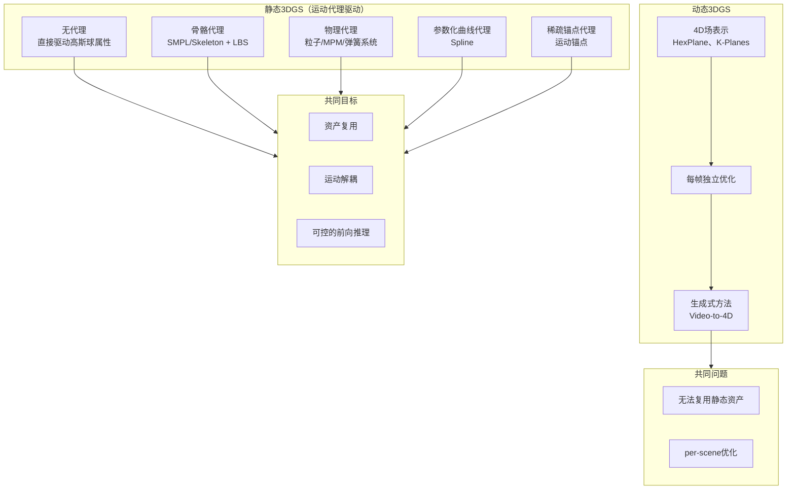

3DGS： 将一个场景显式地表示为数百万个可学习的3D高斯椭球体。每个高斯球拥有位置、协方差（尺度/旋转）、不透明度和球谐函数系数（表示颜色和视角相关外观）。通过光栅化技术，将这些球体投影并融合成2D图像。其核心是显式表示和基于点的可微分光栅化。

---

# 一、3DGS vs NeRF

| 特性 | NeRF | 3D Gaussian Splatting |分析|
| :--- | :--- | :--- | :--- |
| **核心表示** | **隐式**（神经网络） | **显式**（3D高斯球集合） |
| **渲染质量** | **高保真、连续、平滑**，细节和光泽表面处理更好 | 极高质量，但可能有**颗粒感/空洞**，在极端近距离下会"露馅" |NeRF学习的是一个连续的场景函数。  3DGS是离散的点云表示，在非常稀疏或点分布不均的区域，可能会产生"空洞"或颗粒感。虽然通过 densification 和 pruning 可以缓解，但其本质仍然是离散的。|
| **速度** | **慢**（训练：小时/天，渲染：秒/帧） | **极快**（训练：分钟/小时，渲染：**实时 >100 FPS**） |每条射线查询数百次神经网络，计算量巨大。|
| **内存效率** | **高**（模型小，优秀的压缩） | **低**（模型大，存储所有显式属性） |NeRF的模型是一个强大的压缩算法，将数十亿体素的信息压缩到一个紧凑的神经网络中。  3DGS需要显式存储数百万甚至数千万个高斯球。|
| **编辑性** | **困难**（黑盒模型，难以操控） | **相对容易**（可像点云一样选择、移动、编辑） |隐式表示缺乏显式的几何和语义结构。显式的点云，编辑相对直观。|
| **泛化能力** | **强**（支持预训练和先验学习） | **弱**（每个场景独立优化） |神经网络架构天然适合迁移学习和预训练。  3DGS本质上是"从零开始"为每个场景进行优化，缺乏这种跨场景的泛化能力。每个高斯球都是独立的，没有共享的语义知识。|
| **鲁棒性** | 对噪声和错误初始化**相对鲁棒** | 严重依赖**高质量的SfM点云**初始化 |神经网络具有平滑性，不会过拟合每一个噪声点。但许多NeRF变体对相机位姿的  3DGS虽然依赖SfM初始化，但其优化过程相对鲁棒，且社区已经形成了比较固定的超参数设置，开箱即用性更好。|
| **主要应用** | 高质量离线渲染、学术研究、场景压缩 | **实时应用**（VR/AR、游戏）、快速预览、需要交互的场景 |

**3DGS能够克服隐式方法（特别是动态 NeRF）的效率瓶颈和兼容性问题。**
但由于缺乏真实的4D标注数据，只能依赖多视角渲染进行监督学习，因此容易出现视角间的不一致性问题。

---

# 二、静态3DGS vs 动态3DGS

这是 3DGS 动画领域中最重要的分类维度。

## 核心区别

| 维度 | 动态3DGS | 静态3DGS（可驱动） |
| :--- | :--- | :--- |
| **核心思想** | 每一帧独立生成 3DGS，前后帧之间没有关系 | 有一个 reference 3DGS，通过修改其属性（位置、旋转、颜色）来驱动 |
| **时间建模** | 时间维度直接融入优化过程 | 时间维度通过运动代理间接控制 |
| **资产复用** | ❌ 每个新场景都要从头重建 | ✅ 可复用已有的高质量静态 3DGS 资产 |
| **前向推理** | ⚠️ 困难（通常仍是 per-scene 优化） | ✅ 更适合（运动代理可跨 ID 迁移） |
| **时空一致性** | ⚠️ 易出现视角闪烁 | ✅ 天然保持（基于同一份 reference 变形） |
| **适用场景** | 一次性重建、离线渲染 | 实时交互、跨 ID 泛化、可控编辑 |

## 技术路径对比

## 选择建议

| 需求 | 推荐方向 |
| :--- | :--- |
| 一次性动画生成，从视频重建 | 动态3DGS / 4D重建 |
| 需要复用同一个角色的多段动画 | 静态3DGS（骨骼代理） |
| 需要物理真实的交互响应 | 静态3DGS（物理代理） |
| 需要跨 ID 泛化的驱动模型 | 静态3DGS（运动代理） |
| 需要实时渲染 + 实时交互 | 静态3DGS + 预训练代理 |

## 补充说明：4D重建的归属

4D重建是一个**输入形式**的描述（从视频到4D），而非独立的驱动方式。其内部走哪条路取决于具体方法：

| 方法类型 | 归属 |
| :--- | :--- |
| 每帧独立生成 3DGS | **动态3DGS** |
| 先建 reference 再驱动 | **静态3DGS** |
