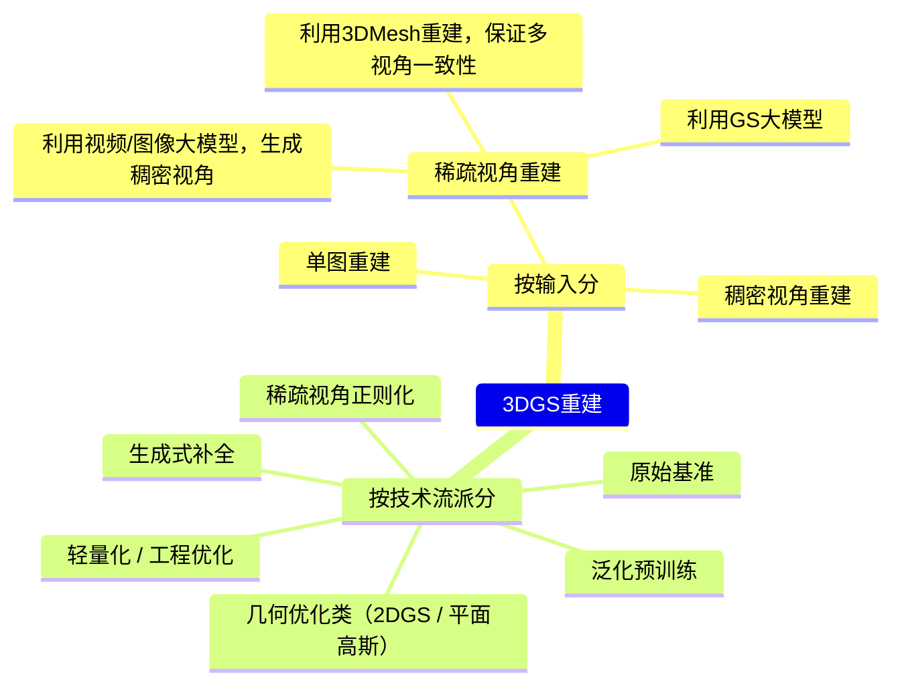

# 3DGS重建

# 稀疏视角重建

## 利用视频/图像大模型，生成稠密视角

[新视角生成](../VideoDiffusionModels/NovelViews.md) + 稠密视角重建

局限性：
1. 依赖于新视角生成的图像质量
2. 依赖于新视角与原视角之间的一致性

|ID|Year|Name|Link|
|---|---|---|---|
||2026.5.12|VidSplat: Gaussian Splatting Reconstruction with Geometry-Guided Video Diffusion Priors|[paper](https://arxiv.org/html/2605.11424)、[Note](https://dida365.com/webapp/#p/69b611433bd95101d8115da1/tasks/6a22e398f3a81101ec9b8775)|