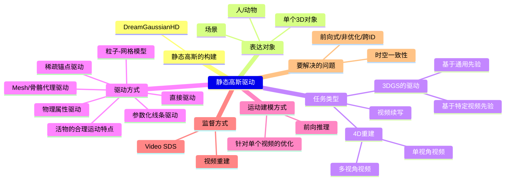

```mermaid
mindmap
静态高斯驱动
    静态高斯的构建
        DreamGaussianHD
    表达对象
        场景
        单个3D对象
        人/动物
    任务类型
        4D重建
            单视角视频
            多视角视频
        视频续写
        3DGS的驱动
            基于特定视频先验
            基于通用先验
    驱动方式
        直接驱动
        Mesh/骨骼代理驱动
        参数化线条驱动
        活物的合理运动特点
        物理属性驱动
        稀疏锚点驱动
        粒子-网格模型
    运动建模方式
        针对单个视频的优化
        前向推理
    监督方式
        Video SDS
        视频重建
    要解决的问题
        时空一致性
        前向式/非优化/跨ID
```

> Video SDS (视频分数蒸馏) 来从视频扩散模型中“蒸馏”运动信息

输入：单/多视角视频，静态3DGS（Optional）  
输出：GS的动态属性，静态3DGS（Optional）  

|ID|Year|Name|解决了什么痛点|主要贡献是什么|Tags|Link|
|---|---|---|---|---|---|---|
