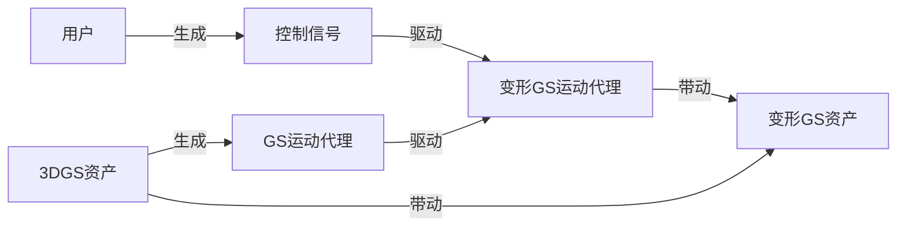
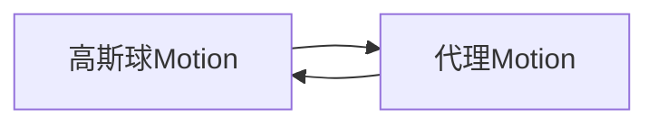
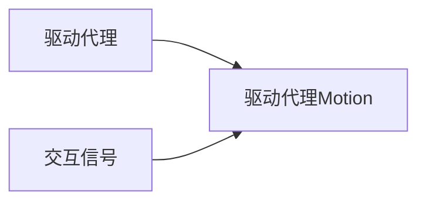
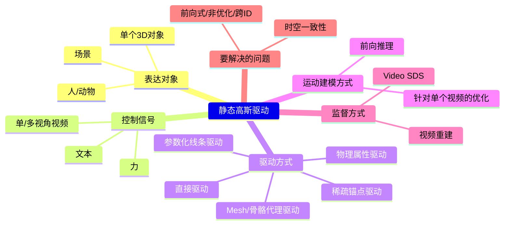

# 显式驱动静态高斯属性

## 与动态高斯的对比

核心思路： 利用控制点/蒙皮等显式或参数化结构来驱动显式图元（如高斯椭球）的变形，从而表示动态。这比纯隐式 NeRF 更高效且渲染质量更高。  
优点：
- 将静态几何与动态运动解耦。静态部分可以高效优化/表示，动态部分专注于运动。这通常比直接拟合整个时空函数更有效率。

主要缺点：
- 要解决如何有效控制显式图元随时间的变形以保持时空一致性和高质量。

## 问题定义

输入：首帧图像或静态3DGS，控制信号    
输出：GS的动态属性， 静态3DGS（Optional）

通过控制信号驱动GS，需要先学习到GS的运动方式与控制信号之间的关联。 

如果控制控制是视频，控制信号与GS运动的关系非常直观，通过Video SDS和视频重建来约束，就可以实现驱动效果。  
但如果控制号与GS运动不是那么显性的关系，就需要借助GS的运动代理来驱动GS了。  
所以GS的运动方式可以是直接驱动每个高斯点，也可以是借助运动代理驱动高斯点。  

借助运动代理来驱动GS有这些好处：  
1. 高斯资产中的高斯球数量巨大，简化的代理更容易学习  
2. 邻近的高斯球的运动是相关联的，通过运动代理可以学到high level的运动趋势
3. 运动代理更方便于运动迁移

因此高斯的驱动可以拆分为以下两个模块：  
（1）

可以通过以下方式配置运动代理：  
- 人工配置
- 基于规则
- 学习

(2)

驱动代理可以是：  
- 原始高斯球（无代理）
- 点云
- Mesh
- Skeleton
- 物理仿真对象

交互信号驱动驱动代理的方式与具体的驱动代理的形式有关，因此下文使用不同驱动代理的类型作为第一级分类。  

## 技术图谱

> Video SDS (视频分数蒸馏) 来从视频扩散模型中“蒸馏”运动信息

# 子类问题

## GS的运动代理：无

无需要代理，直接控制每个高斯球的运动。  

### 控制信号：多/视角视频控制，GS运动代理：无

由视频直接驱动每个高斯点的运动控制信号与GS运动的关系非常直观，通过Video SDS和视频重建来约束，就可以实现驱动效果。   
这实际上是一个[基于3DGS的4D重建](./3DGSAnimation/4DReconstruction.md)的问题。  

### 控制信号：文本，GS运动代理：无

先用文本和首帧生成视频，再用视频驱动GS，即：

[TI2V](../VideoDiffusionModels/VideoGeneration/WorksBasedOnT2I.md) + [基于3DGS的4D重建](./3DGSAnimation/4DReconstruction.md)

|ID|Year|Name|解决了什么痛点|主要贡献是什么|Tags|Link|
|---|---|---|---|---|---|---|
||2024.9.9|Animate3d: Animating any 3d model with multi-view video diffusion|充分利用现有具有多视图属性的3D资产，解决生成结果存在时空不一致问题|1）多视角视频扩散模型（MV-VDM） 2）大规模多视图视频数据集（MV-Video） 3）基于MV-VDM，我们引入结合重建技术与4D分数蒸馏采样（4D-SDS）的框架，利用多视图视频扩散先验实现3D对象动画。|静态高斯模型：预置 表达对象：单个3D对象 运动信息来源：自己训练的多视角图生视频 驱动方式：直接驱动（HexPlane） 监督方式：4D-SDS，视频重建，ARAP 运动推断方式：先前向，再优化|[link](https://arxiv.org/pdf/2407.11398)|
|111|2023.12|**Dreamgaussian4d: Generative 4d gaussian splatting**|隐式表示 (NeRF)的场景重建与驱动都非常低效|一个系统性的图像到4D生成框架|静态高斯模型：DreamGaussianHD  表达对象：单个3D对象  运动信息来源：图生视频得到的单视角视频  驱动方式：直接驱动（HexPlane）  监督方式：video SDS，视频重建 运动推断方式：优化|[link](https://caterpillarstudygroup.github.io/ReadPapers/111.html)|

## GS运动代理：物理仿真对象

技术一：高斯对象分割  
一个高斯场景中可能包含多个对象，这些对象具有不同的物理属性，因此需要分割。
1. 显式分割
2. 隐式分割  

技术二：从静态高斯对象是提取出物理仿真代理。  
1. 代理通常是由高斯球采样或人工挑选出的粒子。
2. 这些粒子可以再重组成Particle或Mesh或Grid或其它混合仿真形式。
3. 仿真粒子带动高斯粒子
  
技术三：学习物理仿真对象的物理属性。  
1. 人工配置
2. 从视频中学习

技术四：使用物理仿真驱动物理仿真对象  
1. 借助物理仿真方法（粒子系统、网格系统）
2. 神经网络方法

### 借助物理仿真的方法

|ID|Year|Name|解决了什么痛点|主要贡献是什么|Tags|Link|
|---|---|---|---|---|---|---|
|129|2025.8.13|TRACE: Learning 3D Gaussian Physical Dynamics from Multi-view Videos|不同物理属性的对象需要人工标注|无需要人工标注，从视频中学习每个高斯点的动力学属性|对象分割：无显式分割 物理仿真代理：高斯球作为刚性粒子 物理属性：从多视角视频中学习 仿真方式：刚性粒子仿真 开源|[link](https://caterpillarstudygroup.github.io/ReadPapers/129.html)|
|175|2025.6.9|**PIG: Physically-based Multi-Material Interaction with 3D Gaussians**|由3D高斯基元表征的场景中，物体间的交互存在三大缺陷：三维分割精度不足、异质材质形变失准及严重渲染伪影。| 1. 从二维像素到三维高斯基元的快速精准映射，从而达成精确的物体级**三维分割**。   2. 为场景中分割后的物体赋予独特物理属性，以实现**多材质耦合交互**。  3. 创新性地将约束尺度嵌入变形梯度，通过钳制高斯基元的缩放与旋转属性**消除渲染伪影**，达成几何保真度与视觉一致性。   |对象分割：显式分割 物理仿真代理：高斯球采样 物理属性：预置？ 仿真方式：MLS-MPM|[link](https://arxiv.org/pdf/2506.07657)|
|174|2025.6.4|**EnliveningGS: Active Locomotion of 3DGS**| 3D 高斯溅射(3DGS)表示的 3D 模型能够实现主动运动   |高效且鲁棒地建模“活化模型”与环境之间的**摩擦接触**|对象分割：显式分割 物理仿真代理：四面体+肌肉 物理属性：预置？ 仿真方式：肌肉动力学|[link](https://openaccess.thecvf.com/content/CVPR2025/papers/Shen_EnliveningGS_Active_Locomotion_of_3DGS_CVPR_2025_paper.pdf)|
||2024.6.16|Physically embodied gaussian splatting: A realtime correctable world model for robotics|以统一的方式捕捉几何、物理及视觉外观信息|提出一种新颖的“高斯-粒子”双元表征，该表征在建模物理世界的同时，（i）支持对未来状态进行预测性仿真，并（ii）允许在动态世界中基于视觉观测进行在线校正。|对象分割：先分割再建模 物理仿真代理：粒子（先建粒子，再细化成高斯） 物理属性：从视频中学习 仿真方式：通过『粒子仿真+形状约束』实现刚体仿真、软体仿真|[link](https://arxiv.org/pdf/2406.10788)|
||2024.4.15| Physgaussian: Physicsintegrated 3d gaussians for generative dynamics||通过将基于牛顿力学的物理动力学无缝集成到3D高斯模型中，实现高质量的新运动合成|对象分割：无分割 物理仿真代理：高斯球作为粒子 物理属性：预置？ 仿真方式：MPM|[link](https://arxiv.org/pdf/2311.12198)|
||2024.4.1|Language-driven physics-based scene synthesis and editing via feature splatting. |同时操控GS对象的外观与物理属性|1. 提出了一种将高质量、以物体为中心的视觉-语言特征蒸馏至三维高斯模型的方法，从而支持基于文本查询的半自动场景解构。 2. 提出了一种利用粒子仿真器从原本静态的场景中合成基于物理的动态效果的方法，其中材料属性通过文本查询自动分配。|对象分割：基于语言的分割 物理仿真代理：高斯球作为粒子 物理属性：通过文本查询自动分配 仿真方式：MPM|[link](https://arxiv.org/pdf/2404.01223)|
||2024.3.14|Reconstruction and simulation of elastic objects with spring-mass 3d gaussians|物体物理属性并进行仿真||对象分割：无 物理仿真代理：Volume Sampling得到anchor，再构建弹簧系统 物理属性：从视频中学习 仿真方式：Mass-Spring System|[link](https://arxiv.org/pdf/2403.09434)|

#### 神经网络方法

|ID|Year|Name|解决了什么痛点|主要贡献是什么|Tags|Link|
|---|---|---|---|---|---|---|
|177|2025.6.18|Particle-Grid Neural Dynamics for Learning Deformable Object Models from RGB-D Videos|||对象分割：显式分割 物理仿真代理：高斯球采样成粒子，空间划分成风格 物理属性：从视频中学习 仿真方式：粒子仿真+网格仿真+数据学习|[link](https://arxiv.org/pdf/2506.15680)|
|179|2025.5.26|ParticleGS: Particle-Based Dynamics Modeling of 3D Gaussians for Prior-free Motion Extrapolation||  根据视觉观测数据建模三维高斯分布的动力学特性  ||

## GS运动代理：Mesh

|ID|Year|Name|解决了什么痛点|主要贡献是什么|Tags|Link|
|---|---|---|---|---|---|---|
||2024.10.9|Dreammesh4d: Video-to-4d generation with sparse-controlled gaussian-mesh hybrid representation|时空一致性与表面外观|图像->3DMesh->Mesh形状->GS形状|运动信息来源：单目视频 驱动方式：Mesh形变驱动|[link](https://arxiv.org/pdf/2410.06756)|
