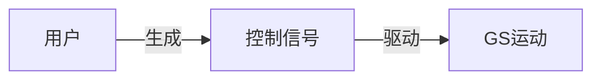
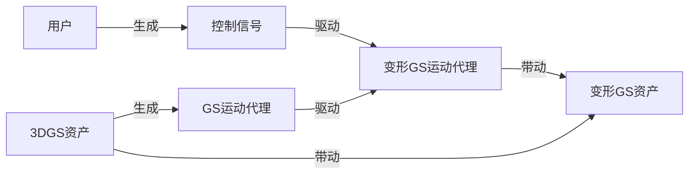
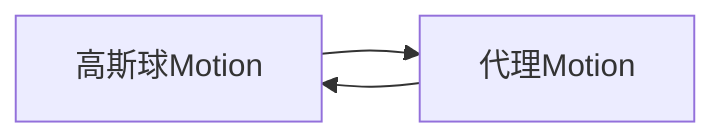
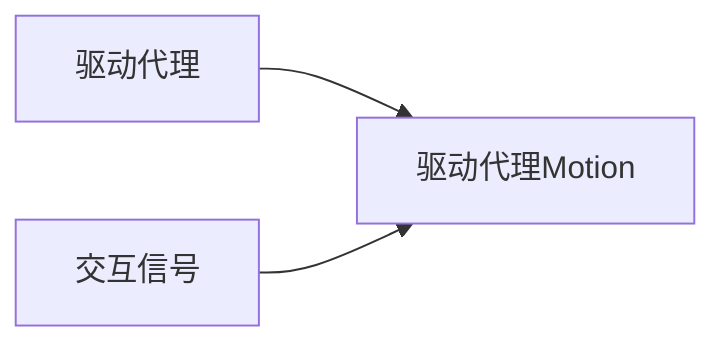
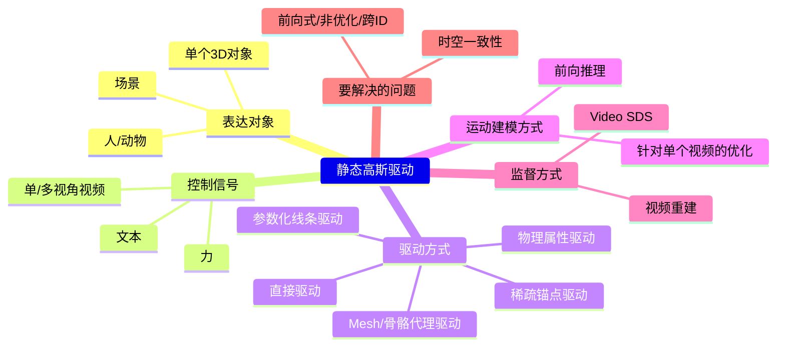

# 显式驱动静态高斯属性

## 与动态高斯的对比

核心思路： 利用控制点/蒙皮等显式或参数化结构来驱动显式图元（如高斯椭球）的变形，从而表示动态。这比纯隐式 NeRF 更高效且渲染质量更高。  
优点：
- 将静态几何与动态运动解耦。静态部分可以高效优化/表示，动态部分专注于运动。这通常比直接拟合整个时空函数更有效率。

主要缺点：
- 要解决如何有效控制显式图元随时间的变形以保持时空一致性和高质量。

## 问题定义

输入：首帧图像或静态3DGS，控制信号    
输出：GS的动态属性， 静态3DGS（Optional）

通过控制信号驱动GS，需要先学习到GS的运动方式与控制信号之间的关联。 

如果控制控制是视频，控制信号与GS运动的关系非常直观，通过Video SDS和视频重建来约束，就可以实现驱动效果。  
但如果控制号与GS运动不是那么显性的关系，就需要借助GS的运动代理来驱动GS了。  
所以GS的运动方式可以是直接驱动每个高斯点，也可以是借助运动代理驱动高斯点。  

借助运动代理来驱动GS有这些好处：  
1. 高斯资产中的高斯球数量巨大，简化的代理更容易学习  
2. 邻近的高斯球的运动是相关联的，通过运动代理可以学到high level的运动趋势
3. 运动代理更方便于运动迁移

因此高斯的驱动可以拆分为以下两个模块：  
（1）

可以通过以下方式配置运动代理：  
- 人工配置
- 基于规则
- 学习

(2)

驱动代理可以是：  
- 原始高斯球（无代理）
- 点云
- Mesh
- Skeleton
- 物理仿真对象

交互信号驱动驱动代理的方式与具体的驱动代理的形式有关，因此下文使用不同驱动代理的类型作为第一级分类。  

## 技术图谱

> Video SDS (视频分数蒸馏) 来从视频扩散模型中“蒸馏”运动信息
