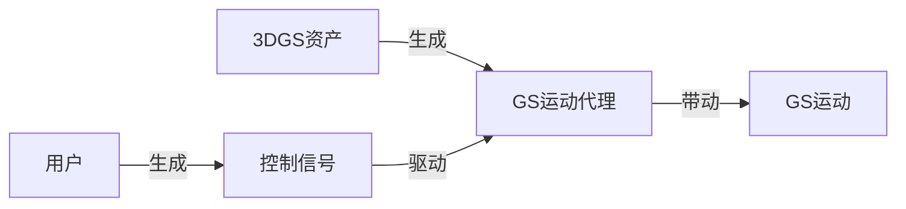
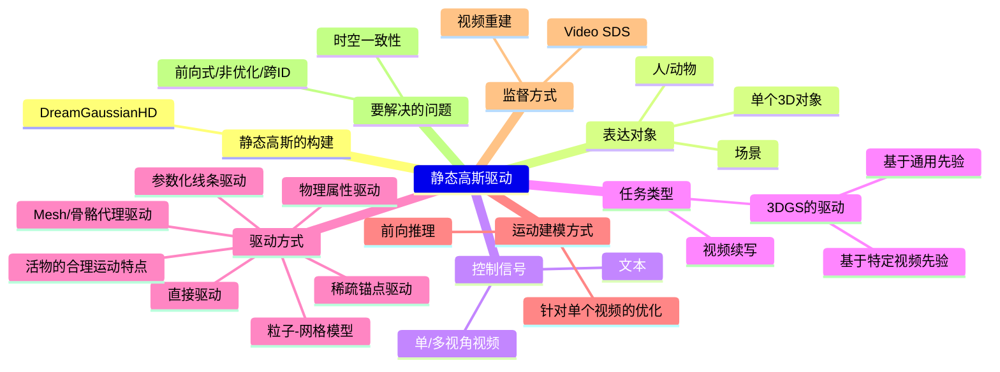

# 显式驱动静态高斯属性

## 与动态高斯的对比

核心思路： 利用控制点/蒙皮等显式或参数化结构来驱动显式图元（如高斯椭球）的变形，从而表示动态。这比纯隐式 NeRF 更高效且渲染质量更高。  
优点：
- 将静态几何与动态运动解耦。静态部分可以高效优化/表示，动态部分专注于运动。这通常比直接拟合整个时空函数更有效率。

主要缺点：
- 要解决如何有效控制显式图元随时间的变形以保持时空一致性和高质量。

## 问题定义

输入：首帧图像或静态3DGS，控制信号    
输出：GS的动态属性， 静态3DGS（Optional）

通过控制信号驱动GS，需要先学习到GS的运动方式与控制信号之间的关联。 

如果控制控制是视频，控制信号与GS运动的关系非常直观，通过Video SDS和视频重建来约束，就可以实现驱动效果。  
但如果控制号与GS运动不是那么显性的关系，就需要借助GS的运动代理来驱动GS了。  
所以GS的运动方式可以是直接驱动每个高斯点，也可以是借助运动代理驱动高斯点。  

使用了运动代理，除了要学习GS的运动代理与控制信号之间的关联，还要学习GS运动代理与GS运动之前的关联。其中，前者与特定的任务相关，而后者可以通过大量的通用数据学到。这就将GS的通用运动规则与特定的应用场景解耦。    

## 技术图谱

> Video SDS (视频分数蒸馏) 来从视频扩散模型中“蒸馏”运动信息

|ID|Year|Name|解决了什么痛点|主要贡献是什么|Tags|Link|
|---|---|---|---|---|---|---|
|177|2025.6.18|Particle-Grid Neural Dynamics for Learning Deformable Object Models from RGB-D Videos||    ||
|176|2025.6.11|HAIF-GS: Hierarchical and Induced Flow-Guided Gaussian Splatting for Dynamic Scene|学习结构化且时间一致的运动表征|一个通过**稀疏锚点**驱动形变实现结构化一致动态建模的统一框架。 1. 通过锚点过滤器识别运动相关区域，抑制静态区域的冗余更新；2. 利用自监督诱导流引导变形模块，通过多帧特征聚合驱动锚点运动，无需显式光流标签；  3. 为处理细粒度形变，分层锚点传播机制能依据运动复杂度提升锚点分辨率，并传播多级变换关系。    |运动信息来源：? 驱动方式：稀疏锚点驱动||
|175|2025.6.9|**PIG: Physically-based Multi-Material Interaction with 3D Gaussians**|由3D高斯基元表征的场景中，物体间的交互存在三大缺陷：三维分割精度不足、异质材质形变失准及严重渲染伪影。| 1. 从二维像素到三维高斯基元的快速精准映射，从而达成精确的物体级三维分割。   2. 为场景中分割后的物体赋予独特物理属性，以实现多材质耦合交互。  3. 创新性地将约束尺度嵌入变形梯度，通过钳制高斯基元的缩放与旋转属性消除渲染伪影，达成几何保真度与视觉一致性。   |运动信息来源：单目视频 驱动方式：物理属性驱动|
|174|2025.6.4|**EnliveningGS: Active Locomotion of 3DGS**| 3D 高斯溅射(3DGS)表示的 3D 模型能够实现主动运动   |高效且鲁棒地建模“活化模型”与环境之间的**摩擦接触**||
|173|2025.5.14|SplineGS: Learning Smooth Trajectories in Gaussian Splatting for Dynamic Scene Reconstruction|静态场景的高质量快速重建的基础上融入形变模块|用Spline来表征时间维度上的平滑形变|运动信息来源：单目视频 驱动方式：参数化线条驱动|
||2024.10.9|Dreammesh4d: Video-to-4d generation with sparse-controlled gaussian-mesh hybrid representation|时空一致性与表面外观|图像->3DMesh->Mesh形状->GS形状|运动信息来源：单目视频 驱动方式：Mesh形变驱动|[link](https://arxiv.org/pdf/2410.06756)|
||2023|4d gaussian splatting for real-time dynamic scene rendering|

# 子类问题

## GS的运动代理：无

### 控制信号：多/视角视频控制，GS运动代理：无

由视频直接驱动每个高斯点的运动，这实际上是一个[基于3DGS的4D重建](./3DGSAnimation/4DReconstruction.md)的问题。  

### 控制信号：文本，GS运动代理：无

先用文本和首帧生成视频，再用视频驱动GS，即：

[TI2V](../VideoDiffusionModels/VideoGeneration/WorksBasedOnT2I.md) + [基于3DGS的4D重建](./3DGSAnimation/4DReconstruction.md)

|ID|Year|Name|解决了什么痛点|主要贡献是什么|Tags|Link|
|---|---|---|---|---|---|---|
||2024.9.9|Animate3d: Animating any 3d model with multi-view video diffusion|充分利用现有具有多视图属性的3D资产，解决生成结果存在时空不一致问题|1）多视角视频扩散模型（MV-VDM） 2）大规模多视图视频数据集（MV-Video） 3）基于MV-VDM，我们引入结合重建技术与4D分数蒸馏采样（4D-SDS）的框架，利用多视图视频扩散先验实现3D对象动画。|静态高斯模型：预置 表达对象：单个3D对象 运动信息来源：自己训练的多视角图生视频 驱动方式：直接驱动（HexPlane） 监督方式：4D-SDS，视频重建，ARAP 运动推断方式：先前向，再优化|[link](https://arxiv.org/pdf/2407.11398)|
|111|2023.12|**Dreamgaussian4d: Generative 4d gaussian splatting**|隐式表示 (NeRF)的场景重建与驱动都非常低效|一个系统性的图像到4D生成框架|静态高斯模型：DreamGaussianHD  表达对象：单个3D对象  运动信息来源：图生视频得到的单视角视频  驱动方式：直接驱动（HexPlane）  监督方式：video SDS，视频重建 运动推断方式：优化|[link](https://caterpillarstudygroup.github.io/ReadPapers/111.html)|

## GS运动代理：物理属性

### 控制信号：力，GS运动代理：GS球的物理状态

|ID|Year|Name|解决了什么痛点|主要贡献是什么|Tags|Link|
|---|---|---|---|---|---|---|
|129|2025.8.13|TRACE: Learning 3D Gaussian Physical Dynamics from Multi-view Videos|从视频中学习每个高斯点的动力学属性|开源|[link](https://caterpillarstudygroup.github.io/ReadPapers/129.html)|
