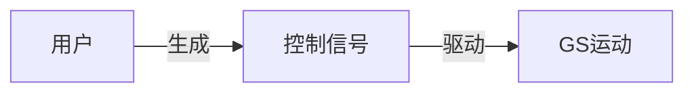
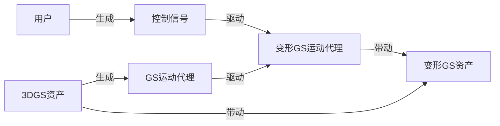
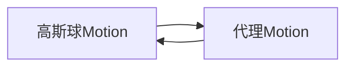
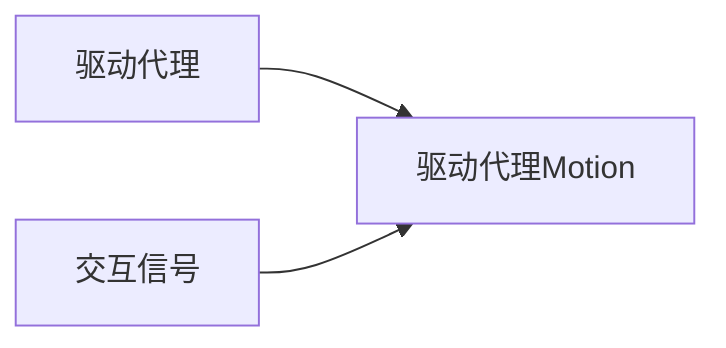
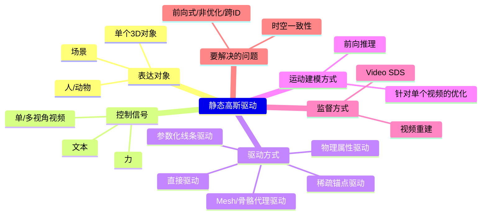

# 显式驱动静态高斯属性

## Overview

**这个方向在做什么**

给一个已有的静态 3DGS 资产注入运动——使它能响应控制信号（视频、文本、物理力）动起来，同时保持视觉质量和时空一致性。

**为什么不直接用动态高斯**

动态高斯（4D GS）将时间维度也参与优化，但代价是：每个新场景都要从头重建，无法复用已有的高质量静态资产，也更难做前向推理。静态高斯驱动的思路是"资产复用+运动解耦"，对需要实时交互或跨 ID 泛化的场景更友好。

**核心难点只有一个：控制信号和高斯球位移之间的桥**

高斯球数以百万计，控制信号（一段文字、一个力向量）无法直接映射到每个球的偏移量。因此几乎所有方法都在解决同一个问题：**建立一个"中间代理"来承接控制信号，再由代理带动高斯球运动**。代理的形态决定了这个方向的技术分叉。

**五条技术路线及其核心权衡**

| 路线 | 代理 | 控制信号 | 优势 | 局限 |
|---|---|---|---|---|
| 直接驱动 | 无（HexPlane/4D场）| 视频 | 实现简单，适配视频重建 | 依赖单个视频优化，跨 ID 泛化差 |
| Mesh/骨骼代理 | 显式 Mesh | 视频、姿态 | 可控性强，拓扑明确 | 建 Mesh 本身有成本，对非刚体效果差 |
| 物理仿真代理 | 粒子/MPM/弹簧 | 力/交互 | 物理合理，支持真实交互 | 物理参数难以自动获取，计算重 |
| 参数化线条代理 | Spline 曲线 | 视频 | 轨迹平滑，时间一致性好 | 表达能力有限，复杂形变处理弱 |
| 稀疏锚点代理 | 运动锚点 | 视频 | 结构化运动，计算高效 | 锚点分布影响效果上限 |

**目前还没解决的问题**

1. **前向推理**：绝大多数方法仍是 per-scene 优化，输入一个新的 GS 资产就要重跑一遍，无法像图像生成模型那样即时推理
2. **物理属性自动获取**：物理仿真方法普遍需要人工设定材料参数，从视频自动学习仍是开放问题
3. **跨 ID 泛化**：同一个驱动模型作用于不同形态的 GS 资产，效果不稳定

---

## 与动态高斯的对比

核心思路： 利用控制点/蒙皮等显式或参数化结构来驱动显式图元（如高斯椭球）的变形，从而表示动态。这比纯隐式 NeRF 更高效且渲染质量更高。  
优点：
- 将静态几何与动态运动解耦。静态部分可以高效优化/表示，动态部分专注于运动。这通常比直接拟合整个时空函数更有效率。

主要缺点：
- 要解决如何有效控制显式图元随时间的变形以保持时空一致性和高质量。

## 问题定义

输入：首帧图像或静态3DGS，控制信号    
输出：GS的动态属性， 静态3DGS（Optional）

通过控制信号驱动GS，需要先学习到GS的运动方式与控制信号之间的关联。 

```mermaid
flowchart LR

用户 -->|生成| 控制信号 -->|驱动| GS运动
```

如果控制控制是视频，控制信号与GS运动的关系非常直观，通过Video SDS和视频重建来约束，就可以实现驱动效果。  
但如果控制号与GS运动不是那么显性的关系，就需要借助GS的运动代理来驱动GS了。  
所以GS的运动方式可以是直接驱动每个高斯点，也可以是借助运动代理驱动高斯点。  

```mermaid
flowchart LR

3DGS资产 -->|生成| GS运动代理
用户 -->|生成| 控制信号
控制信号 & GS运动代理 -->|驱动| 变形GS运动代理
变形GS运动代理 & 3DGS资产 --> |带动| 变形GS资产
```

借助运动代理来驱动GS有这些好处：  
1. 高斯资产中的高斯球数量巨大，简化的代理更容易学习  
2. 邻近的高斯球的运动是相关联的，通过运动代理可以学到high level的运动趋势
3. 运动代理更方便于运动迁移

因此高斯的驱动可以拆分为以下两个模块：  
（1）

```mermaid
flowchart LR
高斯球Motion --> 代理Motion --> 高斯球Motion
```

可以通过以下方式配置运动代理：  
- 人工配置
- 基于规则
- 学习

(2)

```mermaid
flowchart LR
驱动代理 & 交互信号 --> 驱动代理Motion
```

驱动代理可以是：  
- 原始高斯球（无代理）
- 点云
- Mesh
- Skeleton
- 物理仿真对象

交互信号驱动驱动代理的方式与具体的驱动代理的形式有关，因此下文使用不同驱动代理的类型作为第一级分类。  

## 技术图谱

```mermaid
mindmap
静态高斯驱动
    表达对象
        场景
        单个3D对象
        人/动物
    控制信号
        单/多视角视频
        文本
        力
    驱动方式
        直接驱动
        Mesh/骨骼代理驱动
        参数化线条驱动
        物理属性驱动
        稀疏锚点驱动
    运动建模方式
        针对单个视频的优化
        前向推理
    监督方式
        Video SDS
        视频重建
    要解决的问题
        时空一致性
        前向式/非优化/跨ID
```

> Video SDS (视频分数蒸馏) 来从视频扩散模型中“蒸馏”运动信息
