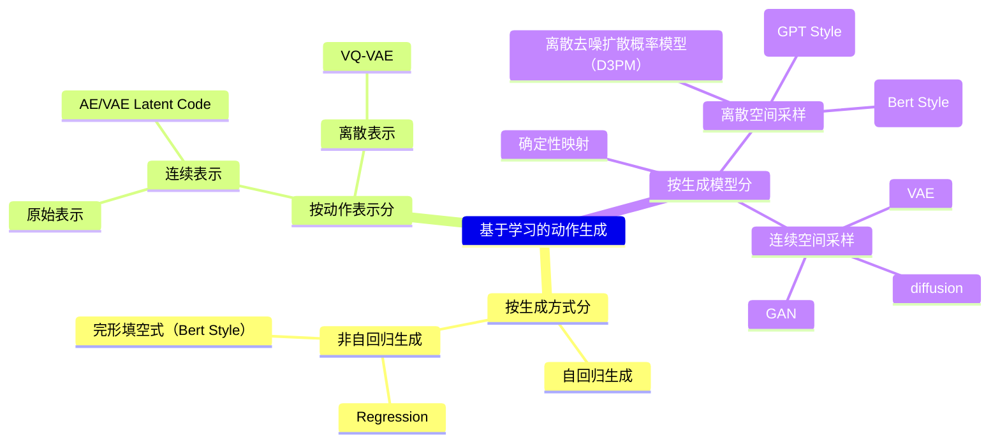

# 无条件动作生成

### GAN

|ID|Year|Name|解决了什么痛点|主要贡献是什么|Tags|Link|
|---|---|---|---|---|---|---|
|133|2022.12.18|Modi: Unconditional motion synthesis from diverse data.|从给定分布中无条件合成运动|1. MoDi——一种在无监督设置下，从极其多样化、非结构化和无标签的数据集中训练得到的生成模型。  2. 将StyleGAN风格控制引入运动生成实现风格化运动生成|控制条件：无  生成方式：Regression 表示方式：连续表示(可能是VAE) 生成模型：Style GAN 其它：模式崩溃/混合（生成动作重复或混乱）	|
||2022|Ganimator: Neural motion synthesis from a single sequence | 小样本生成

# TEXT-CONDITIONED MOTION GENERATION

## Action to Motion

### VAE

|ID|Year|Name|Note|Tags|Link|
|---|---|---|---|---|---|
||2021.10|Action-Conditioned 3D Human Motion Synthesis with Transformer VAE|生成多样且真实的3D人体动作，作为后续研究的基线  不可学习的可微分SMPL层，数据依赖性强 – 生成长序列计算密集| ACTOR、Transformer + VAE、潜在高斯分布对齐||
||2020| **Action2Motion** | – 动作条件运动生成的首个方法 – 基于李代数的VAE框架 – 构建新3D运动数据集：HumanAct12 | – 泛化能力不足 – 仅能生成单一动作的简单运动                              |

### Normalizing Flows

|ID|Year|Name|Note|Tags|Link|
|---|---|---|---|---|---|
||2024.7|Stylevr: Stylizing character animations with normalizing flows|Style Label|

## Text to Motion

### 潜在表征对齐

|ID|Year|Name|Note|Tags|Link|
|---|---|---|---|---|---|
|100|2025.5.16|MoCLIP: Motion-Aware Fine-Tuning and Distillation of CLIP for Human Motion Generation|一种代替CLIP的文本编码方式，其编码空间能跟Motion有更好的对齐，因此更适用于文生动作任务。  MoCLIP是CLIP的Motion版，不能独立使用，需结合基于CLIP的文生动作Pipeline。||[link](https://caterpillarstudygroup.github.io/ReadPapers/100.html)||
||2023| **TMR [120]** | 改进自TEMOS，提升文本-动作对齐，支持检索与生成，根据文本输出3D动作/跨模态检索结果 对比损失优化联合潜在空间，过滤误导性负样本（MPNet） 引入CLIP式对比学习，优化负样本选择策略提升检索性能   TEMOS/TMR通过共享潜在空间实现跨模态对齐，TMR进一步引入对比损失提升检索能力。|VAE隐空间对比学习 文本描述相似性过滤策略 泛化能力不足 部分场景内存效率低|
||2022|Motionclip: Exposing human motion generation to clip space|将运动潜空间直接对齐CLIP的语义文本嵌入，实现零样本泛化能力。然而，CLIP嵌入主要捕获静态图文语义，难以完整表征真实运动合成所需的时序与运动学细节。此外，直接微调CLIP嵌入可能导致预训练语义知识的灾难性遗忘。|
||2022| Temos: Generating diverse human motions from textual descriptions.| 改进自ACTOR 实现文本到SMPL动作的生成   共享潜在空间中文本与动作表征对齐（跨模态一致性） 对称编码器（动作序列+冻结DistilBERT文本编码器），共享潜在空间  虽然生成运动真实，但存在内存消耗大（二次内存消耗、不适于长运动）、长序列处理弱、多样性不足的问题。 – 跨模态嵌入相似性 –  – 文本拼写错误时易失效 – 多样性不足        |    Transformer VAE、潜在空间对齐，非自回归       |

### VAE

|ID|Year|Name|Note|Tags|Link|
|---|---|---|---|---|---|
| |2022|**TEACH [118]**| 扩展自TEMOS，处理连续文本指令生成连贯动作 分层生成：非自回归（单个动作内） + 自回归（动作间时序组合） 分层策略实现时序组合与平滑过渡   TEACH结合非自回归与自回归生成平衡质量与效率。  存在的问题： 动作过渡时易出现加速度峰值|
| |2023| **ATOM** [Zhai et al., 2023] | – CVAE分解复杂动作为原子动作 – 基于掩码运动的课程学习策略               | – 解释复杂文本能力有限 – 文本-运动特征融合策略不足                        |
| |2023|**MultiAct** [Lee et al., 2023] | – 条件VAE架构 – 生成多动作长序列模型                                | – 生成不真实运动 – 无法生成复杂多样动作序列                              |
| |2022|**ImplicitMotion** [Cervantes et al., 2022] | – 变分隐式神经表示 – 线性计算成本                                  | – 参数更新导致性能不稳定                                                  |
||2022| **UM-CVAE** [Zhong et al., 2022] | – 解耦序列级CVAE – 基于FiLM的动作感知调制                           | – 无法生成全新动作 – 生成运动质量有限（数据依赖）                        |
||2022a|Generating diverse and natural 3d human motions from text|两阶段（卷积AE + 时序VAE）分阶段生成文本对应动作   预训练运动编码器提取片段；时序VAE生成运动代码序列   两阶段框架（先编码运动代码，再生成序列）   – text2length阶段确定运动时长 – text2motion阶段用时序VAE生成运动   – 无法处理罕见动作（如“跺脚”） – 细粒度描述和复杂动作失败 – 生成运动不真实 |T2M, Transformer VAE|
|144|2023.3.7| Action-GPT: Leveraging Large-scale Language Models for Improved and Generalized Action Generation |当前运动捕捉数据集中的动作短语通常只包含最精简的核心信息。|通过为大语言模型精心设计提示模板，我们能够生成更丰富、更细粒度的动作描述。  – 首个基于LLM的文本条件运动生成 – 兼容VAE模型的模块   – 无法生成长序列 – 不支持复杂身体运动（瑜伽/舞蹈） – 无手指运动         |

# Motion-Conditioned Motion Generation

|ID|Year|Name|Note|Tags|Link|
|---|---|---|---|---|---|
|27|2024|Learning Human Motion from Monocular Videos via Cross-Modal Manifold Alignment|2D轨迹生成3D Motion||[link](https://caterpillarstudygroup.github.io/ReadPapers/27.html)
|19|2024|WANDR: Intention-guided Human Motion Generation|基于初始与结束状态控制的动作生成。||[link](https://caterpillarstudygroup.github.io/ReadPapers/19.html)|
|113|2017| Phasefunctioned neural networks for character control|PFNN||[link](https://caterpillarstudygroup.github.io/ReadPapers/113.html)|

### Diffusion

### Training Free

|ID|Year|Name|Note|Tags|Link|
|---|---|---|---|---|---|
||2025.5.2|**TSTMotion: Training-free Scene-awarenText-to-motion Generation**|| 场景感知，文生动作 |[link](38.md)|
||2024|“Move as you say, interact as you can: Language-guided human motion generation with scene affordance|AffordMotion|
||2023|Synthesizing diverse human motions in 3d indoor scenes|
||2022|Humanise: Language-conditioned human motion generation in
3d scenes|

# AUDIO-CONDITIONED MOTION GENERATION

## Music to Dance

|ID|Year|Name|Note|Tags|Link|
|---|---|---|---|---|---|
|      | 2023.5.15 | MoFusion: A Framework for Denoising-Diffusion-based Motion Synthesis | – 轻量1D U-Net网络 + 跨模态Transformer，三大约束损失（运动学一致性），显著提升效率与长序列质量 – 运动学损失的时变权重调度         | – 推理时间长 – 文本条件词汇受限                                        |
||2025.5.26|PAMD: Plausibility-Aware Motion Diffusion Model for Long Dance Generation||  合理性感知运动扩散模型 (PAMD)的音乐生成舞蹈  |[link](124.md)|
||2025.5.14|CyberHost: A One-stage Diffusion Framework for Audio-driven Talking Body Generation|| 单阶段音频驱动的说话身体生成 |[link](78.md)|
||2025.5.8|ReactDance: Progressive-Granular Representation for Long-Term Coherent Reactive Dance Generation|| 反应式舞蹈生成(Reactive Dance Generation, RDG)通过结合引导舞者动作和音乐输入来生成跟随者动作 |[link](67.md)|
||2025.5.7|ELGAR: Expressive Cello Performance Motion Generation for Audio Rendition|| 生成乐器演奏动作  |[link](56.md)|
||2025.5.6|PAHA: Parts-Aware Audio-Driven Human Animation with Diffusion Model|| 音频驱动上半身人体动画  |[link](48.md)|
||2023|Listen, denoise, action! audio-driven motion synthesis with diffusion models|
|      | 2023 | **UDE** [Zhou and Wang]      | – 统一文本/音频驱动的单模型 – 基于扩散的解码器                         | – 处理多模态复杂交互困难                                                |
||2022|Edge: Editable dance generation from music|
|      | 2023 | **LDA** [Alexanderson et al.]| – 基于Conformer的扩散模型 – 构建音频+高质量3D运动新数据集               | – 依赖语音特征提取 – 计算开销大                                      |

## Speech to Gesture

|ID|Year|Name|Note|Tags|Link|
|---|---|---|---|---|---|
||2025.6.1|TRiMM: Transformer-Based Rich Motion Matching for Real-Time multi-modal Interaction in Digital Humans||  实时3D手势生成  |[link](146.md)|
||2025.5.29|MMGT: Motion Mask Guided Two-Stage Network for Co-Speech Gesture Video Generation||  利用音频，以及从音频信号生成的**运动掩码**和**运动特征**，共同驱动生成同步的语音-手势视频  |[link](139.md)|
||2025.5.22|MEgoHand: Multimodal Egocentric Hand-Object Interaction Motion Generation|| 以自我为中心的手-物体运动生成   |[link](112.md)|
||2025.5.21|Intentional Gesture: Deliver Your Intentions with Gestures for Speech|| 意图驱动手势生成框架  |[link](110.md)|
||2025.5.14|**Robust Photo-Realistic Hand Gesture Generation: from Single View to Multiple View**|| 高保真手势生成  |[link](94.md)|
||2025.5.3|Co$^{3}$Gesture: Towards Coherent Concurrent Co-speech 3D Gesture Generation with Interactive Diffusion|| 语音生成手势、双人交互、数据集 |[link](43.md)|
||2024|Diffsheg: A diffusion-based approach for real-time speech-driven holistic 3d expression and gesture generation
||2024|Emotional speech-driven 3d body animation via disentangled latent diffusion|
||2024|Semantic gesticulator: Semantics-aware co-speech gesture synthesis|
||2023|Gesturediffuclip: Gesture diffusion model with clip latents| – 多模态提示控制风格（文本+语音） – CLIP引导的语音同步手势合成         | – 数据依赖性强 – CLIP对细节运动建模有限                              |
|      | 2023 | **DiffGesture** [Zhu et al.] | – 扩散音频-手势Transformer（多模态信息处理） – 扩散手势稳定器消除时序不一致 | – 数据多样性不足 – 计算成本高昂                                       |

# SCENE-CONDITIONED MOTION GENERATION

## 确定性映射

|ID|Year|Name|解决了什么痛点|主要贡献是什么|Tags|Link|
|---|---|---|---|---|---|---|
|131|2016| A deep learning framework for character motion synthesis and editing|自动生成角色动作数据|深开创了Deep Learning Based运动生成的先河|控制条件：轨迹条件、风格条件（风格迁移）生成方式：非自回归 表示方式：连续表示（AE） 生成模型：确定性映射|[link](https://caterpillarstudygroup.github.io/ReadPapers/131.html)

### VAE Based

|ID|Year|Name|Note|Tags|Link|
|---|---|---|---|---|---|
||2025.6.18|HOIDiNi: Human-Object Interaction through Diffusion Noise Optimization||    |[link](202.md)|
|29|2024|PACER+: On-Demand Pedestrian Animation Controller in Driving Scenarios|基于2D轨迹或视频的行人动作生成||[link](https://caterpillarstudygroup.github.io/ReadPapers/29.html)|

### Diffusion

|ID|Year|Name|Note|Tags|Link|
|---|---|---|---|---|---|
||2025.5.19|UniHM: Universal Human Motion Generation with Object Interactions in Indoor Scenes|| 整合静态环境、可移动物体、自然语言提示和空间路径点等多模态信息的文生动作  |[link](97.md)|
||2024.3.26|**Move as you say, interact as you can: Language-guided human motion generation with scene affordance**|| 3D环境中的文生3D动作  |[link](63.md)|

## 交互动作生成

|ID|Year|Name|Note|Tags|Link|
|---|---|---|---|---|---|
||2025.5.20|Large-Scale Multi-Character Interaction Synthesis||  生成大规模多角色交互的角色动画 |[link](105.md)|

# 多人动作生成

|ID|Year|Name|解决了什么痛点|主要贡献是什么|Tags|Link|
|---|---|---|---|---|---|---|
||2025.5.23|Multi-Person Interaction Generation from Two-Person Motion Priors|| 利用现有双人运动扩散模型作为运动先验，生成逼真且多样化的多人交互动作   |[link](119.md)|

---

# **3D人体运动生成与合成数据集**

| **数据集名称**               | **关键统计**                                                                 | **模态**                          | **链接/备注**                     |
|------------------------------|-----------------------------------------------------------------------------|-----------------------------------|-----------------------------------|
| **Motion-X++ [301]**          | 1950万3D姿势，120,500序列，80,800视频，45,300音频，自由文本描述              | 3D/点云、文本、音频、视频         | [Motion-X++](https://mocap.cs.cmu.edu/) |
| **HumanMM (ms-Motion) [308]** | 120长序列（237分钟），600多视角视频重建，包含罕见交互动作                    | 3D/点云、视频                     | HumanMM                          |
| **Multimodal Anatomical [309]** | 51,051姿势（53解剖标记），48虚拟视角，2000+病理运动变体                      | 3D/点云、文本                     | Multimodal Anatomical Motion     |
| **AMASS [242]**               | 11,265动作片段（43小时），整合15个数据集（如CMU、KIT），SMPL格式，100+动作类别 | 3D/点云                           | [AMASS](https://amass.is.tue.mpg.de/) |
| **HumanML3D [119]**           | 14,616序列（28.6小时），44,970文本描述，200+动作类别                        | 3D/点云、文本                     | [HumanML3D](https://github.com/EricGuo5513/HumanML3D) |
| **BABEL [307]**               | 43小时动作（AMASS数据），250+动词中心动作类别，13,220序列，含时序动作边界    | 3D/点云、文本                     | [BABEL](https://babel.is.tue.mpg.de/) |
| **AIST++ [246]**              | 1,408舞蹈序列（1010万帧），9摄像机视角，15小时多视角视频                     | 3D/点云、视频                     | [AIST++](https://google.github.io/aichoreographer/) |
| **3DPW [245]**                | 60序列（51,000帧），多样化室内/室外场景，挑战性姿势与物体交互                | 3D/点云、视频                     | [3DPW](https://virtualhumans.mpi-inf.mpg.de/3DPW/) |
| **PROX [310]**                | 20受试者，12交互场景，180标注RGB帧，场景感知运动分析                         | 3D/点云、图像                     | [PROX](https://prox.is.tue.mpg.de/) |
| **KIT-ML [304]**              | 3,911动作片段（11.23小时），6,278自然语言标注（52,903词），BVH/FBX格式       | 3D/点云、文本                     | [KIT-ML](https://motion-annotation.humanoids.kit.edu/) |
| **CMU MoCap**                 | 2605试验，6大类23子类，140+受试者                                           | 3D/点云、音频                     | [CMU MoCap](https://mocap.cs.cmu.edu/) |

---

# **文本到动作生成评估指标**

| **评估指标**           | **定义/计算方式**                                                                 | **用途**                          | **典型基准**                      |
|------------------------|---------------------------------------------------------------------------------|-----------------------------------|-----------------------------------|
| **FID (Fréchet Inception Distance)** | 比较生成与真实动作特征分布的Fréchet距离（低值表示更真实）                          | 真实性评估（如虚拟现实应用）       | HumanML3D, KIT Motion-Language    |
| **R-Precision [311]**  | 在共享嵌入空间中，正确文本在Top-k匹配中的比例（如Top-1/3）                       | 语义一致性（文本-动作对齐）        | HumanML3D, BABEL                   |
| **MultiModal Distance [312]** | 动作与文本嵌入的欧氏距离（低值表示强语义耦合）                                    | 跨模态语义对齐量化                 | ExpCLIP [41], TMR [120]            |
| **Diversity [313]**     | 随机采样动作对的平均距离（高值表示生成多样性）                                    | 动作空间覆盖广度                   | DiverseMotion [122], Motion Anything [125] |
| **Multimodality [313]** | 同一文本生成多动作的方差（高值表示单提示下的多样性）                              | 单提示多样性（避免重复）           | MoMask [123], TEACH [118]          |
| **用户研究 (User Studies)** | 人工评分自然度、情感表达、上下文相关性                                           | 主观质量评估（自动化指标补充）     | 研究论文中常用（如[314]）          |

---

# Reference

1. Generative AI for Character Animation: A Comprehensive Survey of Techniques, Applications, and Future Directions
2. Human Motion Generation Summary
3. Text-driven Motion Generation: Overview, Challenges and Directions