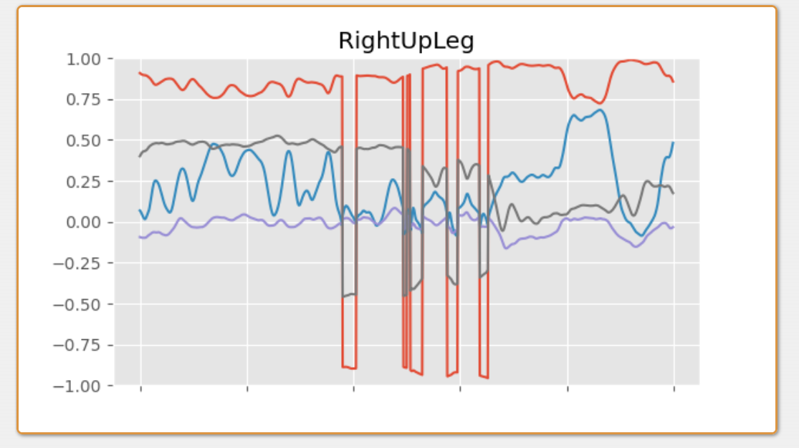
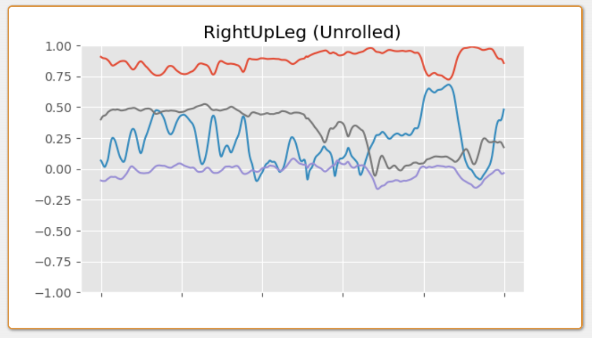

转载出处：https://www.daniel-holden.com/page/joint-limits

# Joint Limits

Created on Nov. 6, 2021, 11:24 a.m.

My previous post on [visualizing rotation spaces](https://theorangeduck.com/page/visualizing-rotation-spaces) got me thinking that it would be nice to write something about joint limits - because a lot of the intuition for how to implement and work with joint limits comes from how we understand rotation spaces.

But what do I mean when I say joint limits? Well essentially joint limits are when we constrain the rotation of a character's joints to within a specified range. And while some of you might be familiar with joint limits as used in physics engines (where constraints between rigid bodies can allow for limiting the amount of relative rotation permitted), I would guess many of you have not considered the use of joint limits in a purely kinematic sense - something which is both interesting and useful.

More specifically, we're going to see how we can represent joint limits as **projection** functions - functions which take some rotation and map it onto the nearest rotation which respects the limit. And those projection functions we're going to build automatically by looking at data of an actor moving their joints. In other words, we're going to be **data-driven**...

---

## Data-Driven

Joint limits provide a good example of the strengths of being data-driven. But what do I mean by that?

Well, when we want to implement a feature such as joint limits we can approach it from different perspectives. We can try to be **artist-driven**, and build the best tools possible to allow artists and animators to use their knowledge to describe in some shape or form the limits they want at each joint of the character. But this is tricky - **abstract** concepts like joint limits are notoriously difficult to translate from an animator's head into concrete parameters which can be input into a mathematical system. Then, even with good tools, doing so **takes time**, and trial and error as animators must check that the inputs they used produce results which match their expectations. Thirdly, if anything changes or there are multiple characters, the animators may need to **repeat** the process several times. And finally, even the best animators may not have a completely **accurate** understanding of the real joint limits of a specific character or actor.

> &#x2705; 由艺术家来定义joint limits可能带来的问题：  
> 1. 抽象的概念难以转化为具体的数值  
> 2. 花时间，且工作不可复用  
> 3. 艺术家也不可能定义出精确的数值  

Alternatively, we can try to build a system which uses *data* to automatically compute the joint limits for a given actor. More specifically, we can make a system which takes as input one or more motion capture clips containing ranges of motion, and outputs the limits. Not only can this process be fully automated, but it should be more accurate, easier to re-run if parameters change, and scales if we want to apply the same process to a large variety of actors or characters.

> &#x2705; 我对此存疑。  
> 既然是针对特定角色所定义的，哪里得到这个特定角色的大量数据呢？  
> 动捕确实可以得到数据，但只是动捕中之人的数据，或者说是根据中之人精确建模的角色的数据，不是这个特定角色的数据。  

Also important to note is that the element of control is not lost by taking a data-driven view - and these two approaches are not an *either-or* decision. If animators wish to edit the joint limits manually they now simply have two options: either edit the raw motion capture data itself, or edit the results of the automatic system, which can be seen as a default setting to be further adjusted using the tools developed for an artist-driven approach.

> &#x2705; 艺术家不直接定义joint limits，而是通过优化动作数据来优化joint limits.

---

## Relative Rotation and Quaternion Unrolling

If we want to understand how to create *projection functions* from animation data, we first need to understand our data in a little more depth - and more specifically - if we have an animation consisting of a stream of quaternions encoding the local rotation of each joint, we need to understand what those quaternions actually represent.

Because, when we think about rotations, and quaternions specifically, we often think about them in two different contexts - first as succinctly encoding the rotation of an object in the world, and second, as encoding a *relative* rotation between two things.

Quaternions also have the property of [double-cover](https://www.daniel-holden.com/page/visualizing-rotation-spaces), meaning that you can represent both a rotation of +90 degrees and -270 degrees around an axis, using two different quaternions (even though these two rotations end up producing the same result in the end).

> &#x2705; 四元数的四项为(w, x, y, z)，把w和（x, y, z）分别取反，表示的是相同的旋转。  

This property is usually annoying in the context of thinking about absolute rotations of objects in the world as it means we have two different encodings for rotating an object in what is essentially the same way. However, this property can be useful in the case of relative rotations, as it allows us to distinguish between a rotation "going the long way around", and one "going the short way around".

>  &#x2705; 当用四元数来表示一种旋转状态时，两个不同的编码描述同一个状态是麻烦的。当用四元数来表示一种旋转过程时，两个不同的编码代表两个不同的旋转方式，是有用的。  

And this is exactly the case for when we want to limit the local joint rotations of a character. Here we definitely *do* want to distinguish between rotating an arm around by 90 degrees, and rotating it by 270 degrees in the opposite direction.

But if we consider local joint rotations as *relative* rotations, what exactly are they *relative to*. Well - odd as it may sound, they're relative to *the identity* rotation - or in other words they're relative to the pose of the character we get if we set all the local joint rotations to the identity.

> &#x2705; 由于reference pose的定义有可能不同，直接使用local rotation可能是有歧义的。  

And, if we actually do this, due to the way many character skeletons are constructed, we usually don't get something that makes much sense. For example, here is the skeleton from [this dataset](https://github.com/ubisoft/ubisoft-laforge-animation-dataset) with all the joint rotations set to the identity.

<iframe 
src="./assets/IdentityPose.m4v" 
scrolling="no" 
border="0" 
frameborder="no" 
framespacing="0" 
allowfullscreen="true" 
height=600 
width=800> 
</iframe>

This is because 3d software packages usually don't place any particular importance on this "identity pose", or may want to have all joints translating along a specific axis by default - both of which can mean the "identity pose" is not meaningful.

So when we talk about joint limits, we want to instead think of our rotations as being relative to something else - some meaningful pose such as a T-Pose, an average pose, or the pose which was used to skin the character mesh:

> &#x2705; reference pose怎么定义不重要，关键是要统一。  

<iframe 
src="./assets/ReferencePose.m4v" 
scrolling="no" 
border="0" 
frameborder="no" 
framespacing="0" 
allowfullscreen="true" 
height=600 
width=800> 
</iframe>

We can find joint rotations relative to this pose simply by multiplying by the inverse of the rotation at this reference pose on the left:

> &#x2705; 不同的reference pose会有不同的“the rotation at this reference pose”  

```c++
rotation = quat_inv_mul(reference_rotation, rotation)
```

But this has only fixed half of our problem - because depending on exactly where our data comes from and how it was processed, these relative rotations may still contain a mix of quaternions from each cover - and there could be jumps in the data where the cover suddenly switches i.e. where we suddenly start encoding rotations as -270 degrees rather than +90 degrees.

> &#x2753; 上面这个方法，只能保证最后到达的状态是对的，不能保证转过去的路径是一致的。  

If we look (with playback sped up) at the following motion capture clip (which we are going to use as the *range of motion* in this article) we might not see anything wrong.

<iframe 
src="./assets/JointLimitAnimation.m4v" 
scrolling="no" 
border="0" 
frameborder="no" 
framespacing="0" 
allowfullscreen="true" 
height=600 
width=800> 
</iframe>

But if we plot the raw quaternion values of the local joint rotations relative to our reference pose, we can see that there are discontinuities and the quaternion cover is flipping at various frames:

 

If we want to fix this we need to do two things. **First, we need to pick a cover for the very first frame in our animation. In this case we can force it to be the relative rotation "going the short way around" from the reference pose using (what I call) the `quat_abs` function. Next, we can "unroll" the rest of the rotations, removing any sudden switches of cover by ensuring each frame uses the quaternion closest to the rotation of the previous frame** (in this code `slice1d` is a basic array-like type using `()` for indexing):

```c++
quat quat_abs(quat x)
{
    return x.w < 0.0 ? -x : x;
}

void quat_unroll_inplace(slice1d<quat> rotations)
{
    // Make initial rotation be the "short way around"
    rotations(0) = quat_abs(rotations(0));
    
    // Loop over following rotations
    for (int i = 1; i < rotations.size; i++)
    {
        // If more than 180 degrees away from previous frame 
        // rotation then flip to opposite hemisphere
        if (quat_dot(rotations(i), rotations(i - 1)) < 0.0f)
        {
            rotations(i) = -rotations(i);
        }
    }
}
```

This allows for relative rotations of more than 180 degrees compared to the reference pose, but only when they actually happen in the data. So now, for each frame, we have the rotation relative to the reference pose accounting for double cover and the fact that the "identity pose" is in most cases meaningless:

 

If we convert these rotations into the [scaled angle axis](https://theorangeduck.com/page/exponential-map-angle-axis-angular-velocity) representation, we end up with a 3d vector. And if we plot this for every frame in our dataset, we can get a *distribution of rotations* for each joint - we can see the full set of rotations used by each joint in our motion capture data. And the region where we have points describes the space of valid rotations for a particular joint - in other words - the joint limit. Here you can see these plots visualized for various different joints:

<iframe 
src="./assets/JointRotationPlot.m4v" 
scrolling="no" 
border="0" 
frameborder="no" 
framespacing="0" 
allowfullscreen="true" 
height=600 
width=800> 
</iframe>

Because this data is so dense we probably want to sub-sample it. Here I use an inefficient yet simple function that just builds up a list of samples by checking each new sample against all the existing ones for closeness.

```c++
// Subsamples a set of `points`. Returns the 
// number of subsampled points. Output array 
// `subsampled` must be large enough for the 
// case where all points are returned. 
int subsample_naive(
    slice1d<vec3> subsampled,
    const slice1d<vec3> points,
    const float distance_threshold = 0.05f)
{
    int count = 0;
    
    // Include first point
    subsampled(count) = points(0);
    count++;
    
    // Loop over other points
    for (int i = 1; i < points.size; i++)
    {
        // Include if no other subsampled point is within
        // `distance_threshold` of this point
        bool include = true;
        for (int j = 0; j < count; j++)
        {
            if (length(subsampled(j) - points(i)) < distance_threshold)
            {
                include = false;
                break;
            }
        }
        
        if (include)
        {
            // Add point and increment count
            subsampled(count) = points(i);
            count++;
        }
    }
    
    // Return number of subsampled points
    return count;
}
```

This gives us sub-sampled data which is a bit more evenly distributed in our space. We can also see what movement in this space looks like as we rotate the character's joints, as shown in pink below.

<iframe 
src="./assets/JointRotationSubsample.m4v" 
scrolling="no" 
border="0" 
frameborder="no" 
framespacing="0" 
allowfullscreen="true" 
height=600 
width=800> 
</iframe>

We can see already when we are rotating a joint beyond the limit. However, what we have here are just data points. If we actually want to do something, such as limiting rotations to be within this region, we need to turn this data into a projection function.

---

## Projection Functions

There are a few operations we might want to perform when it comes to joint limits - we might want to check if a particular rotation is within the limit; we might want to see *how much* a rotation is violating a limit; and we might want to constrain a rotation which is violating a limit to the nearest valid rotation that respects the limit.

> &#x2705;
> (1) f(R) =  True/False  
> (2) f(R) = distance  
> (3) f(R) = R'  // projection function

Luckily, the first two of these operations are easy given the third one. If we have this function we can check if a rotation is inside the limit by seeing if the projection function changes it, and see how much a rotation is outside the limit by measuring *how much* the projection function changes it.

But first we need to pick a specific kind of projection function to use, and work out how to fit the parameters of this projection function to the data we are providing. We'll start with the most simple: rectangular projection.

---

## Rectangular Projection

### AABB

> &#x2705; 优点：简单。缺点：不准确。  

For rectangular projection we fit what is essentially an axis-aligned bounding box to the data by taking the min and max along each dimension.

```c++
void fit_rectangular_limits_basic(
    vec3& limit_min,
    vec3& limit_max,
    const slice1d<vec3> limit_space_rotations,
    const float padding = 0.05f)
{
    // Set limits to opposite float min and max
    limit_min = vec3(FLT_MAX, FLT_MAX, FLT_MAX);
    limit_max = vec3(FLT_MIN, FLT_MIN, FLT_MIN);
  
    for (int i = 0; i < limit_space_rotations.size; i++)
    {
        // Find min and max on each dimension
        limit_min = min(limit_min, limit_space_rotations(i));
        limit_max = max(limit_max, limit_space_rotations(i));
    }
    
    // Add some padding if desired to expand limit a little
    limit_min -= vec3(padding, padding, padding);
    limit_max += vec3(padding, padding, padding);
}
```

And then to project a point onto the surface of the bounding box we simply clamp it to these ranges.

```c++
vec3 apply_rectangular_limit_basic(
    const vec3 limit_space_rotation,
    const vec3 limit_min,
    const vec3 limit_max)
{
    return clamp(limit_space_rotation, limit_min, limit_max);
}
```

This already does a fair job at constraining rotations, but doesn't provide a very tight fit - it allows many rotations far from what we had in our data - as you can see if we visualize the result of this projection:

<iframe 
src="./assets/ProjectionRectangular.m4v" 
scrolling="no" 
border="0" 
frameborder="no" 
framespacing="0" 
allowfullscreen="true" 
height=600 
width=800> 
</iframe>

### OBB

> &#x2705; 优点：比AABB更紧凑的表达。缺点：在边界处不平滑。  

We can make the fit a bit tighter by using an oriented bounding box instead. To orient the bounding box we can use [SVD](https://en.wikipedia.org/wiki/Singular_value_decomposition) to find the "orientation" of our data within the 3d space. Here I'm going to use the [power iteration method](https://towardsdatascience.com/simple-svd-algorithms-13291ad2eef2). This method is not particularly robust, fast, or accurate but it does at least have a relatively short and simple implementation in 3d.

> &#x2705; 一个OBB可以看作是一个立方体经过旋转和形变得到。SVD就是求出这个旋转和形变。  

```c++
vec3 mat3_svd_dominant_eigen(
    const mat3 A, 
    const vec3 v0,
    const int iterations, 
    const float eps)
{
    // Initial Guess at Eigen Vector & Value
    vec3 v = v0;
    float ev = (mat3_mul_vec3(A, v) / v).x;
    
    for (int i = 0; i < iterations; i++)
    {
        // Power Iteration
        vec3 Av = mat3_mul_vec3(A, v);
        
        // Next Guess at Eigen Vector & Value
        vec3 v_new = normalize(Av);
        float ev_new = (mat3_mul_vec3(A, v_new) / v_new).x;
        
        // Break if converged
        if (fabs(ev - ev_new) < eps)
        {
            break;
        }
        
        // Update best guess
        v = v_new;
        ev = ev_new;
    }
    
    return v;
}

void mat3_svd_piter(
    mat3& U,
    vec3& s,
    mat3& V,
    const mat3 A, 
    const int iterations = 64,
    const float eps = 1e-5f)
{
    // First Eigen Vector
    vec3 g0 = vec3(1, 0, 0);
    mat3 B0 = A;
    vec3 u0 = mat3_svd_dominant_eigen(B0, g0, iterations, eps);
    vec3 v0_unnormalized = mat3_transpose_mul_vec3(A, u0);
    float s0 = length(v0_unnormalized);
    vec3 v0 = s0 < eps ? g0 : normalize(v0_unnormalized);

    // Second Eigen Vector
    mat3 B1 = A;
    vec3 g1 = normalize(cross(vec3(0, 0, 1), v0));
    B1 = B1 - s0 * mat3_outer(u0, v0);
    vec3 u1 = mat3_svd_dominant_eigen(B1, g1, iterations, eps);
    vec3 v1_unnormalized = mat3_transpose_mul_vec3(A, u1);
    float s1 = length(v1_unnormalized);
    vec3 v1 = s1 < eps ? g1 : normalize(v1_unnormalized);
    
    // Third Eigen Vector
    mat3 B2 = A;
    vec3 v2 = normalize(cross(v0, v1));
    B2 = B2 - s0 * mat3_outer(u0, v0);
    B2 = B2 - s1 * mat3_outer(u1, v1);
    vec3 u2 = mat3_svd_dominant_eigen(B2, v2, iterations, eps);
    float s2 = length(mat3_transpose_mul_vec3(A, u2));
    
    // Done
    U = mat3(u0, u1, u2);
    s = vec3(s0, s1, s2);
    V = mat3(v0, v1, v2);
}
```

Then, the bounding box location is given by the average point in the space, while the bounding box orientation is given by applying SVD to the inner product of the points, and taking the transpose of the `V` matrix.

```c++
void fit_limit_orientations(
    vec3& limit_position,
    mat3& limit_rotation,
    const slice1d<vec3> limit_space_rotations)
{
    limit_position = vec3();
  
    // Compute Average Position
    for (int i = 0; i < limit_space_rotations.size; i++)
    {
        limit_position = limit_position + 
            limit_space_rotations(i) / limit_space_rotations.size;
    }
    
    // Compute Inner Product
    mat3 inner_product = mat3_zero();
    
    for (int i = 0; i < limit_space_rotations.size; i++)
    {
        vec3 v = limit_space_rotations(i) - limit_position;
      
        inner_product = inner_product + mat3(
            v.x * v.x, v.x * v.y, v.x * v.z,
            v.y * v.x, v.y * v.y, v.y * v.z,
            v.z * v.x, v.z * v.y, v.z * v.z) / limit_space_rotations.size;
    }
    
    // Perform SVD to extract rotation
    vec3 s;
    mat3 U, V;
    mat3_svd_piter(U, s, V, inner_product);
    
    limit_rotation = mat3_transpose(V);
}
```

Once we have the position and orientation computed we need to transform our points by the inverse of this orientation and position (to align and center them) before computing the min and max.

```c++
void fit_rectangular_limits(
    vec3& limit_min,
    vec3& limit_max,
    const vec3 limit_position,
    const mat3 limit_rotation,
    const slice1d<vec3> limit_space_rotations,
    const float padding = 0.05f)
{
    limit_min = vec3(FLT_MAX, FLT_MAX, FLT_MAX);
    limit_max = vec3(FLT_MIN, FLT_MIN, FLT_MIN);
  
    for (int i = 0; i < limit_space_rotations.size; i++)
    {
        // Inverse transform point using position and rotation
        vec3 limit_point = mat3_transpose_mul_vec3(
            limit_rotation,
            limit_space_rotations(i) - limit_position);
      
        limit_min = min(limit_min, limit_point);
        limit_max = max(limit_max, limit_point);
    }
    
    limit_min -= vec3(padding, padding, padding);
    limit_max += vec3(padding, padding, padding);
}
```

For projection we do the same thing, transforming back again after clamping.

```c++
vec3 apply_rectangular_limit(
    const vec3 limit_space_rotation,
    const vec3 limit_min,
    const vec3 limit_max,
    const vec3 limit_position,
    const mat3 limit_rotation)
{
    // Inverse transform point using position and rotation
    vec3 limit_point = mat3_transpose_mul_vec3(
        limit_rotation,
        limit_space_rotation - limit_position);
        
    // Clamp point
    limit_point = clamp(limit_point, limit_min, limit_max);
    
    // Transform point using position and rotation
    return mat3_mul_vec3(limit_rotation, limit_point) + limit_position;
}
```

This oriented bounding box provides a tighter fit:

<iframe 
src="./assets/ProjectionOriented.m4v" 
scrolling="no" 
border="0" 
frameborder="no" 
framespacing="0" 
allowfullscreen="true" 
height=600 
width=800> 
</iframe>

However there is a discontinuity around the box corners and edges where visually it looks like the projected rotation is suddenly changing direction. Are there any other shapes we can try that may be smoother?

---

## Elliptical Projection

> &#x1F50E; Elliptical：椭球   
> &#x2705; 优点：边界平滑。期望改进：让封闭球再紧凑一点。

What about fitting an ellipsoid? Here we can again use SVD to extract the orientation, and then use the displacement on each axis to estimate a scale. Finally, we need to scale the overall ellipsoid to ensure all points are within it:

```c++
void fit_ellipsoid_limits(
    vec3& limit_scale,
    const vec3 limit_position,
    const mat3 limit_rotation,
    const slice1d<vec3> limit_space_rotations,
    const float padding = 0.05f)
{   
    // Estimate Scales
    limit_scale = vec3(padding, padding, padding);
  
    for (int i = 0; i < limit_space_rotations.size; i++)
    {
        vec3 limit_point = mat3_transpose_mul_vec3(
            limit_rotation,
            limit_space_rotations(i) - limit_position);
      
        limit_scale = max(limit_scale, abs(limit_point));
    }
    
    // Compute required radius
    float radius = 0.0f;
    for (int i = 0; i < limit_space_rotations.size; i++)
    {
        vec3 limit_point = mat3_transpose_mul_vec3(
            limit_rotation,
            limit_space_rotations(i) - limit_position);
      
        radius = maxf(radius, length(limit_point / limit_scale));
    }
    
    // Scale by required radius
    limit_scale = max(radius * limit_scale, vec3(padding, padding, padding));
}
```

Once we have the ellipsoid scale computed, the function for projection onto an ellipsoid surface is surprisingly tricky as it [has no closed form solution](https://www.geometrictools.com/Documentation/DistancePointEllipseEllipsoid.pdf). But, there is [a gradient based method](https://github.com/nedelec/Orthogonal-Projection-on-Ellipsoid) we can use which converges in just a few iterations.

```c++
vec3 apply_ellipsoid_limit(
    const vec3 limit_space_rotation,
    const vec3 limit_scale,
    const vec3 limit_position,
    const mat3 limit_rotation,
    const int iterations = 8,
    const float eps = 1e-5f)
{
    // Inverse transform point using position and rotation
    vec3 limit_point = mat3_transpose_mul_vec3(
        limit_rotation,
        limit_space_rotation - limit_position);
    
    // If already inside ellipsoid just return
    if (length(limit_point / limit_scale) <= 1.0f)
    {
        return limit_space_rotation;
    }
    
    vec3 ss = limit_scale * limit_scale + eps;

    float ss_mid = (ss.y < ss.x) ? 
        (ss.z < ss.x ? ss.x : ss.z) : 
        (ss.z < ss.y ? ss.y : ss.z);
    
    float hmin = sqrtf(dot(limit_point * limit_point, ss * ss) / ss_mid) - ss_mid;
    hmin = maxf(hmin, (fabs(limit_point.x) - limit_scale.x) * limit_scale.x);
    hmin = maxf(hmin, (fabs(limit_point.y) - limit_scale.y) * limit_scale.y);
    hmin = maxf(hmin, (fabs(limit_point.z) - limit_scale.z) * limit_scale.z);

    if (dot(limit_point, limit_point / ss.x) > 1.0f && hmin < 0.0f)
    {
        hmin = 0;
    }

    float h = hmin;
    float hprev;

    // Iterations of Newton-Raphson
    for (int i = 0; i < iterations; i++)
    {
        vec3 wa = limit_point / (ss + h);
        vec3 pp = wa * wa * ss;

        hprev = h;
        h = h - (1.0f - sum(pp)) / (2.0f * sum(pp / (ss + h)));

        if (h < hmin)
        {
            h = 0.5f * (hprev + hmin);
            continue;
        }
        
        if (h <= hprev)
        {
            break;
        }
    }

    // Project onto surface
    limit_point = limit_point * ss / (ss + h);
    
    // Transform point using position and rotation
    return mat3_mul_vec3(limit_rotation, limit_point) + limit_position;
}
```

And here we can see it visualized on the character:

<iframe 
src="./assets/ProjectionEllipsoid.m4v" 
scrolling="no" 
border="0" 
frameborder="no" 
framespacing="0" 
allowfullscreen="true" 
height=600 
width=800> 
</iframe>

While the ellipsoid gives a nice smooth limit, and a good fit when the data is distributed nicely, it's not very tight when the data is a weird shape. What else can we try?

---

## K-Dop Projection

> &#x1F50E; K-Dop：K面体  
> &#x2705; 优点：紧凑。缺点：边界不太平滑。

We can also try the so-called [K-Dop](http://www.sccg.sk/~samuelcik/dgs/04_en.pdf), which essentially consists of shape described by an arbitrary number of planes aligned on different axes. When we fit this shape we essentially store the min and max of our data along each of these axes.

```c++
void fit_kdop_limits(
    slice1d<float> limit_mins,
    slice1d<float> limit_maxs,
    const vec3 limit_position,
    const mat3 limit_rotation,
    const slice1d<vec3> limit_space_rotations,
    const slice1d<vec3> limit_kdop_axes,
    const float padding = 0.05f)
{
    // Set limits to opposite float min and max
    limit_mins.set(FLT_MAX);
    limit_maxs.set(FLT_MIN);
  
    for (int i = 0; i < limit_space_rotations.size; i++)
    {
        // Inverse transform point using position and rotation
        vec3 limit_point = mat3_transpose_mul_vec3(
            limit_rotation,
            limit_space_rotations(i) - limit_position);
        
        for (int k = 0; k < limit_kdop_axes.size; k++)
        {   
            // Find how much point extends on each kdop axis
            float limit_point_proj = dot(limit_kdop_axes(k), limit_point);
            limit_mins(k) = minf(limit_mins(k), limit_point_proj);
            limit_maxs(k) = maxf(limit_maxs(k), limit_point_proj);
        }
    }
    
    // Add some padding if desired to expand limit a little
    for (int k = 0; k < limit_kdop_axes.size; k++)
    {
        limit_mins(k) -= padding;
        limit_maxs(k) += padding;
    }
}
```

We can then use these limits to clamp the point along each of the specified axes.

```c++
vec3 apply_kdop_limit(
    const vec3 limit_space_rotation,
    const slice1d<float> limit_mins,
    const slice1d<float> limit_maxs,
    const vec3 limit_position,
    const mat3 limit_rotation,
    const slice1d<vec3> kdop_axes)
{   
    // Inverse transform point using position and rotation
    vec3 limit_point = mat3_transpose_mul_vec3(
        limit_rotation,
        limit_space_rotation - limit_position);
        
    for (int k = 0; k < kdop_axes.size; k++)
    {   
        // Clamp point along given axes
        vec3 t0 = limit_point - limit_mins(k) * kdop_axes(k);
        vec3 t1 = limit_point - limit_maxs(k) * kdop_axes(k);
        limit_point -= minf(dot(t0, kdop_axes(k)), 0.0f) * kdop_axes(k);
        limit_point -= maxf(dot(t1, kdop_axes(k)), 0.0f) * kdop_axes(k);
    }
    
    // Transform point using position and rotation
    return mat3_mul_vec3(limit_rotation, limit_point) + limit_position;
}
```

A set of axes I like to use are each of the primary axes as well as all corners and edges to produce a shape like a [rhombicuboctahedron](https://en.wikipedia.org/wiki/Rhombicuboctahedron):

> &#x1F50E; rhombicuboctahedron：菱方八面体  

<iframe 
src="./assets/ProjectionKDop.m4v" 
scrolling="no" 
border="0" 
frameborder="no" 
framespacing="0" 
allowfullscreen="true" 
height=600 
width=800> 
</iframe>

As you can see, this definitely gives better bounds than before, but the edges are still a bit sharp as with the bounding box.

---

## Softening

Right now our projection functions are not very smooth when they move around the different faces of the surface, and there is a sudden locking of the rotation when the joint limit becomes violated. Instead we can "soften" them by not entirely projecting points completely back onto the surface but instead **giving some leeway when the projection is from very far**.

My little recipe for this is to saturate the projection distance with a `tanh` function, and use it to decide how much of some fixed addition radius to add around the limit surface.

```c++
vec3 projection_soften(
    const vec3 original_position,
    const vec3 projected_position,
    const float falloff = 1.0f,
    const float radius = 0.1f,
    const float eps = 1e-5f)
{
    float distance = length(projected_position - original_position);
    
    if (distance > eps)
    {
        // Compute how much softening to apply up to `radius`
        float softening = tanhf(falloff * distance) * radius;
        
        // Add softening toward original position
        return projected_position + 
            normalize(original_position - projected_position) * softening;
    }
    else
    {
        // No projection applied
        return projected_position;
    }
}
```

This nicely softens our limits, making transitions between faces of the limit surface smoother as well as allowing some small deviation from the limit when projecting large violations:

<iframe 
src="./assets/ProjectionSoften.m4v" 
scrolling="no" 
border="0" 
frameborder="no" 
framespacing="0" 
allowfullscreen="true" 
height=600 
width=800> 
</iframe>

---

## Swing-Twist Decomposition

There is a nice way to decompose our relative rotations which in some cases allows for **tighter** and **more natural** limits. We can decompose our rotations into two separate rotations; one consisting of a **twist around an axis**, and one consisting of a **swing about that axis**. If we choose the axis extending toward the primary child joint we get a very natural decomposition for our rotations. For quaternions this swing twist decomposition can be implemented as follows:

```c++
void quat_swing_twist(
    quat& swing,
    quat& twist,
    const quat q,
    const vec3 axis)
{
    vec3 p = dot(vec3(q.x, q.y, q.z), axis) * axis;
    twist = quat_normalize(quat(q.w, p.x, p.y, p.z));
    swing = -quat_mul_inv(q, twist);
}
```

To get the twist axes we need to look at the extension of the child joints:

```c++
void compute_twist_axes(
    slice1d<vec3> twist_axes,
    const slice1d<vec3> reference_positions,
    const slice1d<int> bone_parents,
    const vec3 default_twist_axis = vec3(1, 0, 0),
    const float eps = 1e-8f)
{
    twist_axes.zero();
    
    for (int i = 0; i < bone_parents.size; i++)
    {
        // Compute average extension of child bones
        for (int j = 0; j < bone_parents.size; j++)
        {
            if (bone_parents(j) == i)
            {
                twist_axes(i) = twist_axes(i) + reference_positions(j);
            }
        }

        // If children found normalize, otherwise use default axis
        if (length(twist_axes(i)) > eps)
        {
            twist_axes(i) = normalize(twist_axes(i));
        }
        else
        {
            twist_axes(i) = default_twist_axis;
        }
    }
}
```

Then, we can decompose each of our joint rotations into two, and essentially repeat the whole process outlined above but for two rotations at each joint instead of one.

<iframe 
src="./assets/ProjectionSwingTwist.m4v" 
scrolling="no" 
border="0" 
frameborder="no" 
framespacing="0" 
allowfullscreen="true" 
height=600 
width=800> 
</iframe>

One interesting thing to notice is that swing-twist decomposition separates out the three degrees of freedom of the rotation. The twist rotation typically only varies in one direction so the data is distributed on a line, while the swing only moves in the two other axes, and so is distributed on a plane. If we wanted we could therefore use 1d and 2d versions of our joint limit functions, but since our current implementation deals with the degenerate cases well enough I wont cover that here.

---

## Inverse Kinematics

In general joint limits can be used to avoid bad posing produced by various other parts of the animation system such as blending, inertialization, or other procedural animation like inverse kinematics.

For example, here I rigged up a little demo with some very basic inverse kinematics showing how we can use the joint limits to ensure the character never produces a bad pose.

<iframe 
src="./assets/InverseKinematics.m4v" 
scrolling="no" 
border="0" 
frameborder="no" 
framespacing="0" 
allowfullscreen="true" 
height=600 
width=800> 
</iframe>

---

## Look-At

Here is another example. In this case I set up a basic procedural look-at system that rotates the spine and head toward the target:

<iframe 
src="./assets/LookAt.m4v" 
scrolling="no" 
border="0" 
frameborder="no" 
framespacing="0" 
allowfullscreen="true" 
height=600 
width=800> 
</iframe>

The movement is a bit exaggerated, but notice how with joint limits enabled the character exhausts their ability to rotate their spine before continuing to rotate their head. On the other hand, without joint limits the character rotates their spine beyond what is humanly possible.

---

## Other Applications

Although I only show two examples here, I think there are many more potential applications for joint limits. I'm certain they could be useful in IK systems such as [FABRIK](http://andreasaristidou.com/FABRIK.html), or in pseudo-physical systems such as [verlet physics ragdolls](https://www.cs.cmu.edu/afs/cs/academic/class/15462-s13/www/lec_slides/Jakobsen.pdf). They could also be useful in deep learning - such as in the loss function of a neural network generating animations.

There is also a link between what we are doing in this article and machine learning itself. Fitting a projection function from data is exactly the goal of a lot of modern machine learning (such as [denoising](https://towardsdatascience.com/denoising-autoencoders-explained-dbb82467fc2)), so there could be interesting ideas here such as training neural networks to learn to limit groups of joints rather than using geometric primitives.

One more thing I didn't mention is that this same process can be used to automatically compute the joint limits required for physically simulated characters such as the one shown in [DReCon](https://montreal.ubisoft.com/en/drecon-data-driven-responsive-control-of-physics-based-characters/), but converting these limits into the format required by the physics engine is a little finicky (and not that interesting) so I don't cover it here.

---

## Issues

One of the issues with doing joint limits in this way (which you may have already spotted in the videos) - is that it can be difficult to avoid the projection "switching sides" and causing a sudden large change to the pose.

You can think of it like this: when an angle of rotation goes over 180 degrees, and reaches 181 degrees, the fastest way to get back to zero becomes not to rotate it by -181 degrees, but to rotate it by a *further* +179 degrees instead. The very same thing can happen for our limits - the nearest rotation can suddenly jump to something very different when it passes "onto the other side" of the limit.

There are a few potential solutions to this - we can use the quaternion double cover to keep track of rotations that extend over 180 degrees from the limit at runtime. We can also try to smooth out or inertialize this switch if we can detect it. Overall, whatever hack we use, probably the most effective way is simply to try and avoid rotations which rotate more than 180 degrees away from the reference pose.

---

## Web Demo

If you want to have a fiddle around with anything shown in this article I've prepared a little web demo [here](https://www.daniel-holden.com/media/uploads/JointLimits/jointlimits.html).

---

## Source Code

All the code for the examples shown here can also be found on [this repo](https://github.com/orangeduck/Joint-Limits).

---

## Conclusion

I enjoyed writing this article because it combines a lot of things I like: an elegant and scalable data-driven solution to an interesting problem, some fun mathematics with a strong visual element, and some cool practical applications. I hope you've enjoyed it too, and perhaps it has spawned some ideas in your own heads about joint limits, or how data can be used to inform things like procedural animation, blending, and the other fundamental operations we do in animation. I'd love to hear if you come up with anything interesting. Until then, thanks for reading!