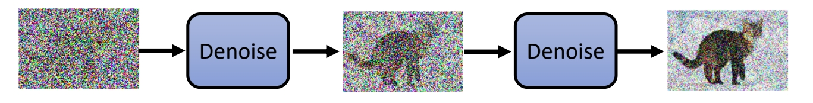
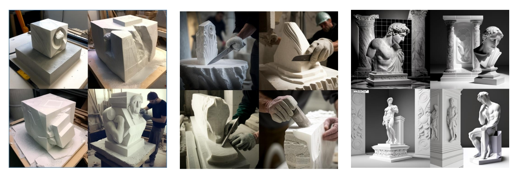
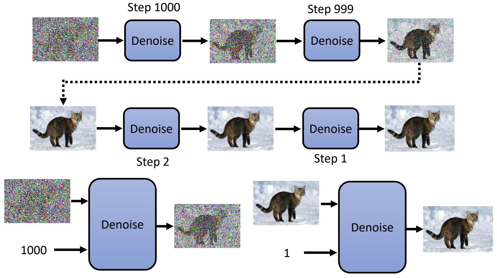
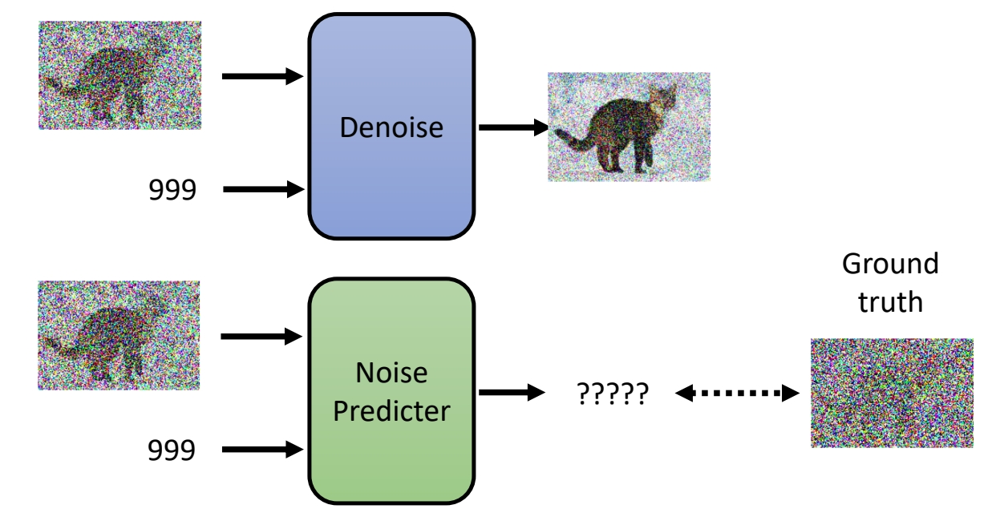
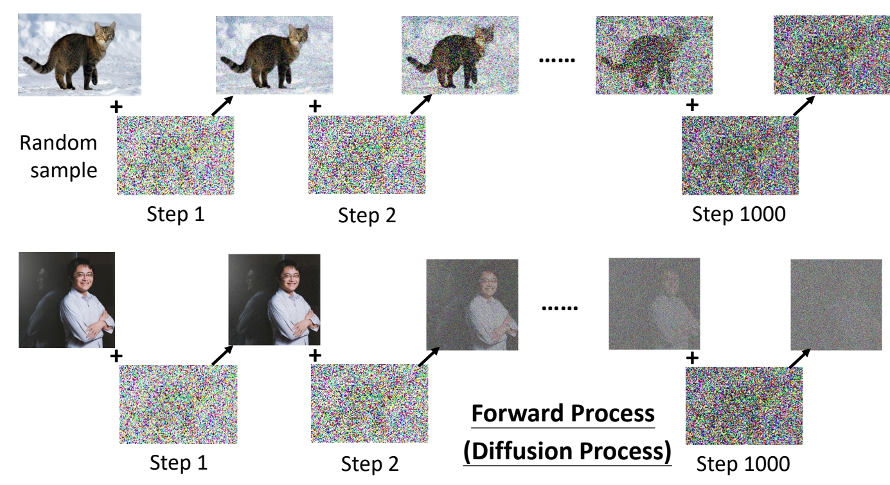
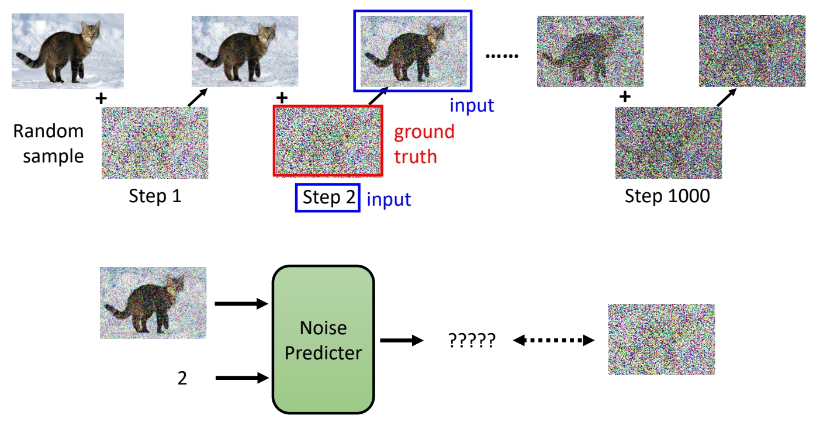
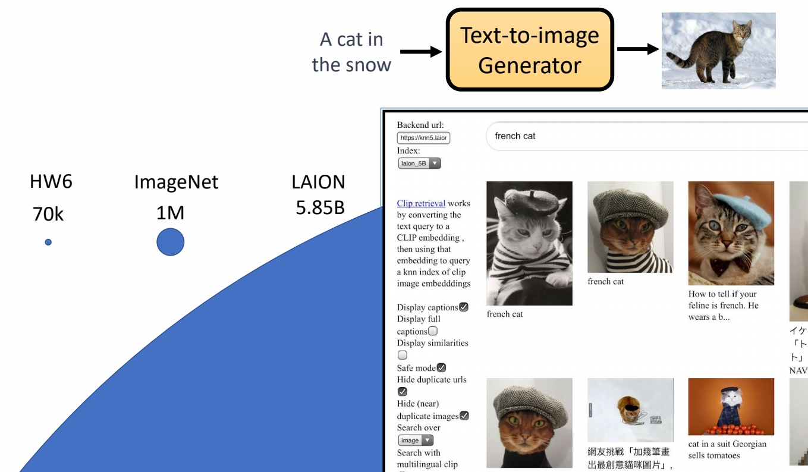
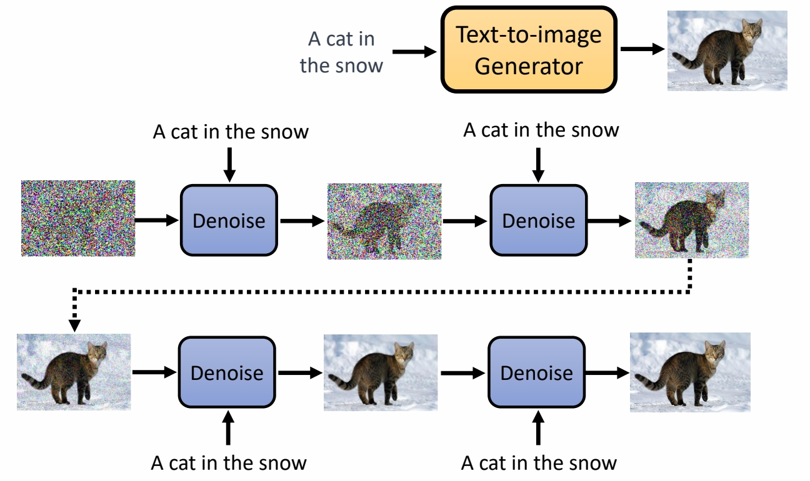
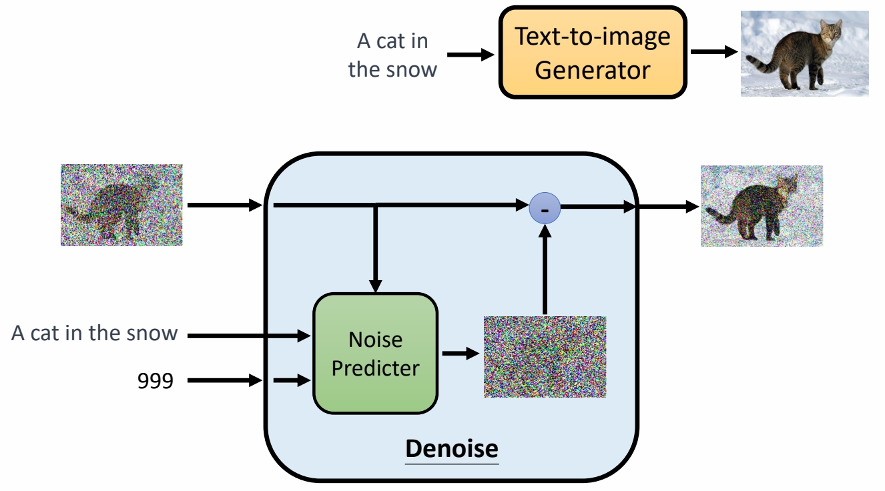
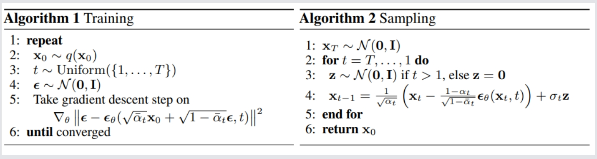

P1   
# Diffusion Model

Denoising Diffusion Probabilistic Models (DDPM)   
<https://arxiv.org/abs/2006.11239>    

P2   
## Diffusion Model 是如何運作的？

 

P3  

 

The sculpture is already complete within the marble block, before I start my work. It is already there, I just have to chisel away the superfluous material. **-Michelangelo**    

 

Powered by Midjourney   

P4   
 

P5   
## Denoise 模組內部實際做的事情

 

P6   
## 如何訓練 Noise Predictor 

 

P7    
 

P8    
 

P9    
## Text-to-Image 

<https://laion.ai/blog/laion-5b/>

 

P10   
## Text-to-Image 

 

P11
## Text-to-Image 

 

P12  
 

P13   
## Denoising Diffusion Probabilistic Models

 

P14   
## Diffusion Model

Denoising Diffusion Probabilistic Models (DDPM)   
<https://arxiv.org/abs/2006.11239>    

