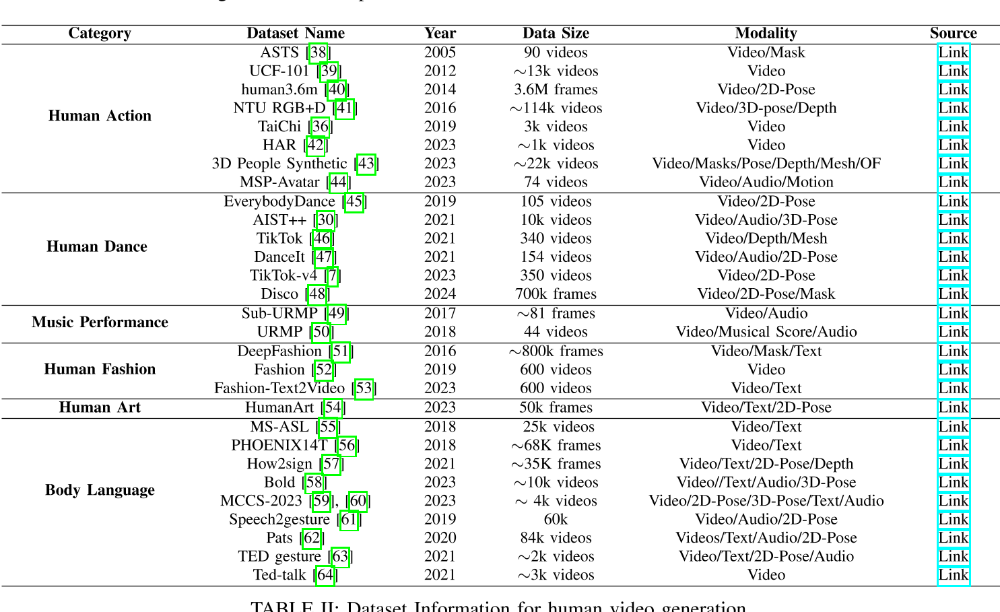

# 人类视频生成的基础知

# 关键子任务

根据驱动生成过程的模态将现有方法分为三类：文本驱动、音频驱动和姿势驱动

## 文本驱动的人类视频生成

讨论了如何使用文本描述来控制生成视频中的人类外观和动作。

|ID|Year|Name|Note|Tags|Link|
|---|---|---|---|---|---|
|1|2024|ID-Animator|To ensure the consistency of appearance in generated videos with the textual descriptions while preserving identity details during frames, ID-Animator [1] leverages a pre-trained textto-video (T2V) model with a lightweight face adapter to encode identity-relevant embeddings. |人体外观控制|
|2||Follow Your Pose|uses text descriptions to provide semantic information about the content of the characters, ensuring the generated videos align with the textual descriptions.|人体外观控制|
|83||HMTV|文本生成动作和相机运动，再生成图像|人体动作控制，2阶段方法|
|84|2020|SignSynth|Gloss2Pose文生动作，GAN动作生视频|人体动作控制，2阶段方法|
|85|2022|H-DNA| |人体动作控制，2阶段方法|
|86|2024|SignLLM|文本->GLoss->Pose->Video|人体动作控制，2阶段方法|
|89|2024||文本->GLoss->Pose->Video|人体动作控制，2阶段方法|
|53||Text2Performer|involves the motion text and a motion encoder. motion text describes the movement, such as "She is swinging to the right." The model implicitly models these descriptions by separately representing appearance and motion, thereby generating high-quality videos with consistent appearance and actions.|text作为prompt直接生成video|
||2024|Motion Avatar: Generate Human and Animal Avatars with Arbitrary Motion|使用交互式文本生成3D动作和3D Mesh，并用3D动作驱动3DMesh|文本控制，3D驱动|[link](https://caterpillarstudygroup.github.io/ReadPapers/39.html)   |

## 音频驱动的人类视频生成

语音驱动：要求生成的人体动作在高级语义方面及在情感和节奏方面与音频和谐。  
音乐驱动：合成一个人在给定的音乐片段引导下跳舞或演奏某种乐器的视频，关注于低级节拍对齐。

  

## 姿势驱动的人类视频生成

包括单条件姿势引导方法和多条件姿势引导方法。

### 2D动作驱动

|ID|Year|Name|Note|Tags|Link|
|---|---|---|---|---|---|
|37|2024|TCAN: Animating Human Images with Temporally Consistent Pose Guidance using Diffusion Models|通过修正attention map实现背景的时序稳定性|Diffusion|[link](https://caterpillarstudygroup.github.io/ReadPapers/37.html)|

### 视频动作驱动

|ID|Year|Name|Note|Tags|Link|
|---|---|---|---|---|---|
|53|2024|Implicit Warping for Animation with Image Sets|用driving视频中的人去驱动reference图像中的人，生成reference做与driving中相同动作的视频|人物视频生成，视频驱动，Cross Attention|[link](https://caterpillarstudygroup.github.io/ReadPapers/53.html)|

### 3D动作驱动

|ID|Year|Name|Note|Tags|Link|
|---|---|---|---|---|---|
|42|2024|HumanVid: Demystifying Training Data for Camera-controllable Human Image Animation|3D建模 + 3D重定向 + 渲染，动作控制+相机控制|人物视频生成，3D管线    |[link](https://caterpillarstudygroup.github.io/ReadPapers/42.html)|

### 虚拟换衣

|ID|Year|Name|Note|Tags|Link|
|---|---|---|---|---|---|
||2025|RealVVT: Towards Photorealistic Video Virtual Try-on via Spatio-Temporal Consistency|虚拟试衣|

# 数据集和评估指标

## 数据集

  

## 评估指标

[link](./VideoDiffusionModels/EvaluationMetrics.md)

# 挑战和难题

- 遮挡问题：身体部位重叠或多人遮挡很常见，但大多数模型不能很好地处理相互影响的问题[98]，[138]。
- Body Deformation
- 外观不一致
- 背景影响
- 时序不一致
- 不自然的姿势
- 文本驱动或语音驱动中，由于本身是一对多问题，可能受限于数据集而存在偏向性

# 影响生成质量的因素

## 生成范式。

与姿势驱动方法（可以视为一阶段方法）相比，文本和音频驱动方法可以分为一阶段和两阶段方法。前者直接使用输入文本或音频作为提示来指导人类视频生成，而后者从输入文本或音频生成姿势，然后使用这些生成的姿势作为信号来指导人类视频生成。在两阶段方法中引入各种姿势类型（例如骨架姿势）提供了额外的几何和语义信息，从而提高了视频运动的准确性和真实感。这使得两阶段方法明显比一阶段方法更有效，尽管会牺牲一些效率。

## backbone

SD 和 SVD 等扩散模型因其卓越的性能和多样性而广泛应用于各种生成任务，包括人类视频生成。然而，与在单个采样步骤中生成样本的 GAN 不同，扩散模型需要多个采样步骤，从而增加了训练和推理的时间成本。

## pose控制信号

不同类型的条件姿势之所以有效，是因为它们提供了补充信息。
- 骨骼姿势准确地描述了帧中人体的空间信息以及身体部位的相对位置。然而，它捕获离散的姿势变化而不是连续的运动细节，提供有限的时间连贯性。
- 光流本质上包括时间信息，捕获连续帧之间的变化并提供特征空间中的连续运动轨迹。这使得模型能够生成帧之间平滑过渡的视频，避免跳跃或不连续。
- 深度地图捕捉人体与背景之间的距离信息，以及表面细节和深度变化。
- 3D 网格提供了骨骼姿势所缺乏的物体表面的详细几何结构。

总之，不同类型的姿势提供互补的时空信息，并且不存在满足所有要求的统一姿势类型。不同的场景和问题可能需要不同的姿势。

# 未来研究方向

- 大规模高质量人类视频数据集
- 长视频生成
- 高保真视频生成
- 提高人类视频扩散模型的效率
- 细粒度可控性
- 交互性。

# Reference

1. https://arxiv.org/pdf/2407.08428
2. https://github.com/wentaoL86/Awesome-Human-Video-Generation