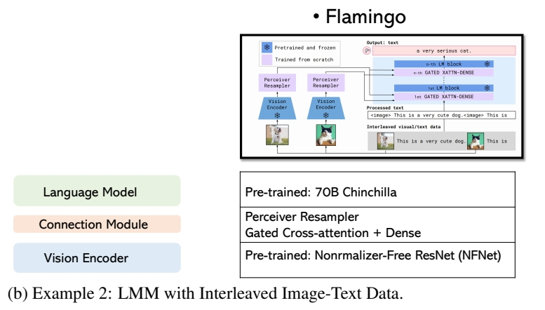
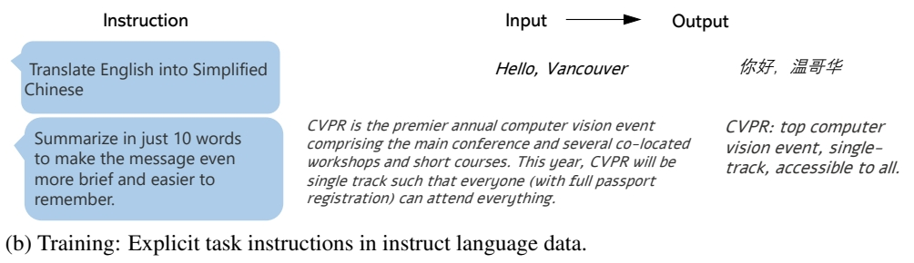

P1   
## Large Multimodal Models: Notes on CVPR 2023 Tutorial

**Chunyuan Li**   
Microsoft Research, Redmond    
<https://chunyuan.li>   

**Abstract**   

This tutorial note summarizes the presentation on **Large Multimodal Models: To-wards Building and Surpassing Multimodal GPT-4, a part of CVPR 2023 tutorial on Recent Advances in Vision Foundation Models**. The tutorial consists of three parts.   
We first **introduce the background on recent GPT-like large models for vision-and-language modeling** to motivate the research in instruction-tuned large multimodal models (LMMs). As a pre-requisite, **we describe the basics of instruction-tuning in large language models**, which is further extended to the multimodal space. Lastly, **we illustrate how to build the minimum prototype of multimodal GPT-4 like models**
with the open-source resource, and review the recently emerged topics.    

> &#x2753; GPT 是语言模型，为什么说它是多模态模型？   
> &#x2753; 什么是 instruction-tuning？    

P3   
## 1 Prologue   

In view of the rapid assimilation and widespread adoption of OpenAI ChatGPT [32]/GPT-4 [33] in contemporary society, there has been a growing interest among academics and researchers to develop open-source large language models (LLMs), and simultaneously explore the extensions into large multimodal models (LMMs)\\(^1\\). In order to elucidate this popular topic for a broader audience, in the CVPR 2023 tutorial on **Recent Advances in Vision Foundation Models**, we have provided a lecture on **Large Multimodal Models: Towards Building and Surpassing Multimodal GPT-4**, based on the public materials in the literature. This note summarizes the tutorial presentation and makes it more complete. It gives guided tours through the literature and explain topics to those who seek to learn the areas on LMMs from basics to the advances. It is prepared for audience including graduate students, researchers and professionals that LMMs are outside their specialties, to help them develop perspectives, and identify trends in LMMs in an accessible way.     

> &#x2705; 在本文中，LMM＝multimodal LLM   

  

In the full tutorial, as shown in Figure 2, we have covered the most recent approaches and principles at the frontier of learning and applying vision foundation models, **including** Q1: Visual and Vision-Language Pre-training; Q2: Generic Vision Interface; Q3: Alignments in Text-to-image Generation; Q4: Large Multimodal Models; and Q5: Multimodal Agents.   
This note **focuses** **on Q4: how to leverage LLM for multimodality, and train LMMs in an end-to-end fashion, so that the models can see and chat.** The presentation consists of three parts. To start, we first share background on recent GPT-like large models for vision-and-language modeling in Section 2. In the 2nd part, as a pre-requisite, we will introduce the concept of instruction tuning in language domains in Section 3, which empowered ChatGPT. Finally, Section 4 covers the last part of the presentation, where we focus on how to build a minimum version of multimodal GPT-4, using LLaVA as a running example. Since LMM is a popular research topic, many new papers have appeared in this line of research in the past three months, of which we provide a summary, so that the audience may quickly get a picture on what the LMM community has been working on.    
The related links of the tutorial presentation on large multimodal models are available at:    
 - *Slides*: <https://tinyurl.com/5c2c2mtm>      
 - *YouTube Video*: <https://youtu.be/mkI7EPD1vp8>    
 - *Bilibili Video*: <https://www.bilibili.com/video/BV1Ng4y1T7v3/>      
For the full information and other parts of the CVPR tutorial, please see the official website at:     
<https://vlp-tutorial.github.io/>    

P4   
## 2 Background   
### 2.1 Image-to-Text Generative Models

LMMs in their current form is primarily **an image-to-text generative model, which takes images as input, and outputs a text sequence.** One example is illustrated in Figure 3 (a) Left. All of the model variants share very similar model architecture and training objective.   
 - *Model Architecture*. As illustrated in Figure 3 (a) Right, the model typically consists of an **image encoder to extract visual features**, and **a language model to decode the text sequence**. The vision and language modalities can be **optionally connected by trainable connection module.** The image encoder and language model can be either trained from scratch or initialized from pre-trained models.    
 - *Training Objective*. As illustrated in Figure 3 (b), it typically employs an auto-regressive loss on the output text tokens. For the attention map in the Transformers [46], **image tokens can attend to each other, and the text token depends on and all image tokens and the previous text tokens.**

    
    

> &#x2705; 语言通常使用自回归方式，图像通常使用 attenion 方式。   

### 2.2 Case Studies  

We use some known LMMs as examples to illustrate how the network architecture framework can be instantiated in different models, while maintaining the same auto-regressive training objective.   

**Case Study I: LMM trained with image-text pairwise instances.** Most LMMs are trained on a large number of image-text pairs, where each training sample is a pair. GIT and BLIP2 are two large models that achieve state-of-the-art (SoTA) performance on many datasets. The comparisons are shown in Figure 4(a). GIT [48] initializes image encoder with constrastive pre-trained Microsoft Florence model, and train a language model from scratch. On the other hand, BLIP2 freezes the weights of pre-trained image and language model, and a train lightweight Q-former. **BLIP2 [20] shows higher sample-efficiency with the bootstrapping training method.**   

> &#x2705; GIT 对所有模块进行端到端训练。
> &#x2705; BLIP2 fix 已有模块，仅训练新增的 connection 模块。 

p5   

  

  

**Case Study II: LMM trained with interleaved image-text sequence instances.** We use Flamingo [1] as example, shown in Figure 4(b). It connect the frozen pre-trained image and language models – by adding novel architectural components in between. Specifically, **Perceiver Sampler module helps reduce compute complexity, and Gated Transformer module helps stabilize training in the initial stage.** Flamingo is trained on a mixture of complementary large-scale multimodal data coming only from the web, without using any data annotated for machine learning purposes. After this training is done, Flamingo can be directly adapted to vision tasks via simple few-shot learning without any additional task-specific tuning.    

> &#x2753; 这个数据集和 pair data 有什么区别？   
> &#x2705; Flamingo 的训练方式同 BLIP2．   

**Multimodal In-Context-Learning.** Beside the SoTA performance on dozens of academic bench￾marks, proabably the most appealing aspect of Flamingo is that it exhibits an emerged property: Multimodal In-Context-Learning. Specifically, **given a couple of image-text pairs as examples, Flamingo can zero-shot task transfer to new unseen problems, such as solving visual math problems**. This means Flamingo can tackle a number of difficult problems with just a handful of task-specific examples, **without any additional training required.** For example in Figure 5, two new tasks are presented to Flamingo. The top row provides two image-text pairs as the context in the prompt, where the text describes the name of the animal in the image, followed by the geographical information
of the animal. Flamingo is able to understand the patterns in the task instruction illustrated by the examples, and output the corresponding information for a new image. In the bottom row, the text first shows the optical character recognition (OCR) result of the image, followed by the arithmetic result. Flamingo learns the task instruction illustrated in the multimodal context, outputs the correct answer for a new math problem in the image. Therefore, Flamingo is generally considered as the GPT-3 moment [3] in the multimodal domain.    

> &#x2705; 对于新任务，不需要训练，只需要给几个例子就能学会。    
> &#x2753; Flamingo 有交互功能吗？怎样学习例子？   
> &#x2753; 这个特性与 In-Context-Learning 有什么关系？   

P6   
  

### 2.3 OpenAI Multimulti GPT4 and Research Gaps 

In March 2023, OpenAI released GPT-4 [33], with impressive capability in visual understanding and reasoning. Though the model details are unknown, there is no doubt that GPT4 enables many new scenarios, based on the examples highlighted the technique report. For instance, two popular visual examples are illustrated in Figure 6. The first one identifies the uncommon visual region and exhibits
strong complex reasoning performance. The second one recognizes text in the image and captures the mere across image-text. For a while, the research community had no clue how this new ability is achieved (probably because they are not tightened to any established academic tasks/datasets), but all are determined that these are exciting results. It naturally raise a question: How can we build Multimodal GPT-4 like models?     

  

To answer it, we start to review the big models from OpenAI, by highlighting the most appealing properties for each model in Figure 7. There are several key observations: (i) GPT-2 [38] is the auto-regressive counterpart in the BERT era [8] for the paradigm of pre-training then fine-tuning. Compared with GPT-2, GPT-3 [3] is a 175B model trained on web-scale text corpus, which exhibits two emerging properties with a frozen model: in-context-learning [3] and chain-of-thoughts (CoT) reasoning [53].. This means, without any additional training required, the model can tackle a wide range of new problems with just a few task-specific examples and by properly prompting it step-by-step, respectively. **It further leads to the paradigm from fine-tuning model weights to prompting**   

P7    

  

**frozen models, where the latter shows higher generality and lower adaptation cost in task transfer.** (ii) ChatGPT and InstructGPT [34] shows the importance of instruction-following and alignment with human intents for LLMs, by fine-tuning the base language model GPT-3/GPT-3.5 on high quality instruction-following data, and improving them with a reward model via reinforcement learning with human feedback. (iii) GPT-4 not only improves the language ability of previous models, but also allows visual signals as additional input for understanding and reasoning. We see that the newer generation model maintains/improves the existing properties of the previous ones, and enable new properties.   

> &#x2705; In-Context-learning 指通过新任务的例子学习新任务。   
> &#x2705; Instruction-Following 指通过理解任务描述完成新任务。 

In another words, from GPT-3 to GPT-4, we see two new properties: instruction-following and multimodal input. This reveals the gap between existing LMMs such as Flamingo and multimodal GPT-4: how to perform instruction-following and alignment research in the multimodal space. and thus the focus of this tutorial & note.    

P8   
## 3 Pre-requisite: Instruction Tuning in Large Language Models    

Note that instruction-following is a notion originated in natural language processing (NLP). To study the intuition and gain a full picture of the history, we revisit instruction tuning with LLMs.    

### 3.1 Instruction Tuning   
 
    
    
    
 
Traditional Language Data. As a typical data instance in NLP, seq2seq representation is quite common for many language tasks: each data instance consists of two parts: sequence as the input and sequence as the output. We provide two examples in Figure 8 (a). Without any task instruction specified, we know they are translation and summarization tasks, respectively.   

This seq2seq representation is also how NLP community used to use their data. **Task instructions are implicit**. Based on each data domain, **individual models are trained, or sometimes multi-tasking over multiple data domain without specifying the task instructions**. When such models are trained, they are **hard to generalize to new tasks in a zero-shot fashion**, because the models do not learn the skill to understand the task instruction, and have no ability to distinguish and generalize what task to perform in the testing stage.   

**Instruct Language Data.** Instead, recently researchers start to **explicitly add task instructions in the model training,** as shown in Figure 8 (b). Interestingly, the task instructions of most NLP tasks can be **expressed in natural language** as well. It leads a new data format: instruction-input-output triplets. Based on the new format, **one single model can be trained, multi-tasking with specified instructions.** Since models have observed many task instructions and many instances for each task in training, it **is natural and easy for the models to generalize to new tasks by task composition** in the inference stage.   

P8   
For example, in the evaluation stage, a new task that require both summarization and translation is provided in Figure 8 (c). Though the model has never seen this new task in training, it observes individual task basis, and learn to perform on new tasks. Note that we humans are always creating new tasks in our daily life, and presumably these new tasks would never been observed by models. It is thus appealing if a model is able to solve thousands of new tasks in the wild in without training. This is partially why ChatGPT is becoming popular and prevalent quickly.     

**3.2 Self-Instruct and Open-Source LLMs**    

How can we collect a diverse set of high-quality instruction-following data? There are two general schemes. One is human-human interaction, where humans (task providers) provide the annotation statement and requirements, based on which another group of humans complete the annotation tasks. such a scheme is typically cost and time consuming. The other scheme is human-machine interaction, where similarly **humans provide the annotation statement and requirements**, but it is now the **machines/models that complete the annotation tasks.**   

To enable LLMs to follow natural language instructions and complete real-world tasks, researchers have been exploring methods of **instruction-tuning** of LLMs. This is implemented by either fine-tuning the model on a wide range of tasks using human-annotated prompts and feedback [34], or supervised finetuning using public benchmarks and datasets augmented with manually or automatically generated instructions [52]. Among these methods, Self-Instruct tuning [51] is a simple and effective method of aligning LLMs to human intent, by **learning from instruction-following data generated by SoTA teacher LLMs.** It turns out that the line of instruction-tuning research has produced effective means to improve the zero and few-shot generalization abilities of LLMs. Self-instruct leverages the in-context-learning ability of LLM. The pipeline is illustrated in Figure 9. Humans create a few examples (i.e., seed examples) as the context, and ask LLM such as GPT-3 or GPT-4 to create more instruct and responses that follows the requirements stated in the prompt. The machine-generated instruction-following data can be further selected to construct with the prompt for in-context-learning in the next data generation iteration. The procedure iterates till a given number of samples are collected. Due to the relatively lower cost and higher response speed of API calls (compared with human annotations), self-instruct is becoming more favorable in the research community.    

> &#x2705; (1) 人工生成一些例子。 (2) LLM 通过例子学习任务。(3) LLM 生成新的问题并回答。（4）人工把生成结果变为数据。    

**Open-Source LLMs: LLaMA Family.** The open-source community has witnessed a surge of open
LLM. The success of ChatGPT [32] and GPT-4 [33] offers tremendous opportunities to improve open￾source LLMs using instruction-tuning. Figure 10 compares several open-source instruction tuned
LLMs. LLaMA [45] is a series of open-sourced LLMs, which match the performance of proprietary
LLMs such as GPT-3. To teach LLaMA to follow instructions, Self-Instruct tuning has been quickly
adopted given its superior performance and low cost. For example, to name a few early attempts
in this line of research, Stanford Alpaca [43] uses 52K instruction-following samples generated by
GPT-3.5, while Vicuna [47] uses around 500K high-quality instruction-following samples (150K
conversions) between user and GPT [39]. To advance the SoTA of instruction-tuning for LLMs,
GPT-4 is utilized as the teacher to generate the responses for the Alpaca instructions [36]. Many
papers have been proposed to improve the instruction-following data to improve the model alignment
quality in chat. For a comprehensive review, we suggest the readers to refer the recent paper [50],
where a LLM Tulu is trained on a mix of several high-quality instruct data, and comprehensive
comparisons are conducted across multiple benchmarks.

  

---------------------------------------
> 本文出自CaterpillarStudyGroup，转载请注明出处。
>
> https://caterpillarstudygroup.github.io/ImportantArticles/