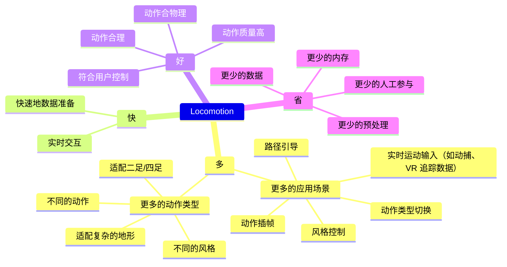

# Locomotion

任务：角色动画的实时控制

## Motion Graph / Motion Matching / Motion Field

优势：
1. 基于准备好的数据库，即可以与角色进行实时控制

缺点：
1. 依赖海量数据
2. 最近邻搜索成本高
3. 内存占用大
4. 对不同地形泛化性差
5. 对动作使用加权混合，其结果趋于平均

## 基于相位的方法

|ID|Year|Name|解决了什么痛点|主要贡献是什么|Tags|Link|
|---|---|---|---|---|---|---|
||2023.8.24|Motion In-Betweening with Phase Manifolds|首次将周期自编码学习的相位流形引入角色补间动画|1. 将复杂的人体运动分解到频域，用相位+振幅编码运动的周期性和时序规律。  2. 相位提取：DeepPhase.  3. 双向控制：角色坐标系+目标坐标系。  4. 用户控制：轨迹控制、动作类型控制。|多：超长动作插帧 快：实时动作插帧 好：可进行路径、风格控制|[PDF](https://arxiv.org/pdf/2308.12751)|
||2022.1.12|Real-Time Style Modelling of Human Locomotion via Feature-Wise Transformations and Local Motion Phases|将相位方法引入到风格迁移任务中。|1. 发布了100 style数据集  2. 扩展相位提取方式，对于非接触运动也能提取相位：对同一类数据使用PCA提取主成分，取第一主成分的系数。若存在周期性，用sin函数拟合系数。  3. 注入风格：输入风格clip，输出alpha和beta，用于调制主网络的隐藏层。训练时，先训练主网络，再接入FiLM，并finetune FiLM。推断时，不需要FiLM，使用预置风格的alpha和beta，也可以用插值得到alpha和beta。|多：具有风格迁移能力。动作泛化到非接触的周期动作。 快：实时的风格切换。 好：连续的风格参数，风格切换无跳变。|[PDF](https://arxiv.org/pdf/2201.04439)|
||2020.7.8|Local motion phases for learning multi-contact character movements|1. PFNN只用于周期性动作  2. PFNN需要手动标注相位|1. 非周期动作=各个局部周期动作的叠加，因此给几个重要的关节独立的相位。  2. 自动提取相位的方法：定义接触为1，再用sin函数拟合。 3. 一个权重估计网络，输入n个相位，输出m个权重参数。  4. 用户的控制信号过于稀疏，导致生成结果平均化。因此训练生成模型GAN，根据稀疏控制信号生成细节控制信号。|多：泛化到非周期动作。 快： 好：引入生成模型，避免动作趋于平均化。 省：无须人工标注。|[PDF](https://www.pure.ed.ac.uk/ws/files/157671564/Local_Motion_Phases_STARKE_DOA27042020_AFV.pdf)|
||2018.10.1|Few‐shot Learning of Homogeneous Human Locomotion Styles|小样本的学习策略|1. 数据准备：(1)大量基本风格数据（2）少量特定风格数据  2. 模型准备：用PFNN实现通用模块，用residual adapter来实现style模块  3. 训练策略：数据（1）用于通用模块与style模块的解耦，数据(2)用于finetune style模块  4. 参数策略：将adapter矩阵分解为X=ADB^T，进一步减少参数量。|多：泛化到不同风格。 快：少量样本即可迁移，训练快。 好：无过拟合，泛化性好。 少：省训练数据，少内存。|[PDF](https://www.pure.ed.ac.uk/ws/files/76661731/Few_shot_learning_of_homogeneous_human_locomotion_styles.pdf)|
||2018.6.30|	Mode-adaptive neural networks for quadruped motion control|传统数据驱动方法（运动图、运动匹配）：需存储完整动作数据库，依赖手动分割、标注，搜索过程复杂，实时性差 CNN 存在输入输出映射模糊问题，RNN 长期预测易收敛到平均姿态（漂浮），PFNN 虽解决模糊问题，但依赖手动相位标注，无法适配非循环运动。|本文提出模式自适应神经网络（MANN），专为四足动物运动控制设计，核心通过 “门控网络 + 运动预测网络” 的双模块架构，从大规模非结构化动作捕捉（MOCAP）数据中自主学习运动模式，无需手动标注相位或步态标签；门控网络基于脚部关节速度、目标速度等特征动态加权多个专家网络输出，运动预测网络生成平滑连贯的下一帧运动，支持怠速、移动、跳跃、坐姿等多种循环与非循环运动，同时允许用户通过速度、方向、动作变量交互控制；实验证明该模型在运动质量、实时性、内存占用上优于传统数据驱动方法（如运动图）和现有神经网络模型（如 PFNN），填补了四足动物非结构化运动数据高效建模与交互控制的空白。|	[PPT](https://slides.games-cn.org/pdf/GAMES201859%E5%BC%A0%E8%B4%BA.pdf)、[视频](https://v.qq.com/x/page/u0760b6r94p.html)|
|113|2017.7.20| Phase-functioned neural networks for character control|1. Motion Matching 需要存储大量数据 2. 自回归方法存在误差积累 3. CNN方法不能实时  4. 物理方法不可控  5. 不能支持复杂地形|1. 混合专家模型，首次将运动相位从「网络输入特征」升级为「网络权重的全局参数化变量」2. 将平地动捕数据与复杂地形耦合，让模型学会了根据地形自动调整动作。|PFNN 多：支持不同地形的泛化性 快：0.8ms/帧 好：1. 混合专家模型，解决相位混合引入的artifacts 2. IK后处理解决脚本问题 省：引入NN，不需要存储原始数据|[link](https://caterpillarstudygroup.github.io/ReadPapers/113.html)|

## 基于网络的方法

|ID|Year|Name|解决了什么痛点|主要贡献是什么|Tags|Link|
|---|---|---|---|---|---|---|
||2025.5.30|MotionPersona: Characteristics-aware Locomotion Control|首个生成式角色控制器。实时交互+角色个性化|1. 输入：文本描述->CLIP->emb，SMPL beta，历史状态，未来轨迹，示例版本(Optimal) 2. 模型：DiT结构，每次45帧，单帧>60fps 3. 动作衔接：在噪声空间对生成的前5帧与最后一帧做平滑  4. 推理时基于对小样本对编码层和输出层微调（DreamBooth）  5. 数据集|多：个性化 快：实时推理 省：极少的定制化数据及微调时间|[PDF](https://arxiv.org/pdf/2506.00173)|
||2025.5.13|DartControl: A Diffusion-Based Autoregressive Motion Model for Real-Time Text-Driven Motion Control|
||2024.8.16|Interactive Character Control with Auto-Regressive Motion Diffusion Models|
||2024.7.11|AAMDM: Accelerated Auto-regressive Motion Diffusion Model|
||2024.4.23|Taming Diffusion Probabilistic Models for Character Control|这篇发表于SIGGRAPH 2024的论文聚焦基于扩散模型的实时角色控制，提出了条件自回归运动扩散模型（CAMDM），首次将运动扩散概率模型成功落地到实时交互式角色控制场景中。核心解决了传统扩散模型计算量大、可控性差、多样性不足的问题，实现了单模型支持多风格、实时响应用户控制、生成高质量且多样化的角色动画，同时能完成风格间的无缝过渡，是角色动画和运动生成领域的重要突破。|
||2023.10.16|MOCHA: Real-Time Motion Characterization via Context Matching|风格迁移 + 实时控制|
||2018.10.4|Recurrent Transition Networks for Character Locomotion|传统方法（如运动图、高斯过程模型）存在泛化性差、仅适配单一动作类型、运行时计算成本高等问题。 基于深度学习的“**从当前状态到目标状态的定向过渡生成**”处于研究空白|1. 改进型 LSTM：传统 LSTM 仅依赖历史状态，RTN 在门控计算中加入未来上下文特征（目标 + 偏移），使生成过程始终朝向目标状态，避免无约束漂移； 2. 隐藏状态初始化：摒弃 “零向量初始化” 或 “全局共享初始状态”，通过 MLP 学习输入首帧与最优初始隐藏状态的映射，让 LSTM 从初始阶段就捕捉运动特征，提升生成质量；  3. ResNet 风格解码器：输出当前帧与下一帧的偏移量，而非直接输出姿态，减少生成帧与输入上下文的间隙，提升过渡流畅性。|[link](https://arxiv.org/pdf/1810.02363)|

## 基于物理的方法

|ID|Year|Name|解决了什么痛点|主要贡献是什么|Tags|Link|
|---|---|---|---|---|---|---|
||2025.5.13|CLoSD: Closing the Loop between Simulation and Diffusion for multi-task character control|
||2023.10.18|Interactive Locomotion Style Control for a Human Character based on Gait Cycle Features|
||2022.5.12|AMP: Adversarial Motion Priors for Stylized Physics-Based Character Control|
||2020.7.26|**Feature-based locomotion controllers**|
||2018.4.8|DeepMimic: Example-Guided Deep Reinforcement Learning of Physics-Based Character Skills|
||2010|Real-time planning and control for simulated bipedal locomotion|
||2007.7.29|	SIMBICON: simple biped locomotion control|① 零力矩点（ZMP）方法依赖预计算轨迹，灵活性不足； ② 强化学习 / 策略搜索需设计复杂奖励函数，高维状态下难以收敛； ③ 数据驱动方法多为运动学建模，缺乏物理适应性。	|“有限状态机 + 全局坐标控制 + 质心反馈” 的极简组合，无需复杂动力学建模，实现实时、鲁棒的物理基双足运动生成|[link](https://www.cs.sfu.ca/~kkyin/papers/Yin_SIG07.pdf)|
