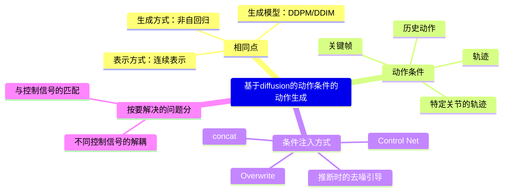

|ID|Year|Name|Note|Tags|Link|
|---|---|---|---|---|---|
||2025.4.23|PMG: Progressive Motion Generation via Sparse Anchor Postures Curriculum Learning||**更高控制精度和更精细的运动生成** |[link](6.md)|
||2024.5|Flexible motion in-betweening with diffusion models|
|169|2025.5.27|IKMo: Image-Keyframed Motion Generation with Trajectory-Pose Conditioned Motion Diffusion Model|现有基于轨迹与姿态输入的人体运动生成方法通常对这两种模态进行全局处理，导致输出结果次优|其核心在于**解耦轨迹与姿态输入**  ||
|168|2025.5.28|UniMoGen: Universal Motion Generation|**骨架无关**的动作生成  |UNet Based，风格与轨迹控制||
|85|2024|OmniControl: Control Any Joint at Any Time for Human Motion Generation|1. 使用ControlNet方式引入控制信号 2. 使用推断时损失注入方式进一步实现空间约束。|MDM，GMD，精确控制，ControlNet|[link](https://caterpillarstudygroup.github.io/ReadPapers/85.html)|
|86|2023|Guided Motion Diffusion for Controllable Human Motion Synthesis|将空间约束融入运动生成过程, 通过two-stage pipeline解决控制信号稀疏导致控制能力不足的问题。 第一阶段通过提升root投影轨迹loss强化轨迹控制，通过去噪函数实现稀疏轨迹->稠密轨迹的方法，从而生成稠密轨迹。 第二阶段使用稠密信号引导生成|GMD，轨迹控制|[link](https://caterpillarstudygroup.github.io/ReadPapers/86.html)|