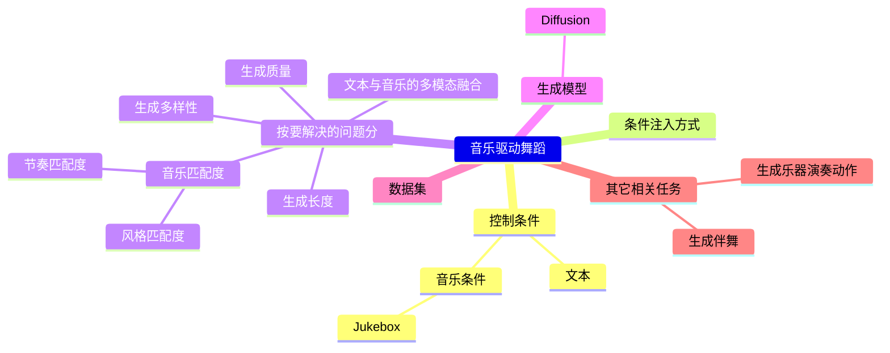

|ID|Year|Name|解决了什么痛点|主要贡献是什么|Tags|Link|
|---|---|---|---|---|---|---|
|      | 2023.5.15 | MoFusion: A Framework for Denoising-Diffusion-based Motion Synthesis |根据多种条件上下文（如音乐和文本）生成长期、时序合理且语义准确的运动序列| – 轻量1D U-Net网络 + 跨模态Transformer，三大约束损失（运动学一致性），显著提升效率与长序列质量 – 运动学损失的时变权重调度   – 推理时间长 – 文本条件词汇受限                                        |[link](https://arxiv.org/pdf/2212.04495)|
|      | 2023.5.16 | Listen, denoise, action! audio-driven motion synthesis with diffusion models | 因为人体运动具有复杂性，且仅凭音频输入会存在高度歧义性，需要概率化描述| 1. DiffWave架构对3D姿态序列进行建模   2. Conformer模块替代膨胀卷积以提升模型表达能力 3. 通过无分类器引导技术实现运动风格调控   4. 构建音频+高质量3D运动新数据集               | – 依赖语音特征提取 – 计算开销大                                      |[link](https://arxiv.org/pdf/2211.09707)|
||2022.11.27|Edge: Editable dance generation from music|可编辑舞蹈生成|1. transformer-based diffusion 生成模型  2. 关节级条件控制与中间帧生成  3. 入了一项新的物理合理性评估指标| SOTA|[link](https://arxiv.org/pdf/2211.10658)|
||2022|Bailando: 3D Dance Generation by Actor-Critic GPT with Choreographic Memory|

# 数据集

AIST++

# 其它相关任务

|ID|Year|Name|解决了什么痛点|主要贡献是什么|Tags|Link|
|---|---|---|---|---|---|---|
||2025.5.8|ReactDance: Progressive-Granular Representation for Long-Term Coherent Reactive Dance Generation|| 反应式舞蹈生成(Reactive Dance Generation, RDG)通过结合引导舞者动作和音乐输入来生成跟随者动作 |[link](67.md)|
||2025.5.7|ELGAR: Expressive Cello Performance Motion Generation for Audio Rendition|| 生成乐器演奏动作  |[link](56.md)|