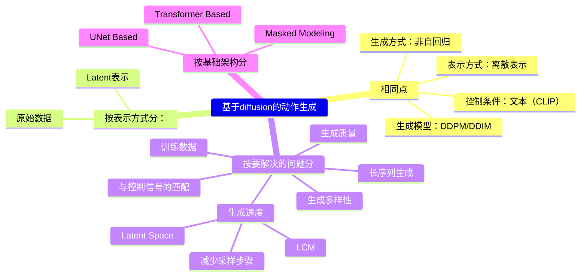

# 基于Diffusion的文生动作

基于扩散的方法直接在连续运动空间操作（如原始动作数据或VAE编码的隐表征），支持高质量动作生成。但这些方法主要进行片段级建模——一次性生成整个动作序列的所有帧。该设计使得修改特定帧时难以保持整体动作一致性与质量。且通常仍局限于粗粒度语义引导或轨迹级控制，导致其缺乏细粒度时间控制能力，用户无法在生成过程中精确定义或编辑动作细节。

## 生成质量

|ID|Year|Name|解决了什么痛点|主要贡献是什么|Tags|Link|
|---|---|---|---|---|---|---|
|   155   | 2024.12.9 | StableMoFusion: Towards Robust and Efficient Diffusion-based Motion Generation Framework |现有的基于扩散模型的方法采用了各不相同的网络架构和训练策略，各个组件设计的具体影响尚不明确。  滑步问题|深入分析并优化人体动作生成的每个组件。  - 通过识别足地接触关系并在去噪过程中**修正脚部运动**    – 推理速度慢（计算成本高）|控制条件：文本（CLIP+word embedding） 表示方式：原始数据 基础架构：Transformer，UNet, RetNet  要解决的问题：生成质量  |[link](https://arxiv.org/pdf/2405.05691)                                             |

## 生成多样性

|ID|Year|Name|解决了什么痛点|主要贡献是什么|Tags|Link|
|---|---|---|---|---|---|---|
||2023.10.1| ReMoDiffuse: RetrievalAugmented Motion Diffusion Model|检索增强生成，融合Top-k相似运动样本+CLIP语义特征，提升生成多样性与上下文相关性|– 语义调制Transformer                          | – 数据依赖性强 – 计算成本高昂                                        |[link](https://arxiv.org/pdf/2304.01116)|

## 框架演进

|ID|Year|Name|解决了什么痛点|主要贡献是什么|Tags|Link|
|---|---|---|---|---|---|---|
|160|2025.5.26|Absolute Coordinates Make Motion Generation Easy|局部相对动作表示方法(通过相对于骨盆和前一帧对动作进行编码)简化了早期生成模型的训练，但它却给扩散模型带来了关键限制，并阻碍了其在下游任务中的应用。 |全局空间中的**绝对关节坐标**表示方法的文生动作。 保持性能的同时天然支持下游任务|
|101|2025.5.16|Towards Robust and Controllable Text-to-Motion via Masked Autoregressive Diffusion|VQVAE类方法：离散表征难以忠实表达新动作  扩散模型类方法：连续表征缺乏对单帧的细粒度控制   作者希望可以帧级的动作控制同时能够对训练集以及的动作有较好的泛化性。|1. 递归式地补充部分帧（类似MoMask），直到全部生成   2. 帧级VAE| VAE + MoMask + diffusion  |[link](https://caterpillarstudygroup.github.io/ReadPapers/101.html)|
| 164 | 2024.8.30 | Text-driven Human Motion Generation with Motion Masked Diffusion Model  | 通过上下文推理学习时空语义间运动关系的能力|– 跨时间帧与身体部位的掩码建模策略    – 计算成本高昂 | MMDM                                                          |[link](https://arxiv.org/pdf/2409.19686v1)|
| 165 | 2023.8.30 | Human Motion Diffusion as a Generative Prior |标注运动数据匮乏、仅关注单人动作生成以及缺乏精细控制能力|1. 并行组合：于两个固定先验及少量双人训练样本，我们开发了轻量级通信模块ComMDM，用于协调两个生成动作间的交互  2. 串行组合：仅通过短片段训练的扩散先验，即可生成由提示区间及其过渡组成的长动画序列。3. 模型组合：先训练独立先验模型以生成符合指定关节约束的动作，进而提出DiffusionBlending插值机制，有效融合多个此类模型，实现灵活高效的关节级与轨迹级精细控制与编辑                   | – 依赖初始模型质量 – 长间隔运动不一致 – 泛化能力不足                    |[link](https://arxiv.org/pdf/2303.01418)|
||2022.9.29|Human Motion Diffusion Model|**扩散模型首次应用于动作条件生成**|1. 	多样性与保真度权衡（训练/采样轨迹曲线限制）	生成结果多样且逼真  2. 预测x0而不是噪声 计算开销大、推理速度低，仅适合短序列生成|控制条件：文本（CLIP） 表示方式：原始数据表示 基础架构：Transformer  要解决的问题：motion + DDPM   HMDM, MDM|
|132| 2022.8.31 | MotionDiffuse: Text-Driven Human Motion Generation with Diffusion Model |根据多样化文本输入实现细腻且精细的运动生成 |**首个基于扩散模型的文本驱动运动生成框架**，并在此基础上做了大量改进： 1. 通过文本特征与noise的self attention，实现文本-动作的跨模态生成 2. 在噪声空间对不同文本提示的融合，实现不同部分的细粒度控制  3. 在噪声空间对不同片断的融合，实现长序列的生成|控制条件：文本（CLIP） 表示方式：原始数据 基础架构：Transformer  要解决的问题：motion + DDPM   其它：开源|[link](https://caterpillarstudygroup.github.io/ReadPapers/132.html)|                                 |

## 生成速度

|ID|Year|Name|解决了什么痛点|主要贡献是什么|Tags|Link|
|---|---|---|---|---|---|---|
|162|2024.12.30|Motionlcm: Real-time controllable motion generation via latent consistency model|motion diffusion + LCM|[link](https://arxiv.org/pdf/2404.19759)
|    154  | 2024.11.23 | EMDM: Efficient Motion Diffusion Model for Fast and High-Quality Motion Generation       |实现**快速**、高质量的人体运动生成。  1. latent space方法学习latent space需要成员  2. DDIM 会导致质量下降。|通过**条件去噪扩散GAN**技术，在任意（可能更大）步长条件下根据控制信号**捕捉多模态数据分布**，实现高保真度、多样化的少步数运动采样。  – **快速**扩散方案   – 可能违反物理定律（如漂浮/地面穿透）| 控制条件：文本（CLIP） 表示方式：原始数据 基础架构：Transformer  要解决的问题：生成速度|  [link](https://arxiv.org/pdf/2312.02256)                |
||2023.5.19|Executing your Commands via Motion Diffusion in Latent Space||在**潜在空间**应用扩散模型，降低计算复杂度，潜在空间压缩提升生成速度 – 生成运动长度受限 – 仅支持人体主干（无手部/面部动作）|控制条件：文本（CLIP） 表示方式：Latent表示(Transformer Based VAE) 基础架构：Transformer  要解决的问题：生成速度 其它：MLD, LMDM|[link](https://arxiv.org/pdf/2212.04048)|

## 文本控制性

|ID|Year|Name|解决了什么痛点|主要贡献是什么|Tags|Link|
|---|---|---|---|---|---|---|
|161|2025.5.8|ReAlign: Bilingual Text-to-Motion Generation via Step-Aware Reward-Guided Alignment|双语文本输入合成3D人体运动 |1. BiHumanML3D双语人体运动数据集  2. 双语运动扩散模型(BiMD)，通过跨语言对齐表征捕捉语义信息，实现统一的双语建模。  3. 提出了奖励引导的采样对齐方法(ReAlign)，包含用于评估采样过程中对齐质量的步态感知奖励模型，以及引导扩散过程向最优对齐分布演进的奖励引导策略。该奖励模型融合步态感知标记，结合保证语义一致性的文本对齐模块和提升真实性的运动对齐模块，通过在每一步优化噪声运动，平衡概率密度与对齐效果。  实验表明，在文本-运动对齐质量和运动生成质量上SOTA。||[link](https://wengwanjiang.github.io/ReAlign-page)|
| 158     | 2023.12.22 | FineMoGen: Fine-Grained Spatio-Temporal Motion Generation and Editing |生成符合细粒度描述的复杂动作序列|1. 名为时空混合注意力（SAMI）的新型Transformer架构。SAMI从两个角度优化全局注意力模板的生成：  1）时空混合注意力机制, 显式建模时空组合的约束条件；  2）利用稀疏激活的专家混合机制自适应提取细粒度特征。  2. HuMMan-MoGen**数据集**，包含2,968个视频和102,336条细粒度时空描述。 – 运动数据格式支持有限 – 依赖大型语言模型  |控制条件：文本 表示方式： 基础架构：Transformer   要解决的问题：文本契合|[link](https://arxiv.org/pdf/2312.15004)|
||2023.10.19| Humantomato: Text-aligned whole-body motion generation|文生全身动作（肢体、表情、手势）|[link](https://arxiv.org/abs/2310.12978)|
|   157   | 2023.9.12 | Fg-T2M: Fine-Grained Text-Driven Human Motion Generation via Diffusion Model |现有方法仅能生成确定性或不够精确的动作序列，难以有效控制时空关系以契合给定文本描述。|1）语言结构辅助模块——通过构建精准完整的语言特征以充分挖掘文本信息；  2）上下文感知渐进推理模块——借助浅层与深层图神经网络分别学习局部与全局语义语言学特征，实现多步推理。 – 语言结构辅助模块  – 受限于语言模型能力 |控制条件：文本（CLIP） 表示方式：原始数据 基础架构：Others   要解决的问题：文本契合 |[link](https://arxiv.org/pdf/2309.06284)|

## 长序列生成

|ID|Year|Name|解决了什么痛点|主要贡献是什么|Tags|Link|
|---|---|---|---|---|---|---|
|      | 2024.2.23 | Seamless Human Motion Composition with Blended Positional Encodings |根据连续变化的文本描述生成长时间连续运动序列|1. 混合位置编码：绝对编码阶段重建全局运动一致性，而相对编码阶段则构建平滑逼真的动作过渡 2. 两个新指标：峰值加加速度和加加速度曲线下面积，用以检测运动中的突变转换  – 复杂文本描述生成失败 – 部分过渡轻微不匹配                       |    要解决的问题：长序列生成  其它：**FlowMDM**   |[link](https://arxiv.org/pdf/2402.15509)|

## 训练数据

|ID|Year|Name|解决了什么痛点|主要贡献是什么|Tags|Link|
|---|---|---|---|---|---|---|
|156|2023.5.16|Make-An-Animation: Large-Scale Text-conditional 3D Human Motion Generation| 基于diffusion的动作生成任务受限于对较小规模动作捕捉数据的依赖，导致在面对多样化真实场景提示时表现不佳。|摒弃了顺序生成（通过特定的损失函数强制保证时序一致性）的方式，仅依赖于标准的扩散损失。 **两阶段训练**。先在一个大型静态 3D 姿态数据集上进行预训练，以学习姿态-文本的关联。  通过其并行采样策略和大规模预训练策略保持运动的连续性。  – 计算成本高 – 生成部分不自然运动|控制条件：文本（T5） 表示方式：原始数据 基础架构：**UNet**   要解决的问题：训练数据|[link](https://azadis.github.io/make-an-animation/)|