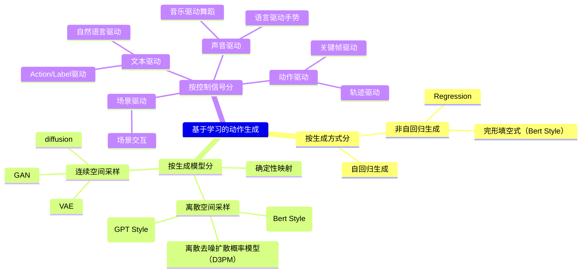

# 基于离散表示的骨骼动作生成

不管是离散表示还是连续表示，动作生成任务要解决的问题、所使用的数据集、评价指标等都是相似的。这里把离散表示的动作生成单独提成一页，是考虑到：  
- 离散表示所构建的是真实数据的离散分布
- 离散分布的采样与连续分布的采样对于构建生成模型有较大的影响
- 采样是生成算法的重要环节

VQ-VAE及其变体将动作编码为离散标记，本质上将运动生成问题从回归任务转化为分类任务。然而受限于码本结构，VQ-VAE倾向于存储已知动作而非泛化到新动作。虽然这些模型在训练数据分布内能精确生成和重建动作，却难以处理分布外运动导致信息损失和动作感知失真。

# 离散空间采样

## GPT Style

『离散表示+自回归生成框架』能够实现文生动作任务，且生成动作的质量非常高。  

离散表示把motion序列变成了token序列。  
动作生成的控制信号也可以有离散形式的或者连续形式。如果控制信号正好也是离散的token表达，那么通过将控制信号的离散表达与动作的离散表达进行对齐，那么可以提升跨模态生成的一致性。   

要解决的问题：  
1. 生成结果与控制信号的匹配度
2. 生成时长
3. 生成质量

### 多模态Latent Code对齐

Latent Code对齐用于以下场景：  
1. 输入（控制信号）与输出（生成动作）都是离散表达  
2. 输入与输出具体不同的表达语义（例如语言和动作）  
3. 输入包含不同语义的控制信号（例如语言+动作）

|ID|Year|Name|解决了什么痛点|主要贡献是什么|Tags|Link|
|---|---|---|---|---|---|---|
|87|2024.3.18|MotionGPT: Finetuned LLMs are General-Purpose Motion Generators|1. 利用VQ-VAE，将运动序列编码为一种特殊“语言” 2.  将运动生成视为序列到序列任务，结合LLM能力实现从文本到动作的端到端生成。 3. 首个多模态控制的动作生成方法|VQ-VAE + LLM + LoRA， 生成质量(FID)有明显提升|控制条件：文本(token)/key frame  生成方式：自回归 表示方式：离散表示（VQ-VAE） 生成模型：复用GPT 其它：LLM|[link](https://caterpillarstudygroup.github.io/ReadPapers/87.html)|
|146|2023.11.28|AvatarGPT: All-in-One Framework for Motion Understanding, Planning, Generation and Beyond|在与人体运动相关的研究领域，学者们仍在为每个任务开发孤立模型。| VQ-VAE + LLM + Adapter|
|145|2023.7.20|MotionGPT: Human Motion as a Foreign Language.|构建一个能够统一处理语言与运动等多模态数据的模型|1. 采用离散向量量化技术将人体运动转化为运动标记 2. 基于该"运动词汇表"，以统一的方式对运动和文本进行语言建模，将人体运动视为特殊形式的语言。 3. (**提示学习**)采用运动-语言混合数据对MotionGPT进行预训练，并基于提示问答任务进行微调。|控制条件：问题（文本T5，动作VQ-VAE）  生成方式：自回归 表示方式：离散表示（VQ-VAE） 生成模型：GPT Style 问答模型|
||2022.8.4|TM2T: Stochastic and tokenized modeling for the reciprocal generation of 3d human motions and texts. |文生3D全身动作，实现同文本生成多个差异化动作，并避免产生无意义的静止姿态序列。|**首次提出离散量化的运动表示**  互惠生成方法通过同时训练文本→运动和运动→文本任务，显著提升了**语义对齐**能力。|控制条件：文本（NMT Encoder）  生成方式：自回归 表示方式：离散表示（同VQ-VAE，但没有使用这个词） 生成模型：GPT Style（NMT Decoder）|

### 不需要Latent Code对齐

以下场景不需要Latent Code对齐：
1. 输入（控制信号）与输出（生成动作）具有相同的语义，例如历史动作预测未来动作的任务。  
2. 输入（控制信号）使用连续表示方式，不能与输出（生成动作）的离散表示方式共享空间。  

|ID|Year|Name|解决了什么痛点|主要贡献是什么|Tags|Link|
|---|---|---|---|---|---|---|
|151 |2024.6.2| T2LM: Long-Term 3D Human Motion Generation from Multiple Sentences | 处理多句子文本生成长且复杂的动作序列，直接学习端到端文本-运动映射。|  – 连续长期VQ-VAE生成框架 – 1D(时序维度)卷积VQ-VAE（避免时序不一致）  – 无法生成细粒度运动 – 仅支持短文本描述                       |1D卷积VQ-VAE + Transformer，长序列生成|控制条件：**文本（CLIP）**  生成方式：自回归 表示方式：离散表示（VQ-VAE） 生成模型：GPT Style 其它：Transformer|[link](https://arxiv.org/pdf/2406.00636)|
|88|2023.9.24|T2m-gpt: Generating human motion from textual descriptions with discrete representations|**基于VQ-VAE与GPT的文生人体运动框架**|1. 基于VQ-VAE的离散运动表示  2. VQ-VAE + Transformer（GPT）的文生动作框架**  3. 生成质量(FID)有明显提升|控制条件：**文本（CLIP）**  生成方式：自回归 表示方式：离散表示（VQ-VAE） 生成模型：GPT Style 其它：Transformer，开源|[link](https://caterpillarstudygroup.github.io/ReadPapers/88.html)|
|150|2023.9.2|AttT2M:Text-Driven Human Motion Generation with Multi-Perspective Attention Mechanism. |1. 人体运动固有的复杂时空特性 2. 文本与运动间跨模态关系学习的难度| – 基于身体部位注意力的时空VQ-VAE – 全局-局部注意力学习跨模态关系   – 长文本驱动生成多样性不足 – 数据依赖（无法生成未见运动）|控制条件：**文本（CLIP）**  生成方式：自回归 表示方式：离散表示（VQ-VAE） 生成模型：GPT Style 其它：Transformer|[link](https://arxiv.org/pdf/2309.00796)
|143|2022.10.19| PoseGPT: Quantization-based 3D Human Motion Generation and Forecasting |任意观测长度（包括零观测）条件下的运动生成|1. 量化隐空间的编码器-解码器架构   2. 基于离散编解码的动作生成 |控制条件：历史动作, action   生成方式：自回归  表示方式：离散表示  生成模型：类GPT模型预测隐空间索引   其它： 量化方案限制运动多样性     |

## Bert Style

『离散表示 + 掩码语言模型生成框架』的文生动作模型。

*   **核心思想：** 将动作序列**离散化** 为令牌序列（类似 NLP 中的单词）。在训练时，随机或有策略地**掩码 (Mask)** 一部分令牌，让模型基于上下文（未掩码令牌和文本条件）**预测被掩码的令牌**。
*   **优势：** 通常比扩散模型**效率更高**，能有效学习动作的时空依赖关系。
  
### Text to Motion

|ID|Year|Name|解决了什么痛点|主要贡献是什么|Tags|Link|
|---|---|---|---|---|---|---|
||2025|BAMM: Bidirectional Autoregressive Motion Model.|bert style   – 条件掩码自注意力Transformer – 混合注意力掩码训练                  | – 中等计算复杂度 – 无法生成快速变化的根运动                            |
|148|2024.3.28|MMM: Generative Masked Motion Model. |**基于掩码动作模型的全新简易动作生成范式。**|与MoMask非常相似，文中没有与MoMask的对比  对输入动作令牌进行**随机掩码**，模型基于所有未掩码令牌（上下文）同时预测所有被掩码的令牌（非自回归）。 局限性：无法生成长而详细的文本描述  |控制条件：文本（CLIP）  生成方式：Bert Style 表示方式：离散表示VQ-VAE 生成模型：条件掩码运动模型|[link](https://caterpillarstudygroup.github.io/ReadPapers/148.html)|
||2023.11.29| MoMask: Generative Masked Modeling of 3D Human Motions|VQ-VAE + Bert Style的文生动作新框架 | VQ-VAE + 分层码本结构；掩码预测生成粗糙运动，残差层逐步细化  **首个离散运动表示+掩码语言模型的文生动作框架** |控制条件：文本（CLIP）  生成方式：Bert Style 表示方式：离散表示（VQ-VAE + 残差细化） 生成模型：掩码语言模型|[link](https://arxiv.org/pdf/2312.00063)|

### music 2 dance

|ID|Year|Name|解决了什么痛点|主要贡献是什么|Tags|Link|
|---|---|---|---|---|---|---|
| |2023|**TM2D** [Gong et al., 2023] | – VQ-VAE框架 – 双模态特征融合（跨模态Transformer）                  | – 缺乏配对数据（音乐/文本） – 限于特定舞蹈风格（数据依赖）                |

## 离散去噪概率模型 D3PM

### Text to Motion

|ID|Year|Name|Note|Tags|Link|
|---|---|---|---|---|---|
|152|2024.7.19|M2D2M: Multi-Motion Generation from Text with Discrete Diffusion Models|先用VQ-VAE获取离散运动编码，再在标记序列上学习去噪扩散模型。为多动作生成设计动态转移概率确保动作间平滑过渡。|– 动态转移概率模型 – 新评估指标Jerk（动作边界平滑度），但Jerk指标无法评估所有场景 |控制条件：文本(CLIP)  生成方式：非自回归 表示方式：离散表示（VQ-VAE） 生成模型：离散去噪扩散概率模型（D3PM） 其它：动作边界平滑度指标Jerk|[link](https://arxiv.org/pdf/2407.14502)
||2023.9.4|DiverseMotion: Towards Diverse Human Motion Generation via Discrete Diffusion |在动作质量与多样性之间取得平衡仍是一个未解决的挑战。该问题主要由两个关键因素导致：  1）现有基准数据集中动作-描述对缺乏多样性；  2）对文本提示存在片面且有偏差的语义理解，主要关注动词成分而忽略其他词语所指示的微妙差异。|1. 构建了大规模野生动作-描述数据集（WMC）  2. 提出分层语义聚合（HSA）模块来捕获细粒度语义。  3. 将上述设计整合到有效的动作离散扩散（MDD）框架中|控制条件：文本（分层语义聚合HSA）  生成方式：非自回归 表示方式：离散表示（VQ-VAE） 生成模型：动作离散扩散（MDD）框架   其它：数据集|
||2023|Text-to-Motion Synthesis using Discrete Diffusion Model|扩散模型计算成本较高，且生成的运动可能与输入文本对齐度不足。|结合离散潜在空间与扩散模型，学习表达性条件概率映射以实现运动合成。 1. 学习离散运动表达   2. 应用离散去噪扩散概率模型（D3PM）学习运动标记的条件概率分布。  3. 训练过程中进一步采用离散无分类器引导技术，通过合适的引导尺度实现运动与对应文本描述的对齐。|控制条件：文本  生成方式：非自回归 表示方式：离散表示（VQ-VAE） 生成模型：离散去噪扩散概率模型（D3PM） 其它：MoDDM|
|  147    | 2023.8.30 | Priority-Centric Human Motion Generation in Discrete Latent Space       |并非所有动作都与特定文本描述具有同等关联度——某些更具显著性和信息量的动作应在生成过程中被优先考虑|1. 基于Transformer的VQ-VAE架构，**通过全局自注意力机制与正则化项构建紧凑的离散动作表示，有效防止代码坍塌**。 2. 一种创新的运动离散扩散模型，**通过分析动作令牌在整体序列中的重要性来制定噪声调度策略**。 局限性：难以捕捉运动细粒度细节| **M2DM** 控制条件：文本  生成方式：非自回归 表示方式：离散表示（基于Transformer的VQ-VAE架构） 生成模型：离散去噪扩散概率模型（D3PM）|[link](https://arxiv.org/pdf/2308.14480)

# 连续空间采样

## Diffusion

|ID|Year|Name|解决了什么痛点|主要贡献是什么|Tags|Link|
|---|---|---|---|---|---|---|
|149|2024.9.17|BAD: Bidirectional Auto-Regressive Diffusion for Text-to-Motion Generation|自回归模型难以捕捉复杂的双向模式。  Mask Modeling假设标记相互独立，削弱了对序列依赖关系。  掩码或吸收操作对序列进行的破坏可能引入不自然的失真，增加学习难度。|双向自回归扩散模型（BAD），基于排列的序列破坏技术，**融合了自回归与基于掩码的生成模型优势，** 保持因果依赖的同时有效捕捉序列与双向关系。  [?] 创新的把diffusion用于离散数据的方法|控制条件：文本（CLIP）  生成方式：Bert Style 表示方式：离散表示VQ-VAE 生成模型：a novel corruption (diffusion) technique|[link](https://arxiv.org/pdf/2409.10847)|

### Score Matching

|ID|Year|Name|解决了什么痛点|主要贡献是什么|Tags|Link|
|---|---|---|---|---|---|---|
|102|2025.5.16|HGM³: Hierarchical Generative Masked Motion Modeling with Hard Token Mining|由于文本固有的歧义性以及人体运动动态的复杂性|1. 类似MoMask的残差VQ-VAE，但专门训练了一个网络来决定给哪些token掩码   2. 把文本编码成不同粒度的embedding，提升文本的整体把控与细节控制|控制条件：文本（Graph Reasoning）  生成方式：Bert Style 表示方式：离散表示（分层文本编码，每一层是残差VQ-VAE） 生成模型：残差VQ-VAE(类似于Diffusion的逐渐细化的生成模式)  |[link](https://caterpillarstudygroup.github.io/ReadPapers/102.html)|
|92|2025|Deterministic-to-Stochastic Diverse Latent Feature Mapping for Human Motion Synthesis|基于score的生成模型，其训练过程涉及复杂的曲率轨迹，导致训练稳定性不足。|1. 第一阶段通，运动重建(VQ-VAE with different network)，学习运动潜在表征 2. 第二阶段，使用确定性特征映射过程(DerODE)构建高斯分布与运动潜在空间分布之间的映射关系 3. 生成时通过通过向确定性特征映射过程的梯度场中注入可控噪声(DivSDE)实现多样性。|控制条件： Action Label   生成方式：非自回归 表示方式：离散表示（VQ-VAE） **生成模型：flow matching + score matching**|[link](https://caterpillarstudygroup.github.io/ReadPapers/92.html)|

# 离散表示 vs 连续表示对比表  

| **对比维度**         | **离散表示**                                                                 | **连续表示**                                                                 |
|----------------------|-----------------------------------------------------------------------------|-----------------------------------------------------------------------------|
| **运动编码**         | VQ-VAE或量化器从姿态序列生成运动token                                        | 自编码器或直接使用原始连续姿态数据                                            |
| **生成模型**         | Transformer（如GPT） 掩码模型（如BERT） 离散扩散模型                     | 原始运动空间的扩散模型 隐空间扩散（如LDMs）                                  |
| **文本对齐**         | 易与NLP模型集成 可将运动视为"语言"                                        | 需注意力/跨模态融合 映射结构较弱                                           |
| **训练稳定性**       | 易发码本坍塌和量化伪影                                                      | 扩散中连续MSE损失保障稳定性                                                   |
| **保真度与多样性**   | 码本大时保真度高 多样性受限                                               | 随机采样天然多样 表现力强                                                  |
| **推理速度**         | 小型自回归模型快 长序列慢                                                | 迭代采样通常较慢 LDMs可提速                                                |
| **控制与编辑**       | 支持掩码修复 token级符号控制                                              | 精细编辑（如FLAME） 支持帧/关节控制（如SALAD）                              |
| **流式/在线能力**    | 自回归解码受限 非因果序列阻碍实时性                                       | 因果隐变量支持流式生成 （如MotionStreamer）                                |
| **常见局限**         | 量化信息损失 分词器训练困难                                               | 计算成本高 文本精确对齐难                                                  |
| **代表工作**         | T2M-GPT [2023] MMM [2024] MotionGPT [2023] MoDDM [2023] M2D2M [2024] | MotionDiffuse [2022] MoFusion [2023] FLAME [2023] SALAD [2025] MoLA [2024] MotionStreamer [2025] |
