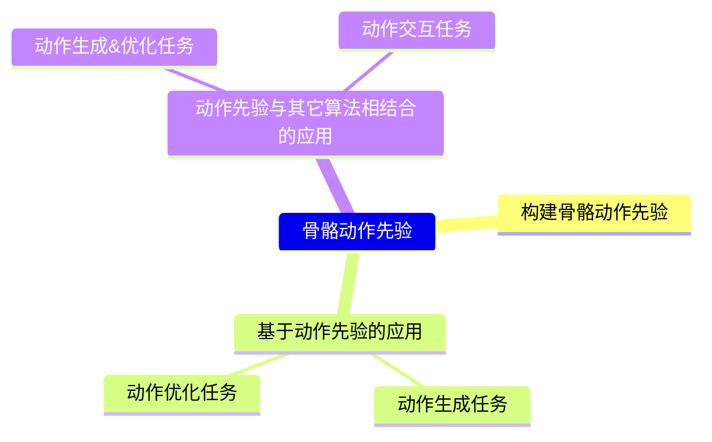
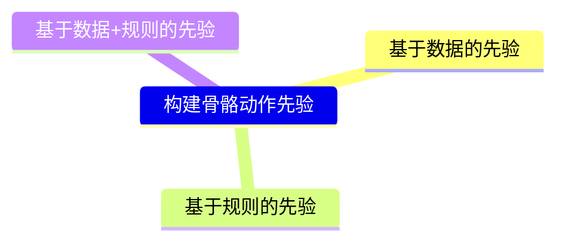
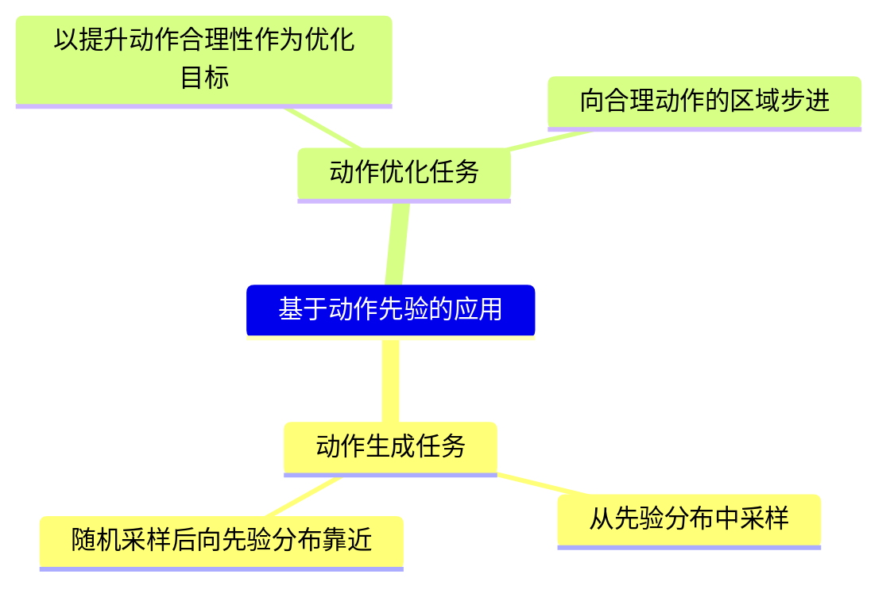
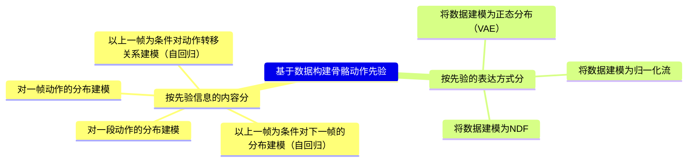
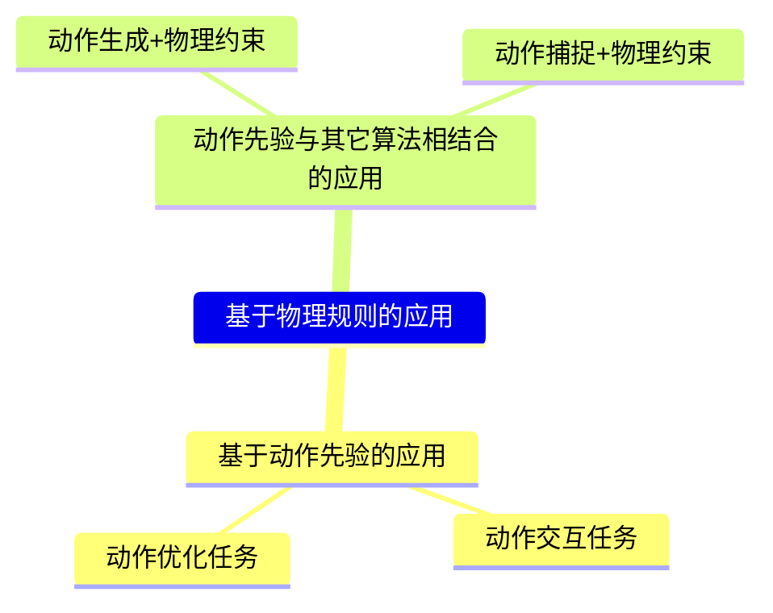

# 动作先验 / 动作优化

这一个系列的论文通常包含三个主题：

在本文中，动作生成任务、动作优化任务、动作生成&优化任务的区别在于

||基于动作先验的动作生成任务|基于动作先验的动作优化任务|动作先验与其它算法相结合的动作生成&优化任务|
|---|---|---|---|
|动作来源|由动作先验决定|源动作为已知信息|由其它的生成算法决定|
|动作先验的作用|决定做什么动作|约束动作的合理性|约束动作的合理性|
|生成过程与优化过程是否耦合|不涉及优化|不耦合|耦合，需要考虑其它生成算法与动作先验模型的合作方式|

*如果一个方法中使用了多种先验，还需要考虑这些先验之间怎么结合。*  

## 构建动作先验：  
要解决的问题：如何通过数据或规则构造动作先验。

## 基于动作先验的应用

基于动作先验完成以下任务：  
（1）动作生成任务：可以基于动作先验进行动作生成（无控制条件），生成结果为最符合动作先验的动作。  
要解决的问题：怎样基于动作先验进行生成  
（2）动作优化任务：可以基于动作先验对已有的动作进行优化，生成结果为与原始动作最接近的且最符合动作先验的任务。  
要解决的问题：怎样基于动作先验对已有动作进行优化  

## 动作先验与其它算法相结合的应用

动作先验与其它算法结合完成以下任务，此时动作先验只用于约束动作的合理性。  

（1）动作生成&优化任务：可以使用额外的动作生成方法（基于控制条件）先生成再优化，或者生成与优化迭代进行，得到即使符合生成要求又符合动作先验的动作。  
要解决的问题：怎样把动作生成和动作优化结合起来  
（2）动作交互任务：使用额外的交互算法与用户交互，通过动作先验的约束，使得交互结果符合动作先验。  
要解决的问题：如何把动作先验实时地融入到交互结果中

*如果文章中通过使用动作先验结合其它算法实现来完成任务，但方法是没有体现动作先给与其它算法的结合，而是分阶段进行，则将归类为基于动作先验的动作优化任务*。  
*对于归于此类的文章，如果关键创新点在动作先验，则归到本页。如果关键创新点在其它算法，则归到其它算法对应的页面。*

# 基于数据的动作先验

## VAE

|ID|Year|Name|解决了什么痛点|主要贡献是什么|Tags|Link|
|---|---|---|---|---|---|---|
|14|2021|HuMoR: 3D Human Motion Model for Robust Pose Estimation|在存在噪声和遮挡的情况下恢复合理的姿势序列|**1. 建模运动先验模型：** based on 136，通过先验逼近后验，使得先验建模更准确   2. 基于运动先验的动作生成：based on 136   3. 基于运动先验的动作优化，可以产生『准确且合理的运动和接触』的动作。|Condition VAE，转移关系建模|[link](https://caterpillarstudygroup.github.io/ReadPapers/14.html)|
|136|2021.3.26|Character Controllers Using Motion VAEs|在给定足够丰富的运动捕捉片段集合的情况下，如何实现有目的性且逼真的人体运动|**1. 建模运动先验模型：** 信息来源：数据 建模内容：以上一帧为条件对下一帧的分布建模（自回归）  建模方式：VAE  2. 基于运动先验的动作生成：从分布中随机采样实现随机生成，从分布中蒙特卡罗采样实现可控生成   3. 动作先验与其它算法相结合：深度强化学习 | [link](https://caterpillarstudygroup.github.io/ReadPapers/136.html)|

## Normalizing Flows

|ID|Year|Name|解决了什么痛点|主要贡献是什么|Tags|Link|
|---|---|---|---|---|---|---|
|134|2020.12.7|MoGlow: Probabilistic and controllable motion synthesis using normalising flows|基于数据的运动建模与合成|基于归一化流的新型概率化、生成式且可控的运动数据模型。  1. 运动先验：通过归一化流来描述运动数据的概率分布   2. 基于运动先验的动作生成：通过随机采样从先验分布中生成新的运动数据   3. 动作生成任务：以控制信号的满足程度和动作的合理性概率为目标进行动作优化||[link](https://caterpillarstudygroup.github.io/ReadPapers/134.html)|

## NDF

|ID|Year|Name|解决了什么痛点|主要贡献是什么|Tags|Link|
|---|---|---|---|---|---|---|
|137|2025.9.11|Geometric Neural Distance Fields for Learning Human Motion Priors|实现鲁棒、时序一致且物理合理的三维运动重建|**1. 建模运动先验模型：** 显式地将人体运动建模为对应姿态、转移（速度）和加速度动态的神经距离场（NDF）零水平集 **2. 动作优化任务** （1）一种新型自适应步长混合算法，用于在合理运动集合上进行投影计算； （2）一种创新几何积分器，在测试时优化和生成过程中实现真实运动轨迹的"展开"。|
|172|2025.5.26|PAMD: Plausibility-Aware Motion Diffusion Model for Long Dance Generation||  合理性感知运动扩散模型 (PAMD)的音乐生成舞蹈  |[link](124.md)|
|139|2024.4.11|NRDF: Neural Riemannian Distance Fields for Learning Articulated Pose Priors||**1. 建模运动先验模型：** 通过高维四元数积空间中的神经场零水平集来表征合理关节空间.  **2. 动作优化任务**：采用自适应步长黎曼梯度下降法，确保迭代点始终保持在SO(3)^K乘积空间内，从而获得更快的收敛速度|
|138|2022.7.27|Pose-NDF: Modeling Human Pose Manifolds with Neural Distance Fields|直接建模真实姿态流形并保持姿态间距离|**1. 建模运动先验模型：** 信息来源：数据 建模内容：单帧动作  建模方式：NDF  **2. 动作优化任务**：根据距离向0水平集步进，每一次步进后都需要投影回SO(3)空间|

# 基于规则的动作先验

基于规则的先验，通常是使用物理规则。物理规则是客观存在的，不需要刻意去构建。关键在于怎么把物理规则应用到具体的任务中。

物理规则不是一种分布，无法采样，所以没有单纯基于物理规则的生成任务。  
基于动作先验交互任务是指，给角色一个力，角色如何响应或者保持平衡。  
根据动作优化过程是否与其上游过程耦合，还区分是单纯的动作优化任务，还是动作优化结合其它算法的任务。  

|规则注入方式|应用于动作交互|应用于动作优化|应用于『与其它算法结合』|
|---|----|---|---|
|借助物理引擎|||其它算法->物理约束->其它算法|
|将物理方程作为损失函数约束|||其它算法与物理约束联合优化|
|向物理合理的方向移动一小步 （需要结合diffsion这种多步生成方法，也可能借助物理引擎或者损失函数也移动）|||其它算法与物理约束依次进行|

## 动作先验与其它算法相结合的应用

### 借助物理引擎

常见套路：  
其它算法->物理约束->其它算法  

要解决的问题：  
1. 通过物理引擎约束后，其结果可能又存在僵硬等artifacts了  
2. 物理引擎约束这一步可能不可微，导致不能端到端优化
3. 物理引擎的计算可能会比较耗时、笨重

|ID|Year|Name|解决了什么痛点|主要贡献是什么|Tags|Link|
|---|---|---|---|---|---|---|
|112|2025.6.5|**POMP: Physics-consistent Motion Generative Model through Phase Manifolds**|物理先验 + 动作生成|一个基于运动学的框架，其它算法->物理约束->其它算法：  其它算法：Diffusion模块生成动作   物理约束：仿真模块使用**比例微分控制器**优化动作   算法：**利用相流形将运动先验与物理约束对齐**，优化结果再映射回运动学数据，从而合成物理上真实的运动。| 物理合理，自回归，动作优化 |[link](https://caterpillarstudygroup.github.io/ReadPapers/112.html)|
|114|2023|Drop: Dynamics responses from human motion prior and projective dynamics|物理先验 + 动作生成|1. DROP，一个高度稳定、极简的基于物理的人体模拟器，提供人体运动的物理先验。  2.**其它算法->物理约束->其它算法**:  其它算法：本文以MotionVAE为例，用于生成动作 物理约束： 利用投影动力学 其它算法：SoftCorrection|[link](https://caterpillarstudygroup.github.io/ReadPapers/114.html)|

###  向物理合理的方向移动一小步（需要结合diffsion这种多步生成方法）

常见套路：  
在其它算法过程中的每一小步，进行一次小的物理约束

要解决的问题：  
1. 物理约束这一步的计算可能会比较耗时、笨重
2. 物理约束这一步可能借助物理引擎或者构造Loss，但必须可微
3. 需要结合diffusion这种多step的算法

|ID|Year|Name|解决了什么痛点|主要贡献是什么|Tags|Link|
|---|---|---|---|---|---|---|
| 140 | 2023.8.18 | PhysDiff: Physics-Guided Human Motion Diffusion Model|物理先验 + 动作生成（diffusion）|其它算法与物理约束依次进行：Diffusion + 物理修正   局限性：  物理模拟器导致计算复杂度极高 |

### 将物理方程作为损失函数约束

要解决的问题：  
1. 将物理约束转化为Loss

|ID|Year|Name|解决了什么痛点|主要贡献是什么|Tags|Link|
|---|---|---|---|---|---|---|
|26|2024.4.5|PhysPT: Physics-aware Pretrained Transformer for Estimating Human Dynamics from Monocular Videos|物理先验 + 动作捕捉|其它算法与物理约束联合优化：  其它算法：基于SMPL模型从单目视频估计人体动力学   物理约束：通过拉格朗日损失隐式融入物理约束|[link](https://caterpillarstudygroup.github.io/ReadPapers/26.html)|

# 基于数据+规则的动作先验

|ID|Year|Name|解决了什么痛点|主要贡献是什么|Tags|Link|
|---|---|---|---|---|---|---|
|135|2025.9.11|Improving Human Motion Plausibility with Body Momentum|『附着在根关节上的局部坐标系中的局部运动』与『世界坐标系中根关节的全局运动』之间的耦合关系  1. 分别处理则无法精确捕捉局部与全局动力学之间的耦合关系 2. 基于物理仿真（从关节扭矩和外部力推导全局轨迹）又存在计算成本高、复杂度大的问题|1. 考虑全局与局部耦合关系的运动先验：使用全身线性和角动量作为约束条件，将局部运动与全局运动联系起来，其原理为**动量反映了关节层面动力学对身体空间运动的整体影响，它提供了将局部关节行为与全局位移相关联的物理基础方法**。 2. 数据先验与物理先验的结合：从数据中学习动量曲线  3. 基于运动先验的动作优化：一种新的损失项，用于强制生成动量曲线与真实数据中观测到的动量曲线保持一致。采用我们的损失函数可减少脚部滑动和抖动，改善平衡性，并保持恢复运动的准确性。|[link](https://caterpillarstudygroup.github.io/ReadPapers/135.html)|
|142|2023.9.24|Incorporating Physics Principles for Precise Human Motion Prediction|| 基于欧拉-拉格朗日方程（EL-Eq.）预测未来SMPL姿态参数，流程简单。|PhysMoP
|141|2022.6|PIMNet: Physics-infused Neural Network for Human Motion Prediction|未来动作预测|人体动力学 + VAE
