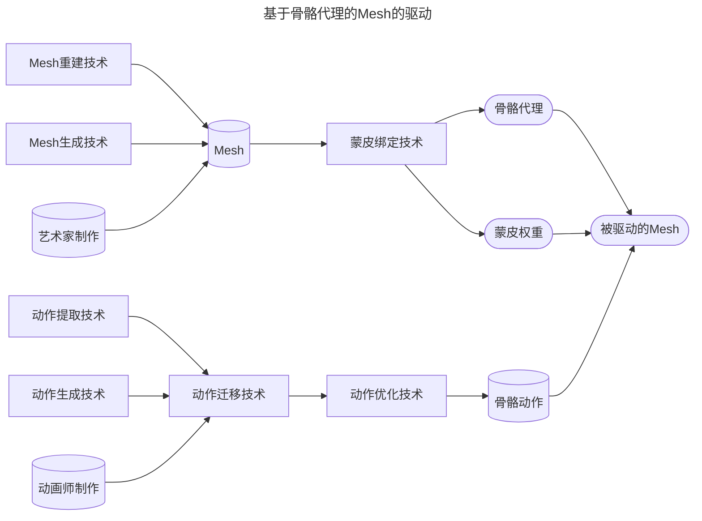
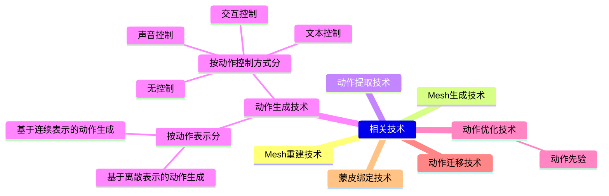

# 基于骨骼代理的Mesh的驱动

```mermaid
---
title: 基于骨骼代理的Mesh的驱动
---
flowchart LR
    Mesh[("Mesh")]
    骨骼动作[("骨骼动作")]
    骨骼代理(["骨骼代理"])
    蒙皮权重(["蒙皮权重"])
    被驱动的Mesh(["被驱动的Mesh"])

    艺术家制作[("艺术家制作")]
    动画师制作[("动画师制作")]

    Mesh重建技术 & Mesh生成技术 & 艺术家制作 --> Mesh
    动作提取技术 & 动作生成技术 & 动画师制作 --> 动作迁移技术 --> 动作优化技术 --> 骨骼动作
    Mesh-->蒙皮绑定技术-->骨骼代理 & 蒙皮权重
    骨骼代理 & 蒙皮权重 & 骨骼动作 --> 被驱动的Mesh
```

```mermaid
mindmap
相关技术
    Mesh重建技术
    Mesh生成技术
    动作提取技术
    动作生成技术
        按动作表示分
            基于连续表示的动作生成
            基于离散表示的动作生成
        按动作控制方式分
            无控制
            文本控制
            声音控制
            交互控制
    动作优化技术
        动作先验
    动作迁移技术
    蒙皮绑定技术
```