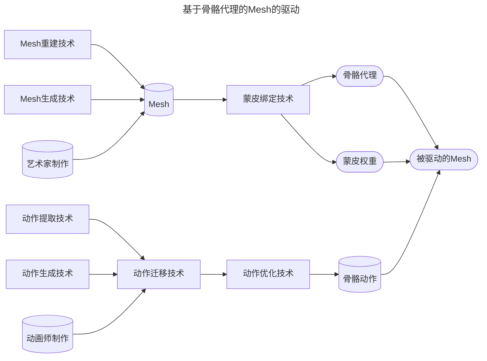
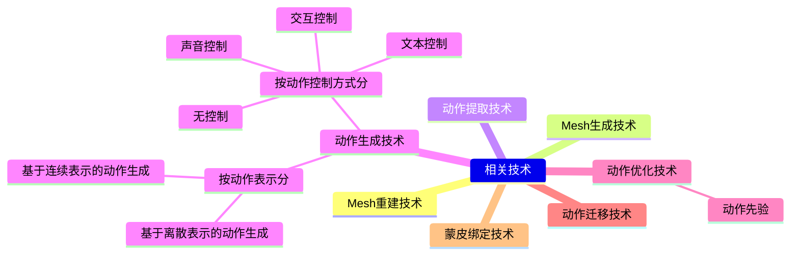

# 基于骨骼代理的Mesh的驱动

## Overview

**这个方向在做什么**
给一个静态 Mesh 资产注入运动能力——使它能响应外部控制信号（用户输入、文本、参考视频）做出自然、真实、可控的肢体动作。整个流程分为三个解耦的子问题：**蒙皮绑定**（建立骨骼与 Mesh 的关联）、**动作获取**（生成或迁移骨骼动作序列）、**前向驱动**（将骨骼动作应用到 Mesh 上得到最终输出）。

**为什么用骨骼做代理**
Mesh 有成千上万个顶点，控制信号（"向左走"、"挥手"）无法直接映射到每个顶点的位移。骨骼是一个低维、结构化的中间层：几十根骨骼就能描述一个完整姿态，蒙皮权重再把骨骼运动"广播"到全部顶点。这个设计沿用了几十年，至今仍是游戏、影视工业的标准 pipeline。

**三个子问题各自的挑战**

| 子问题 | 核心挑战 | 典型技术 |
|---|---|---|
| 蒙皮绑定 | 自动从 Mesh 几何预测骨骼结构和蒙皮权重，通用性差、非刚体区域误差大 | 几何学习、GNN、扩散模型 |
| 动作生成 | 在满足物理约束的前提下生成可控、多样、泛化到不同地形/体型的动作 | 运动匹配、相位网络、强化学习 |
| 动作迁移 | 将源角色动作迁移到拓扑/比例各异的目标角色，同时保持运动语义 | 重定向、风格迁移、逆运动学 |

**动作生成的两大技术路线**

- **基于运动学**：直接控制关节角度/位置，不考虑物理合理性，效果上限受数据质量制约。细分为数据库匹配（Motion Matching）、监督学习（相位网络）、生成模型（扩散）三类。
- **基于动力学**：驱动力/力矩作为控制量，角色在物理模拟中运动，天然具备物理真实感和抗扰动能力，但训练成本高、策略迁移难。

**目前还没解决的问题**
1. **跨体型泛化**：同一个运动控制器在不同比例、不同拓扑的 Mesh 上表现不稳定
2. **开放世界地形**：大多数方法在受限地形数据集上训练，遇到新地形需要重新设计
3. **蒙皮绑定自动化**：对非人形或高度变形区域（衣物、软体），自动绑定质量仍不如艺术家手工
4. **动力学方法的数据效率**：基于 RL 的方法需要大量仿真交互，样本效率低

---

