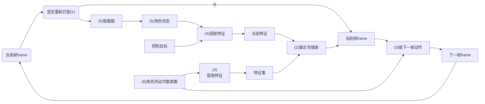
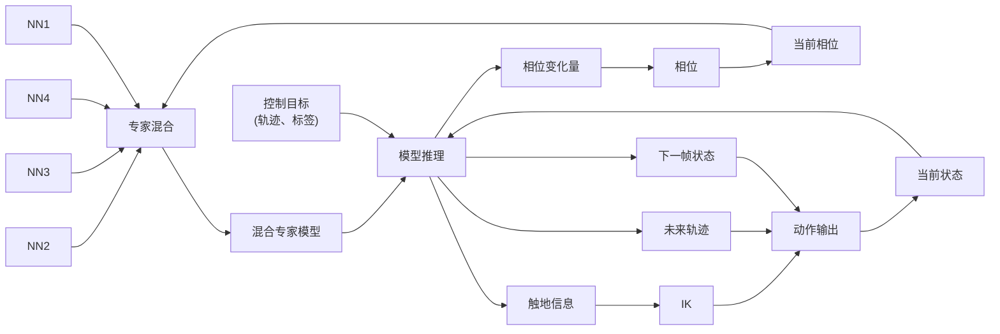
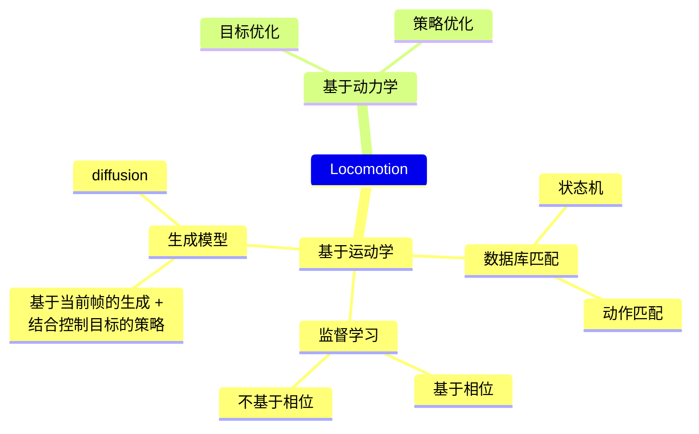
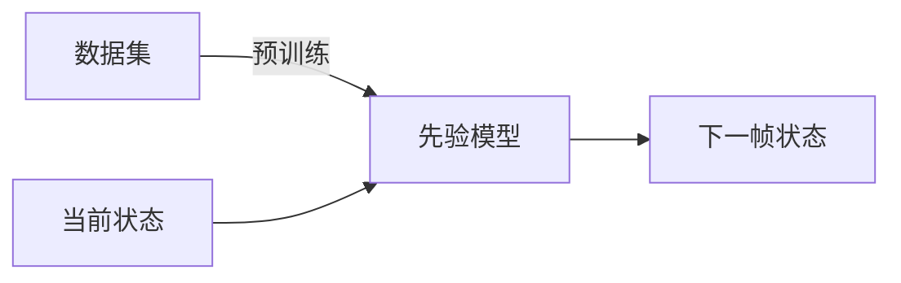
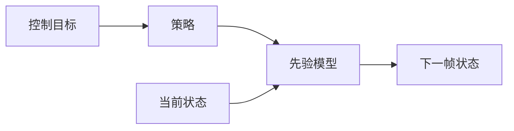
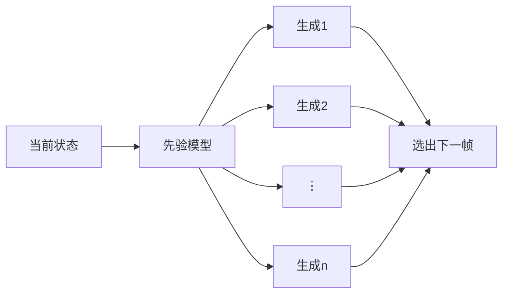
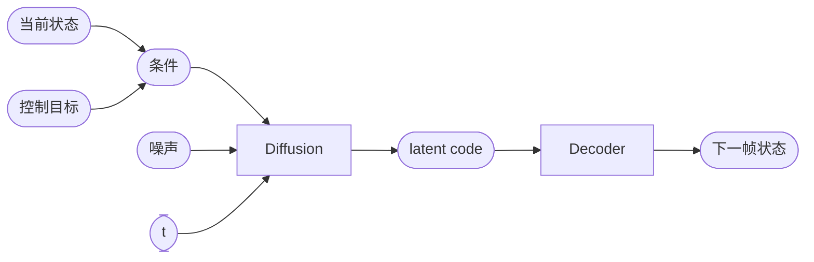

P41 A   

| ID     | Year | Title    | 特点             |
|--|--|--|--|
|        |      | Motion Field    |             |
|        |      | Motion Graph   | Baseline，以clip为单位 (1) 只在一个clip结束时重新匹配自己 (2) 寻找最适配的clip，并用拖帧衔接。|
|        |      | Motion Matching   | 以frame为单位 (1) 每帧或几帧重新匹配，响应更快 (2) 寻找最匹配的帧，并用blend 做衔接。 |
|        | 2020 | Learned Motion Matching | 基于数据集，把(1)(2)(3)(4)替换成了网络模块，消除了在线推理时对数据库的依赖。 |
| 231016 | 2024.8.16 | Interactive Character Control with Auto-Regressive Motion Diffusion Models  | 让(5)和(6)分别是不同的角色，并增加将运动内容与运动风格解耦的模块。 在运动空间进行最近邻匹配，在匹配结果中融入目标风格，实现在线风格迁移的效果。 |

笔记P1

笔记P2

笔记P3

**优势：**   
1. 能对用户输入做出稳定实时的响应。    

**局限性：**   
1. 依赖精心的设计   
2. 用高度可变的运动数据进行训练，会产生平均化的结果。   
3. 难以泛化到数据以外的动作。   

笔记P4

2022    DeepPhase    
从全身运动数据中提取深度多维相位信息，以实现更好的时间和空间对齐     

基于运动学的方法：直接控制每个关节的动画数据，不考虑其物理合理性，其效果上限受制于数据。

基于动力学的方法：不直接提供动画数据，而是提供关节受力，让每个关节在力的作用下运动。

### 生成 + 控制    

(1) 无控制自回归生成模型   

(2) 引入控制策略

    

### 提取文字

| ID  | Year | Title | 特点 |
|-----|------|-------|------|
| 136 | P15 Ⓐ |      | 使用RL策略控制或Monte-Carlo方式 |
|     | P47 Ⓐ |     | 风格迁移任务，根据源角色当前状态预测目标角色下一帧动作。不涉及未来轨迹引导。 |
|     | P46 Ⓐ |     | A-MDM 136中的VAE替换成了MLP diffusion 并使用分层强化学习进行控制。 |

### 条件生成

1. 难以在各种控制信号间进行泛化。    
2. 难以泛化到数据以外的动作。   
3. 支持多模态条件信号和任意损失引导。   
4. 能够实现更长期的目标和复杂任务。    

| ID | Year | Name | 主要贡献是什么 |
|----|------|------|----------------|
|    | [1]  |      | Tracer（扩散模型）结合地形与用户控制生成优化轨迹。 Pacer根据轨迹、地形等因素生成关节控制策略，且可泛化到不同体型的人身上。 |

| ID | Year | Name | 主要贡献 |
|----|------|------|----------|
|    | [2]  |      | 1. 把运动规划和控制整合到一个模型中，消除两个模型带来的domaingap 2. 文本、目标、轨迹等多模态输入 3. Diffusion Forcing范式进行训练，消除长期累计误差 4. 通过引导采样，无需finetune，即可泛化到不同（包括没见过）的控制信号。  具体方法为行为克隆学习，先从动捕数据中提取状态-策略对，再用diffusion学习策略。 |

### 运动规划器 + 运动控制器

类似“可控生成 + 动作优化”   

1. 规划器和控制器之间存在GAP，导致动作质量下降
2. 控制策略难以准确跟踪规划的运动，需要微调，限制了其泛化能力
3. 优点同“可控生成”

P48Ⓑ
笔记 P10

### 运动先验 + 下游控制    

类似于“生成 + 控制”

1. 每个任务都需要单独训练策略

P49 Ⓐ    

