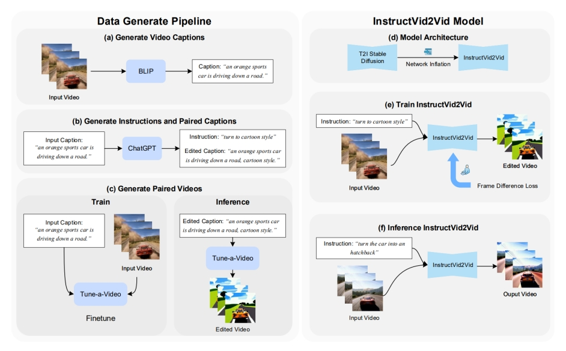
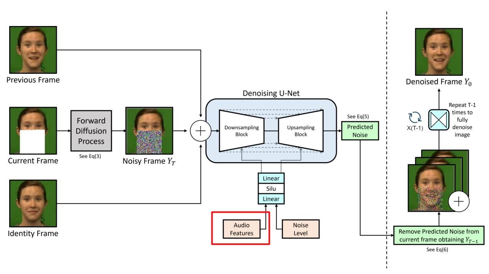

P263   
# 3 Video Editing  

## 3.5 Other Guidance

P264  

   

> &#x2705; 在已有图片的情况，直接输入 Prompt 不符合用户习惯，用户只需描述要修改的点，通过 Prompt 2 Prompr 转化为完整 prompt.    

P265   
## InstructPix2Pix

Instruction-guided image editing

 

Brooks et al., “InstructPix2Pix: Learning to Follow Image diting Instructions,” CVPR 2023.  

P266   
## InstructVid2Vid

Instruction-guided Video Editing

 - Generate ⟨instruction, video⟩ dataset using ChatGPT, BLIP and Tune-A-Video   
 - Train inflated Stable Diffusion for instruction-guided video editing   

 

Qin et al., “InstructVid2Vid: Controllable Video Editing with Natural Language Instructions,” arXiv 2023.    

> &#x2705;（1）把说话的部分 mask 掉 （2）用 diffusion 根据 Audio Feature 生成说话的部分。   
> &#x2705; 额外约束：（1）reference 状态 （2）前后帧 smooth     
> &#x2705; 语音驱动嘴形。   

P267   
## Speech Driven Video Editing via an Audio-Conditioned Diffusion Model

Speech-driven video editing

 

Bigioi et al., “Speech Driven Video Editing via an Audio-Conditioned Diffusion Model,” arXiv 2023.   

P268   
## Soundini

Sound-guided video editing

 

Lee et al., “Soundini: Sound-Guided Diffusion for Natural Video Editing,” arXiv 2023.    

P269   
## Video Editing Under Various Guidance: More Works

|||
|--|--|
|   | **Collaborative Score Distillation** (Kim et al.)   Instruction-guide video editing   “Collaborative Score Distillation for Consistent Visual Synthesis,” NeurIPS 2023. |
|   | **Make-A-Protagonist** (Zhao et al.)   Video ediSng with an ensemble of experts   “Make-A-Protagonist: Generic Video Edigng with An Ensemble of Experts,” arXiv 2023. |
|   | **DragNUWA** (Yin et al.)   Multimodal-guided video editing   “DragNUWA: Fine-grained Control in Video Generation by Integrating Text, Image, and Trajectory,” arXiv 2023. |

P272

> &#x2705; showlab/Awesome-Video-Diffusion    

