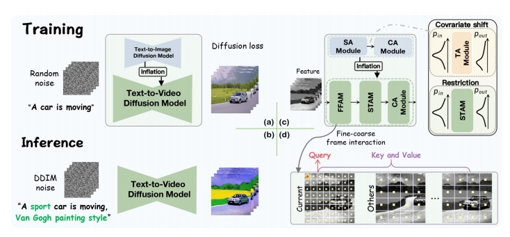
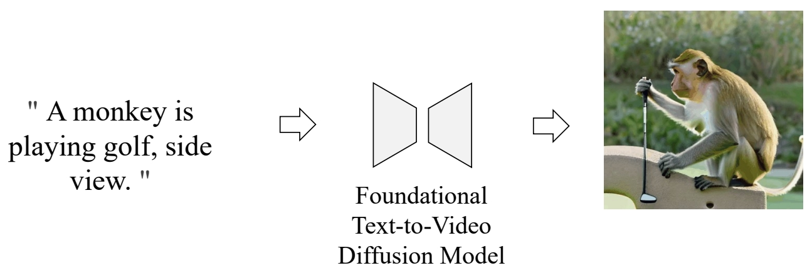

P147  
# 3 Video Editing

## 3.1 Tuning-based

P148  
## One-Shot Tuned

P149 

 

P150  
## Tune-A-Video

One-shot tuning of T2I models for T2V generation/editing

 

Wu et al., “Tune-A-Video: One-Shot Tuning of Image Diffusion Models for Text-to-Video Generation,” ICCV 2023.    

<https://github.com/showlab/Tune-A-Video>

### **Motivation**

Motivation: appearance from pretrained T2I models, dynamics from a reference video 

   

P153

### 方法

**Obs #1: Still images that accurately represent the verb terms**

 

**Obs #2: Extending attention to spatio-temporal yields consistent content**

 

P154   

 

P155

 

**Full finetuning**: finetunes the entire network

 - inefficient, especially when #frames increases;   
 - prone to overfitting → poor editing ability.   

**Our tuning strategy**: update the specific projection matrices

 - parameter efficient and fast (~10 min);    
 - retains the original property of pre-trained T2I diffusion models.   

\begin{align*} \mathcal{V} ^\ast =\mathcal{D} (\mathrm{DDIM-samp} (\mathrm{DDIM-inv} (\varepsilon (\mathcal{V} )),\tau^\ast  ))\end{align*}

**Structure guidance via DDIM inversion**

 - preserves the structural information   
 - improves temporal consistency      

P156  
### 主观效果

    
P157  
 
P158  
 
P159  
  
P160  
 

P161
### 客观指标

 

**Automatic metrics – CLIP Score**

 - *Frame Consistency*: the average cosine similarity between all pairs of video frames   
 - *Textual Alignment*: average CLIP score between all frames of output videos and corresponding edited prompts    

**User study** 

Compare two videos generated by our method and a baseline (shown in random order):   

 - *Which video has better temporal consistency?*    
 - *Which video better aligns with the textual description?*    

Wu et al., “Tune-A-Video: One-Shot Tuning of Image Diffusion Models for Text-to-Video Generation,” ICCV 2023.

> &#x2705; base model：没有太多 motion.   

P162  
## Dreamix

Few-shot finetuning for personalized video editing

**Main idea: Mixed Video-Image Finetuning**

 - Finetune Imagen Video (Ho et al., 2022) which is a strong video foundation model

 

 - Finetuned to generate individual frames (bypassing temporal attentions) & video

 

Molad et al, “Dreamix: Video Diffusion Models are General Video Editors,” arXiv 2023.    

P163  
## Dreamix

Few-shot finetuning for personalized video editing

**Inference Overview**

 - Corrupt the input video by downsampling and add noise   
 - Apply the finetuned video diffusion model to denoise and upscale   

 

Molad et al, “Dreamix: Video Diffusion Models are General Video Editors,” arXiv 2023.    

P164   
## One-Shot Tuned Video Editing: More Works

> 部分笔记移至Mike Shou章节

|||
|--|--|
|   | \\(\mathbf{EI^2}\\) (Zhang et al.)  Modify self-attention for better temporal consistency   “Towards Consistent Video Editing with Text-to-Image rDiffusion Models,” arXiv 2023. |

|ID|Year|Name|Note|Tags|Link|
|---|---|---|---|---|---|
||2023|Video-P2P: Video Editing with Cross-attention Control|Improve input-output semantic consistency of video editing via shared embedding optimization and cross-attention control。 |attention控制|

> &#x2705; 不需要训练的方式。   

P165   
## One-Shot Tuned Video Editing: More Works

 

**Compared to training-free editing methods:** 

 - Cons: still need 1 video for training
 - Pros: supports significant shape change 

Wu et al., “Tune-A-Video: One-Shot Tuning of Image Diffusion Models for Text-to-Video Generation,” ICCV 2023.    

P166  
## Multiple-Shot Tuned

Video Editing: Text Conditioned

P167  

 

P168
## MotionDirector

Tune on multiple videos of a motion to be customised

 

Zhao et al., “MotionDirector: Motion Customization of Text-to-Video Diffusion Models,” arXiv 2023.    

P169  
## MotionDirector

Tune on multiple videos of a motion to be customised

 

Zhao et al., “MotionDirector: Motion Customization of Text-to-Video Diffusion Models,” arXiv 2023.    

P170   
## MotionDirector

Tune on multiple videos of a motion to be customised

 

Zhao et al., “MotionDirector: Motion Customization of Text-to-Video Diffusion Models,” arXiv 2023   

P171   
## MotionDirector

## Tune on multiple videos of a motion to be customised

 - MokonDirector can customize foundakon models to generate videos with desired mokons.

 

Zhao et al., “MotionDirector: Motion Customization of Text-to-Video Diffusion Models,” arXiv 2023.   

P172   
## MotionDirector

Tune on multiple videos of a motion to be customised  

 - The challenge is generalizing the learned motions to diverse appearance.   
 - MotionDirector learns the appearances and motions in reference videos in a decoupled way, to avoid overfitting on the limited appearances.   

 

Zhao et al., “MotionDirector: Motion Customization of Text-to-Video Diffusion Models,” arXiv 2023.   

P173   
## MotionDirector

Tune on multiple videos of a motion to be customised

 - Decouple appearance and motion.

 

Zhao et al., “MogonDirector: Mogon Customizagon of Text-to-Video Diffusion Models,” arXiv 2023.     

P174   
## MotionDirector  

Tune on muleple videos of a moeon to be customised

- Comparing with other methods.

 

Zhao et al., “MotionDirector: Motion Customization of Text-to-Video Diffusion Models,” arXiv 2023.    

P175   
## MotionDirector

Tune on multiple videos of a motion to be customised

 - Comparing with other methods.   

 

Zhao et al., “MotionDirector: Motion Customization of Text-to-Video Diffusion Models,” arXiv 2023.    

P176  
## MofonDirector

Tune on multiple videos of a motion to be customised

 

Zhao et al., “MotionDirector: Motion Customization of Text-to-Video Diffusion Models,” arXiv 2023.     

---------------------------------------
> 本文出自CaterpillarStudyGroup，转载请注明出处。
>
> https://caterpillarstudygroup.github.io/ImportantArticles/

> &#x2705; 在一个视频上训练后可以对视频进行编辑。   
> &#x2705; 训练过程：(1) 对模型的时域模块 finetune．   
> &#x2705; (2) 对图像打乱后用图像 finetune．  
> &#x2705; 把视频和图片进行 mix finetune.    
> &#x2705; 图片 finetune 会把 tenmporal 模块 fix 住。   

> &#x2705; 需要训练的模型，且针对一个模型进行训练。   
> &#x2705; 基本泛式：输入：一段视频，一个文生图模型，一个文本提示词。输出：基于定制化的文生图得到文生视频。   
> &#x2705; 不在大规模上训练，只在一个视频上训练，只需十分钟。  

> &#x2705; 推断过程：(1) 把视频 dounsample，维度变小。   
> &#x2705; (2) 加入噪声作为初始噪声，类似于 DDIM Inversion.     
> &#x2705; (3) 用 diffusion model 生成。   
> &#x2705; (4) 上采样。   
> &#x2705; 如果有更多 reference vedio 是不是能学得更好。   
> &#x2705; (1) 用几段视频学习 concept．   
> &#x2705; (2) 把 concept 接入到 diffusion model 中。   
> &#x2705; 通过多段视频学习 motion concept.   

> &#x2705; 不仅学 motion，还可以学 camera motion，camera motion，物体轨迹。 

> &#x2705; 怎么把一个 concept 应用到不同的物体上。   
> &#x2705; 怎样只学 motion 而不被物体的 appearance 影响，能不能 decouple.   
> &#x2705; 分支1：spatial path，灰色为 spatial LoRA，学习外表信息。   
> &#x2705; 分支2：temporal path，蓝色为 temporal LoRA，这个 path 用于学习 motion.    
> &#x2705; debias：去掉 appreance 对 loss 的影响。   
> &#x2705; temporal LORA 学习时使用但不修改 spatial LORA 的 Weight.   
> &#x2705; 应用：(1) 也可以用于 one shot       
> &#x2705; (2) 可以用于 appreace 和 motion 的组合   
> &#x2705; (3) 可以用于 Image Animation 