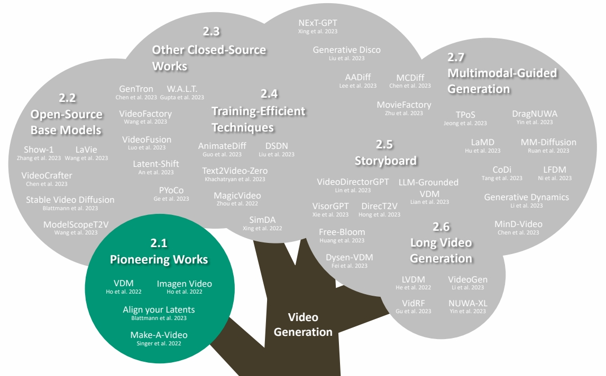
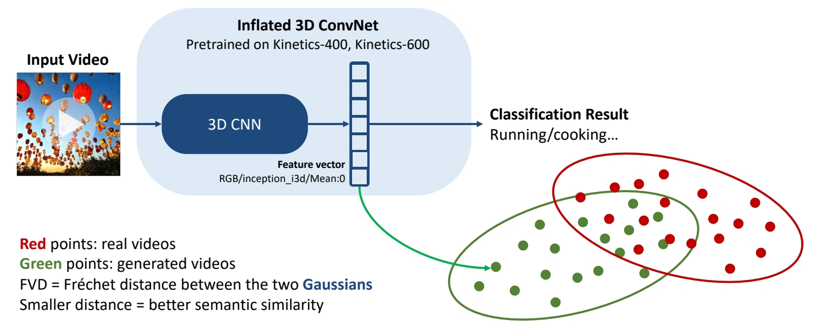
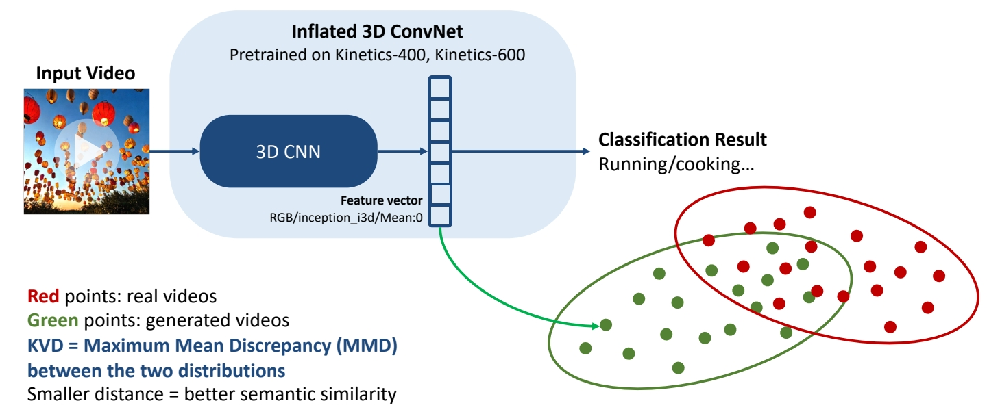
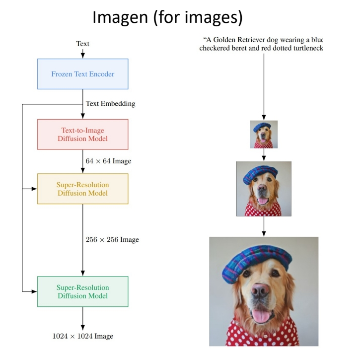
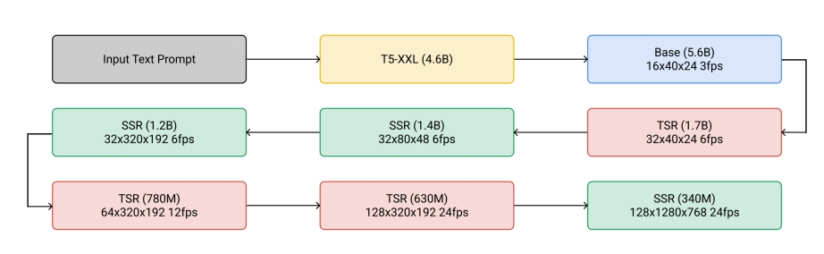

P36  
# Video Diffusion Models  

## 2D -> 3D

VDM的一般思路是，在T2I基模型的基础上，引入时序模块并使用视频数据进行训练。  

引入时间模型的方法有卷积方法（Conv3D、Conv(2+1)D）、注意力机制(Cross Attention、Transformer)

|||
|---|---|
|Conv2D||
|Conv3D||
|Conv(2+1)D||

> &#x2705; \\(t\times d\times d\\) 卷积 kenal 数量非常大，可以对 kernel 做分解，先在 spatial 上做卷积，然后在 temporal 上做卷积。   
> &#x2705; 特点：效果还不错，效率也高。   

P39   
## 3D U-Net factorized over space and time

> &#x2705; 2D U-Net 变为 3D U-Net，需要让其内部的 conv 操作和 attention 操作适配 3D.   

- Image 2D conv inflated as → space-only 3D conv, i.e., 2 in (2+1)D Conv   

> &#x2705; (1) 2D conv 适配 3D，实际上只是扩充一个维度变成伪 3D，没有对时序信息做抽象。  

   - Kernel size: (3×3) → (<u>1</u>×3×3)   
   - Feature vectors: (height × weight × channel) → (<u>frame</u> × height × width × channel)   
- Spatial attention: remain the same   

> &#x2705; (2) attention 操作同样没有考虑时序。   

- Insert temporal attention layer: attend across the temporal dimension (spatial axes as batch)   

> &#x2705; (3) 时序上的抽象体现在 temporal attention layer 上。   

|ID|Year|Name|Note|Tags|Link|
|---|---|---|---|---|---|
||2022|Video Diffusion Models|

P40  
# Make-A-Video

|ID|Year|Name|Note|Tags|Link|
|---|---|---|---|---|---|
||2022|Make-A-Video: Text-to-Video Generation without Text-Video Data|

Cascaded generation

 

> &#x2705; 效果更好，框架在当下更主流。   
> &#x2705; (1) SD：decoder 出关键帧的大概影像。  
> &#x2705; (2) FI：补上中间帧。   
> &#x2705; (3) SSR：时空上的超分。   
> &#x2705; 时序上先生成关键帧再插帧，空间上先生成低质量图像再超分。   
> &#x2705; 这种时序方法不能做流式输出。   

P41   

    

> &#x2753; 第 3 步时间上的超分为什么没有增加帧数？   

P42  

  

> &#x2705; 此处的伪 3D 是指 (2＋1)D，它有时序上的抽像，与 VDM 不同。   
> &#x2705; 空间卷积使用预训练好的图像模型。   

P43   
## Make-A-Video

Cascaded generation

 

> &#x2705; attention 操作也是 (2＋1)D．      

P44  

**Training**
 - 4 main networks (decoder + interpolation + 2 super-res)   
    - First trained on images alone    
    - Insert and finetune temporal layers on videos   
 - Train on WebVid-10M and 10M subset from HD-VILA-100M   

> &#x2705; 先在图片上训练，再把 temporal layer 加上去。    

P45   
## Datasets

The WebVid-10M Dataset

 

Bain et al., “Frozen in Time: A Joint Video and Image Encoder for End to End Paper,” ICCV 2021.    

> &#x2705; WebVid 是常用的视频数据集，有高清视频及配对文本。   

P46   
## Evaluation Metrics

 

P47   

## Evaluation Metrics   

Quantitative evaluations

**Image-level Evaluation Metrics**

 - Fréchet Inception Distance (FID, ↓): semantic similarity between images   
 - Peak Signal-to-Noise Ratio (PSNR, ↑): pixel-level similarity between images   
 - Structural Similarity Index (SSIM, ↓): pixel-level similarity between images   
 - CLIPSIM (↑): image-text relevance   

**Video-level Evaluation Metrics**

 - Fréchet Video Distance (FVD, ↓): semantic similarity & temporal coherence   
 - Kernel Video Distance (KVD, ↓): video quality (via semantic features and MMD)   
 - Video Inception Score (IS, ↑): video quality and diversity   
 - Frame Consistency CLIP Score (↑): frame temporal semantic consistency   

P48   
## Fréchet Inception Distance (FID)

Semantic similarity between images

 

**Lantern image generated with Stable Diffusion 2.1.**    

Heusel et al., “GANs Trained by a Two Time-Scale Update Rule Converge to a Local Nash Equilibrium,” NeurIPS 2017.    
Hung-Yi Lee, “Machine Learning 2023 Spring,” National Taiwan University.    

> &#x2705; FID：评估两个 distribution 的差距有多大。   
> &#x2705; 由于使用了网络的高层 feature，可以评价 high／evel 的语义相似性。   

P49   
## Peak Signal-to-Noise Ratio (PSNR)

Pixel-level similarity between images

 - For two images \\(x,y \text{ of shape }  M\times N\\):   

\begin{align*} \mathrm{PSNR} (x,y) = 10 \log_{10}{} \frac{255^2}{\mathrm{MSE} (x,y)}  \end{align*}

where    

\begin{align*} \mathrm{MSE} (x,y) = \frac{1}{MN} \sum_{i=1}^{M} \sum_{j=1}^{N} (x_{ij}-y_{ij})^2\end{align*}

Horé et al., “Image Quality Metrics: PSNR vs. SSIM,” ICPR 2010.    

P50  
## Structural Similarity Index Measure (SSIM)

Pixel-level similarity between images

 - Model any image distortion as a combination of:   
(1) loss of correlation, (2) luminance distortion, (3) contrast distortion

 - For two images \\(x,y \text{ of shape }  M\times N\\):   

\begin{align*}  \mathrm{SSIM} (x,y)=l(x,y)\cdot c(x,y)\cdot s(x,y)\end{align*}

where   

\begin{align*} \begin{cases}
 \text{Lumiannce Comparison Funckon:} l(x,y)=\frac{2\mu _x\mu _y+C_1}{\mu _x^2+\mu _y^2+C_1}  \\\\ 
 \text{Contrast Comparison Funckon:} c(x,y)=\frac{2\sigma  _x\sigma  _y+C_2}{\sigma  _x^2+\sigma  _y^2+C_2}  \\\\ 
  \text{Structure Comparison Funckon:} s(x,y)=\frac{\sigma  _{xy}+C_3}{\sigma  _{x}\sigma  _{y}+C_3}  \end{cases}\end{align*}
 

Wang et al., “Image Quality Assessment: from Error Visibility to Structural Similarity,” IEEE Transactions on Image Processing, April 2004.   
Horé et al., “Image Quality Metrics: PSNR vs. SSIM,” ICPR 2010.   

P51   
## CLIP Similarity   

Image-caption similarity

 

Radford et al., “Learning Transferable Visual Models From Natural Language Supervision,” ICML 2021.      

P52   
## Fréchet Video Distance (FVD)  

Semantic similarity and temporal coherence between two videos    

 

Unterthiner et al., “FVD: A new Metric for Video Generation,” ICLR 2019.    
Unterthiner et al., “Towards Accurate Generative Models of Video: A New Metric & Challenges,” arXiv 2018.     

P53   
## Kernel Video Distance   

Video quality assessment via semantic features and MMD  

 

Unterthiner et al., “FVD: A new Metric for Video Generation,” ICLR 2019.    
Unterthiner et al., “Towards Accurate Generative Models of Video: A New Metric & Challenges,” arXiv 2018.      

P54   
## Video Inception Score (IS)

Video quality and diversity

 

Salimans et al., “Improved Techniques for Training GANs,” NeurIPS 2016.    
Barratt et al., “A Note on the Inception Score,” ICML 2018.    
Saito et al., “Train Sparsely, Generated Densely: Memory-Efficient Unsupervised Training of High-Resolution Temporal GAN,” IJCV 2020. 

> &#x2705; 多样性，在不给定 condition 的情况生成的分布的多样性。   
> &#x2705; 质量：在给 condition 的条件下应生成特定的类别。   

P55   
## Frame Consistence CLIP scores

Frame temporal semantic consistency

 - Compute CLIP image embeddings for all frames   
 - Report average cosine similarity between all pairs of frames   

 

Radford et al., “Learning Transferable Visual Models From Natural Language Supervision,” ICML 2021.    

P57   
## Evaluation Metrics    

Hybrid evaluation

**EvalCrafter**

 - Creates a balanced prompt list for evaluation   
 - **Multi-criteria decision analysis** on 18 metrics: visual quality, content quality…   
 - Regress the coefficients of all metrics to generate an overall score aligned with user opinions   

 

Liu et al., “EvalCrafter: Benchmarking and Evaluating Large Video Generation Models,” arXiv 2023.      

P58  
## Make-A-Video   

Cascaded generation

 

Singer et al., “Make-A-Video: Text-to-Video Generation without Text-Video Data,” arXiv 2022.    

P59   
## Make-A-Video   

Cascaded generation

 

Singer et al., “Make-A-Video: Text-to-Video Generation without Text-Video Data,” arXiv 2022.     

> &#x2705; 早期都在 UCF 数据上比较，但 UCF 本身质量比较低，新的生成方法生成的质量更高，因此不常用 UCF 了。  

P60  
## Make-A-Video   

Cascaded generation

 

Singer et al., “Make-A-Video: Text-to-Video Generation without Text-Video Data,” arXiv 2022.    

P62   
## Make-A-Video   

Cascaded generation

**From static to magic**   

Add motion to a single image or fill-in the in-betw    

 

Singer et al., “Make-A-Video: Text-to-Video Generation without Text-Video Data,” arXiv 2022.    

P63   
# Imagen & Imagen Video

Leverage pretrained T2I models for video generation; Cascaded generation

|||
|--|--|
|   |   |

Imagen: Saharia et al., “Photorealistic Text-to-Image Diffusion Models with Deep Language Understanding,” arXiv 2022.    
Imagen Video: Ho et al., “Imagen Video: High Definition Video Generation with Diffusion Models,” arXiv 2022.    

> &#x2705; 先在 image 上做 cascade 生成      
> &#x2705; 视频是在图像上增加时间维度的超分   
> &#x2705; 每次的超分都是独立的 diffusion model?   
> &#x2753; temporal 超分具体是怎么做的？   

P64   
## Align your Latents

|ID|Year|Name|Note|Tags|Link|
|---|---|---|---|---|---|
|48|2023|Align your Latents: High-Resolution Video Synthesis with Latent Diffusion Models|T2I(LDM) -> T2V(SVD) Cascaded generation||[link](https://caterpillarstudygroup.github.io/ReadPapers/48.html)| 

---------------------------------------
> 本文出自CaterpillarStudyGroup，转载请注明出处。
>
> https://caterpillarstudygroup.github.io/ImportantArticles/