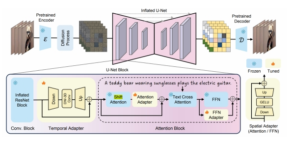

P96  
# 2 Video Generation

## 2.4 Training-efficient techniques

> &#x2705; 在低分辨率数据上训练，但结果可以泛化到高分辨率。   
> &#x2705; 优势：可以即插即用到各种用户定制化的模型中。   

P97  

 

P98 
## AnimateDiff  

Transform domain-specific T2I models to T2V models

 - Domain-specific (personalized) models are widely available for image   
    - Domain-specific finetuning methodologies: LoRA, DreamBooth…   
    - Communities: Hugging Face, CivitAI…   
 - **Task: turn these image models into T2V models, without specific finetuning**   

Guo et al., “AnimateDiff: Animate Your Personalized Text-to-Image Diffusion Models without Specific Tuning,” arXiv 2023.     

> &#x2705; 用同一个 patten 生成 noise，得到的 image 可能更有一致性。   
> &#x2705; （2）中间帧的特征保持一致。    

P99  
## AnimateDiff   

Transform domain-specific T2I models to T2V models

**Methodology**

 - Train a motion modeling module (some temporal layers) together with frozen base T2I model   
 - Plug it into a domain-specific T2I model during inference   

 

Guo et al., “AnimateDiff: Animate Your Personalized Text-to-Image Diffusion Models without Specific Tuning,” arXiv 2023.    

> &#x2705; 在 noise 上对内容进行编辑，即定义第一帧的 noise，以及后面帧的 noise 运动趋势。   

P100 
## AnimateDiff   

Transform domain-specific T2I models to T2V models

**Methodology** 

 - Train a motion modeling module (some temporal layers) together with frozen base T2I model   
 - Plug it into a domain-specific T2I model during inference   

   

 - Train on WebVid-10M, resized at 256x256 (experiments show can generalize to higher res.)   

Guo et al., “AnimateDiff: Animate Your Personalized Text-to-Image Diffusion Models without Specific Tuning,” arXiv 2023.    

> &#x2705; 保证中间帧尽量相似。   

P101   
> &#x2705; 扣出背景并 smooth.    

P102  
## Text2Video-Zero   

Use Stable Diffusion to generate videos without any finetuning

**Motivation: How to use Stable Diffusion for video generation without finetuning?**  

 - Start from noises of similar pattern   
 - Make intermediate features of different frames to be similar   

Khachatryan et al., “Text2Video-Zero: Text-to-Image Diffusion Models are Zero-Shot Video Generators,” arXiv 2023.    

> &#x2705; 完全没有经过训练，使用 stable diffusion 生成。  

P103   
## Text2Video-Zero   

Use Stable Diffusion to generate videos without any finetuning

 - Start from noises of similar pattern: given the first frame’s noise, define a global scene motion, used to translate the first frame’s noise to generate similar initial noise for other frames   

 

Khachatryan et al., “Text2Video-Zero: Text-to-Image Diffusion Models are Zero-Shot Video Generators,” arXiv 2023.  

P104   
## Text2Video-Zero

Use Stable Diffusion to generate videos without any finetuning

 - Make intermediate features of different frames to be similar: always use K and V from the first frame in self-attention   

 

Khachatryan et al., “Text2Video-Zero: Text-to-Image Diffusion Models are Zero-Shot Video Generators,” arXiv 2023.    

> &#x2705; 生成电影级别的视频，而不是几秒钟的视频。   

P105   
## Text2Video-Zero

Use Stable Diffusion to generate videos without any finetuning

 - Optional background smoothing: regenerate the background, average with the first frame

 

Khachatryan et al., “Text2Video-Zero: Text-to-Image Diffusion Models are Zero-Shot Video Generators,” arXiv 2023.   

P106   
> &#x2705; 文本 → 结构化的中间脚本 → 视频   

P107 
## Training Efficient Techniques: More Works

|||
|--|--|
|   | **MagicVideo** (Zhou et al.)   Insert causal attention to Stable Diffusion for better temporal coherence   “MagicVideo: Efficient Video Generation With Latent Diffusion Models,” arXiv 2022.  |
|    | **Simple Diffusion Adapter** (Xing et al.)   Insert lightweight adapters to T2I models, shift latents, and finetune adapters on videos  “SimDA: Simple Diffusion Adapter for Efficient Video Generation,” arXiv 2023. |
|  | **Dual-Stream Diffusion Net** (Liu et al.)   Leverage multiple T2I networks for T2V   “Dual-Stream Diffusion Net for Text-to-Video Generation,” arXiv 2023. |

> &#x2705; 用纯文本的形式把图片描述出来。   
> &#x2705; 方法：准备好 pair data，对 GPT 做 fine-tome.    
> &#x2705; 用结构化的中间表示生成图片。   
> &#x2705; 先用 GPT 进行文本补全。   

---------------------------------------
> 本文出自CaterpillarStudyGroup，转载请注明出处。
>
> https://caterpillarstudygroup.github.io/ImportantArticles_mdbook/
