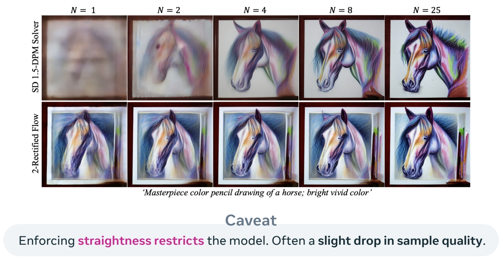

P111  
# Model Adaptation  

P112    
## You’ve trained a model. What next?

    

P113    
Faster Sampling   

P114    
## Faster sampling by straightening the flow   

    

$$
ℒ(θ) = \mathbb{E}_{t,(X_0,X_1)∼π_{0,1}^0}||u^θ_t (X_t) − (X_1 − X_0)||^2
$$

Rectified Flow refits using the **pre-trained (noise, data) coupling**.      
**Leads to straight flows**.     

“Flow Straight and Fast: Learning to Generate and Transfer Data with Rectified Flow” Liu et al. (2022)      
“InstaFlow: One Step is Enough for High-Quality Diffusion-Based Text-to-Image Generation” Liu et al. (2022)    

P116    
## Faster sampling by straightening the flow    

    

“InstaFlow: One Step is Enough for High-Quality Diffusion-Based Text-to-Image Generation” Liu et al. (2022)    

P118    
## Faster sampling by self-consistency loss   

    

“One Step Diffusion via Shortcut Models” Frans et al. (2024)    

P119    
## Faster sampling by self-consistency loss   

    

“One Step Diffusion via Shortcut Models” Frans et al. (2024)    

P121    
## Faster sampling by self-consistency loss    

    

“One Step Diffusion via Shortcut Models” Frans et al. (2024)    

P124   
## Faster sampling by only modifying the solver   

**Can adapt pre-trainedmodels to different schedulers**.  

    

Related by a **scaling & time** transformation:    

    

    

“Elucidating the design space of diffusion-based generative models” Karras et al. (2023)    
“Bespoke Solvers for Generative Flow Models” Shaul et al. (2023)     

P126   
## Faster sampling by only modifying the solver   

**Bespoke solvers:**    
**Decouples** model & solver.     
Model is left unchanged.    
Parameterize solver and optimize.   

**Can be interpreted as** finding best scheduler + more.   

**Solver consistency:** sample quality is retained as NFE → ∞.    

    

“Bespoke Solvers for Generative Flow Models” Shaul et al. (2023)    
“Bespoke Non-Stationary Solvers for Fast Sampling of Diffusion and Flow Models” Shaul et al. (2024)    

P127    
## Faster sampling by only modifying the solver

Bespoke solvers can t**ransfer across different data sets and resolutions**.     

$$
\mathrm{Caveat} 
$$

However, **does not reach distillation performance at extremely low NFEs.**    

“Bespoke Solvers for Generative Flow Models” Shaul et al. (2023)     
“Bespoke Non-Stationary Solvers for Fast Sampling of Diffusion and Flow Models” Shaul et al. (2024)     

P128   
## Faster sampling references   

**Rectified flows:**    
“Flow Straight and Fast: Learning to Generate and Transfer Data with Rectified Flow” Liu et al. (2022)     
“InstaFlow: One Step is Enough for High-Quality Diffusion-Based Text-to-Image Generation” Liu et al. (2024)     
“Improving the Training of Rectified Flows” Lee et al. (2024)    

**Consistency & shortcut models:**      
“Consistency Models” Song et al. (2023)    
“Improved Techniques for Training Consistency Models” Song & Dhariwal (2023)    
“One Step Diffusion via Shortcut Models” Frans et al. (2024)    

**Trained & bespoke solvers:**    

“DPM-Solver-v3: Improved Diffusion ODE Solver with Empirical Model Statistics” Zheng et al. (2023)     
“Bespoke Solvers for Generative Flow Models” Shaul et al. (2023)     
“Bespoke Non-Stationary Solvers for Fast Sampling of Diffusion and Flow Models” Shaul et al. (2024)     

P129   
## You’ve trained a model. What next?   

Inverse Problems (Training-Free)     

P133    
## Solving inverse problems by posterior inference   

    

“Pseudoinverse-Guided Diffusion Models for Inverse Problems” Song et al. (2023)    
“Training-free Linear Image Inverses via Flows” Pokle et al. (2024)    

