P1     
# Flow Matching Basics

P2     
## Agenda   

[40 mins] **01 Flow Matching Basics**     
[35 mins] **02 Flow Matching Advanced Designs**     
[35 mins] **03 Model Adaptation**     
[30 mins] **04 Generator Matching and Discrete Flows**    
[10 mins] **05 Codebase demo**    

P4     
01 Flow Matching Basics   

P6    
WHAT IS FLOW MATCHING?       
A scalable method to train **flow generative models**.      

HOW DOES IT WORK?      
Train by regressing a **velocity**, sample by following the **velocity**      

P8    
## The Generative Modeling Problem

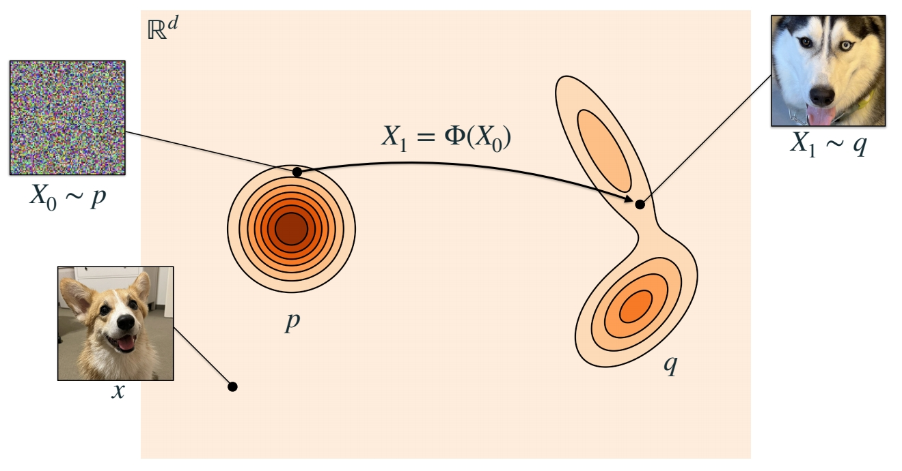   

> 正方形代表所有可能的状态所构成的空间，即图像空间正方形中的每个点代表一个sample，即一张图像。      
\\(P\\) 是源分布，\\(Q\\) 是目标分布。     
\\(X_0\\) 和 \\(X_1\\)分别是 \\(P\\) 分布和 \\(Q\\) 分布中的 sample．     
生成模型的目标是，找到一个可以从 \\(P\\) 中 sample 到 \\(Q\\) 中 sample 的映射。    

P9     

> GAN 是一种生成模型，优点是快，因为它的生成过程只需要一个forward。缺点是（1）没有一个精确的可以用于 sample 的概率模型（2）难以训练。     

P10    
## Model

• Continuous-time Markov process       

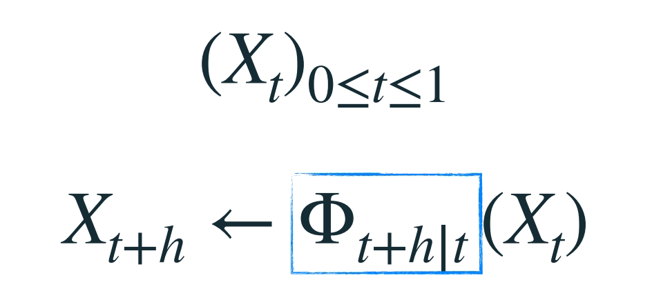

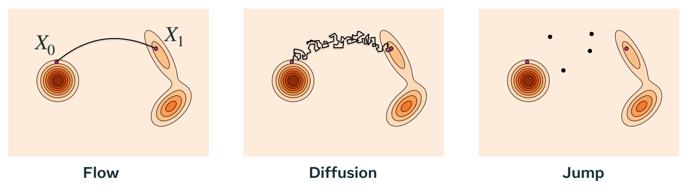

> 增量生成是另一种生成范式，不是直接生成最终结果，而是逐步生成。每一次生成比上一次要好。\\(\Phi\\) 是从一次生成到另一次生成的转移函数。    
Flow 的转移过程是平滑的。Diffusion 是连续但不平滑的。还有一些是不连续的，但都是基于连续时间马尔可夫过程的随机过程。      
生成模型的目标是学习转移函数。      

P11    

## Marginal probability path

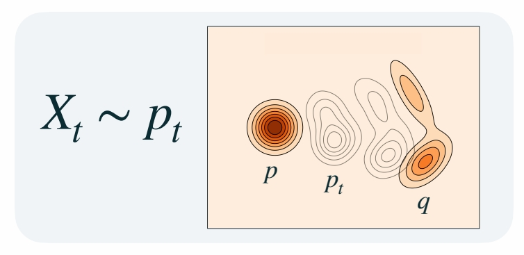

> 边缘概率路径，是指，任意一个特定的 \\(t\\) 时刻，\\(X_t\\) 所属于的分布 \\(P_t\\)。 即连续时间上的分布簇。    
生成模型最重要的是，边缘概率路径以 \\(P\\) 分布开始，以 \\(Q\\) 分布结束。     

P12   
• For now, we focus on flows…    

> 流的特点：(1) 确定性，已知 \\(X_t\\)，那么 \\(X_{t+h}\\) 是确定的。(2) 平滑       
流的优势：(1) sample 速度快 (2) 可以构建模型似然的无偏估计器。      
Diffusion 和 Jump 具有更大的设计空间，因此具有更多生成能力。    

P13    
## Flow as a generative model    

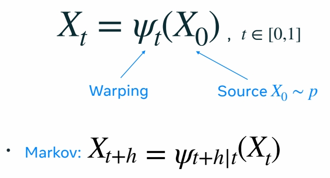

> \\(\Psi_t\\) 是一个双射函数，因此它可以重塑空间而不丢失信息。    
通过对高维空间的 warping，使 \\(P\\) 分布逐步变为 \\(Q\\) 分布。     

> 对两个双射函数做线性组合，得到的函数不能保持其双射的特性，因此，基于双射函数的模型难以被参数化（设计模型结构、连接方式，定义参数如何初始化，哪些参数可以被优化）。    

P14     
## Flow = Velocity    

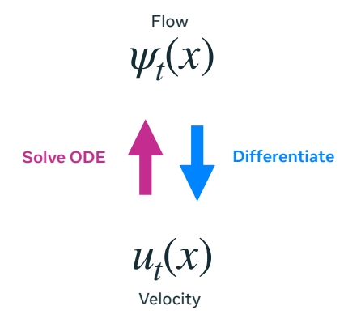    

$$
\frac{d}{dt} \Psi  _t(x)=u_t(\Psi _t(x))
$$

• **Pros**: velocities are <u>**linear**</u>      
• **Cons**: simulate to sample      

> 可以利用速度对流做参数化，在这里，速度是指 \\(P\\) 分布中的每个 sample 向 \\(Q\\) 分布中对应 sample 变化的速度（快慢和方向）。    
对 Flow 做微分可以得到 velocity，对 velocily 解常微分方程，可以得到 Flow.     
使用速度的好处：速度是线性的，可以相加或分解，因此可以对速度做参数化。       
使用速度的缺点：sample 出速度后，要再解一次 ODE。   

P15    
Velocity \\(u_t\\) **generates** \\(p_t\\) if     

$$
X _t=\Psi _t(X_0)\sim p_t
$$

> 使用速度来定义边缘概率路径。   

P16        

> Flow Matching 的训练：学习一个速度模型，由速度得到边缘路径概率 \\(P_t\\)，使得 \\(P_0 = P\\)， \\(P_1= Q\\)     

P17    
## Sampling a flow model

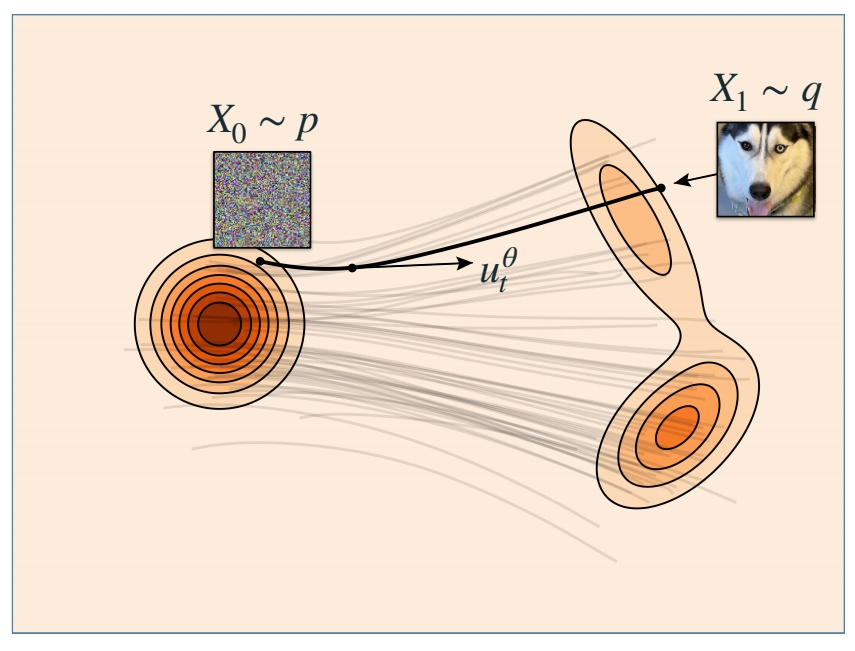    

$$
\frac{d}{dt} X_t=u^0_t(X_t)
$$

Use any ODE numerical solver.      
One that works well: **Midpoint**     

> Flow Matching 的推断：(1) 从 \\(P\\) 分布中 sample 一个 noise， (2) 根随速度（解ODE）得到对应在 \\(Q\\) 分布中的 sample。    

P19    
## Simplest version of Flow Matching 

    
    

$$
\mathbb{E } _{t,X_0,X_1}||u_t^0(X_t)-(X_1-X_0)||^2
$$

"Flow Matching for Generative Modeling" Lipman el al. (2022)      
"Flow Straight and Fast: Learning to Generate and Transfer Data with Rectified Flow" Liu et al. (2022)       
"Building Normalizing Flows with Stochastic Interpolants" Albergo et al. (2022)    

> **flow matching 的训练**      
(1) 随机构造源 \\(X_0\\) 和目标 \\(X_1\\)。     
(2) 在 [0，1] 区间随机采样一个时间步 \\(t\\)。    
(3) \\(X_t\\) 是 \\(X_0\\) 与 \\(X_1\\) 的线性组合。     
(4) \\(X_t\\) 是网络输入，让网络输出逼近\\(X_1-X_0\\)。     

P20     
## Simplest version of Flow Matching 

• Arbitrary \\(X_{0\sim p},X_{1\sim q}\\)      
• Arbitrary coupling \\((X_0,X_1)\sim \pi _{0，1}\\)     

Why does it work?      
• Build flow from conditional flows      
• Regress conditional flows      

> 这里没有对 \\(X_0\\) 和 \\(X_1\\) 所属的分布作限制。 \\(X_0\\) 和 \\(X_1\\) 可以是独立的噪声和图像，也可以是具有某种关系（例如黑白与彩色）的 pair data。    
条件流是指一些简单的，固定的部分。   

P21    
## Build flow from conditional flows
 
    

$$
X_t=\Psi _t(X_0|x_1)=(1-t)X_0+tx_1
$$

\\(p_{t|1}(x|x_1)\\) conditional probability     
\\(u_t(x|x_1)\\) conditional velocity     

  
> 假设目标分布只有 \\(X_1\\) 这一个点，那么流和速度是这样的。    

P22    

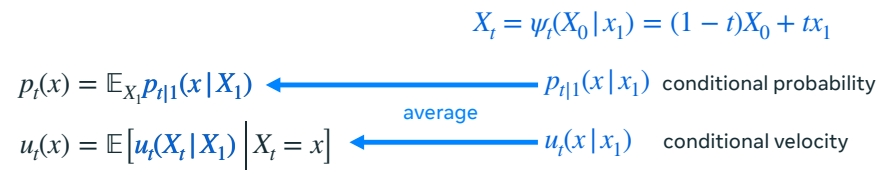    

P23    
## The Marginalization Trick

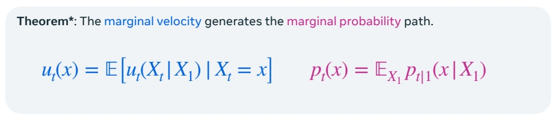    

P24    
## Flow Matching Loss

• Flow Matching loss:     

$$
ℒ_{FM}(θ) = \mathbb{E}  _{t,X_t}||u^θ_t (X_t) − u_t(X_t)||^ 2 
$$

• Conditional Flow Matching loss:    

$$
ℒ_{CFM}(θ) = \mathbb{E}  _{t,X_1,X_t}||u^θ_t (X_t) − u_t(X_t|X_1)||^ 2 
$$

**Theorem:** Losses are equivalent,     

$$
\nabla _θℒ_{FM}(θ) = \nabla _θℒ_{CFM}(θ)
$$

P25    
## Generalized Flow Matching Loss

• Flow Matching loss:    

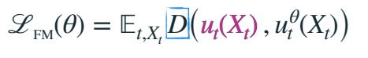    

• Conditional Flow Matching loss:     

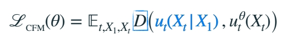    

Theorem: Losses are equivalent iff D is a Bregman divergence.     

$$
\nabla _θℒ_{FM}(θ) = \nabla _θℒ_{CFM}(θ)
$$

P26    
## Generalized Matching Loss

**Theorem:** Losses are equivalent **iff** \\(D\\) is a **Bregman divergence**.      

    

P27    
## How to choose \\(ψ_t(x|x_1)\\)?      

• Optimal Transport minimizes **Kinetic Energy**:    

$$
\int_{0}^{1} \mathbb{E} _{X_t\sim p_t}||u_t(X_t)||^2dt\le \mathbb{E} _{X_0,X_1}\int_{0}^{1}|| \dot{ψ} _t(X_0|X_1)||^2dt
$$

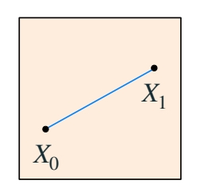    

$$
ψ _t(x|x_1)=tx_1+(1-t)x
$$

**Linear conditional flow:**      
• Minimizes bound     
• Reduces KE of initial coupling      
• Exact OT for single data points     
• <u>**Not**</u> Optimal Transport (but in high dim straighter)      

"Flow Straight and Fast: Learning to Generate and Transfer Data with Rectified Flow" Liu et al. (2022)      
"On Kinetic Optimal Probability Paths for Generative Models" Shaul et al. (2023)     

P29    
## Flow Matching with Cond-OT

    

$$
ℒ_{CFM}(θ) = \mathbb{E}D(u^θ_t (X_t),u_t(X_t|X_1))
$$

$$
ℒ_{CFM}(θ) = \mathbb{E}||u^θ_t (X_t)-(X_1-X_0)||^ 2 
$$

P30    
## Affine paths

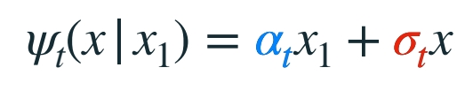    

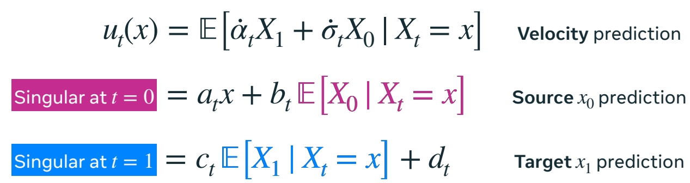    

P31    
## Gaussian paths

$$
p(x) = 𝒩(x |0 , I) \quad  π_{0,1}(x_0, x_1) = p(x_0)q(x_1)
$$

    

P32   　
##　Affine and Gaussian paths

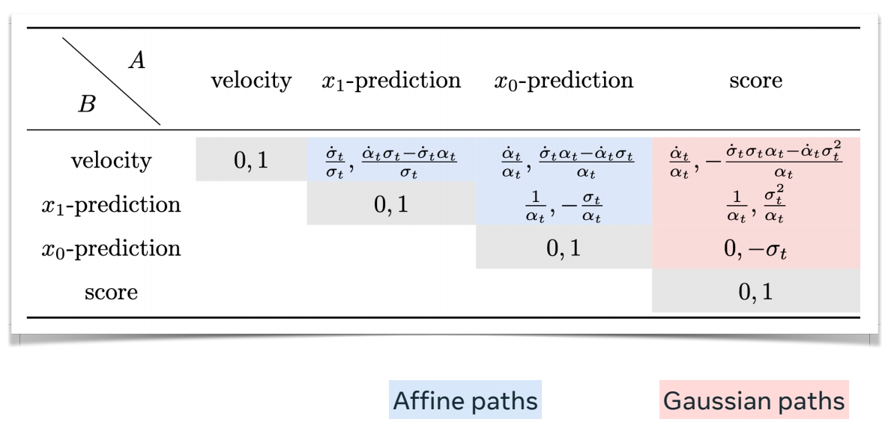    

P33     

    

