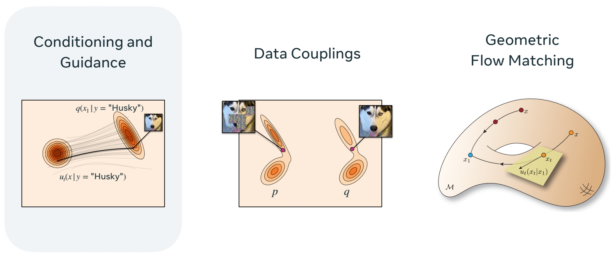
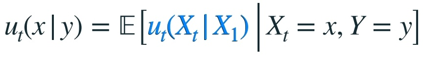
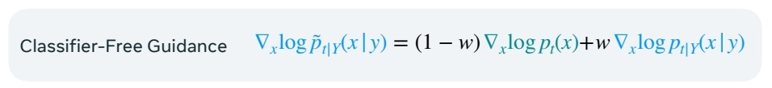
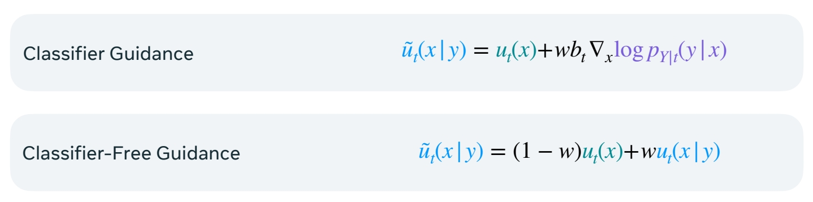
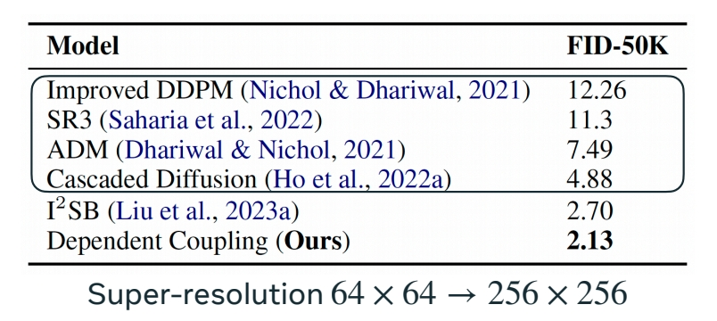
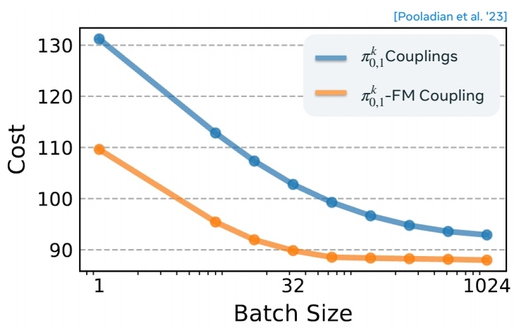
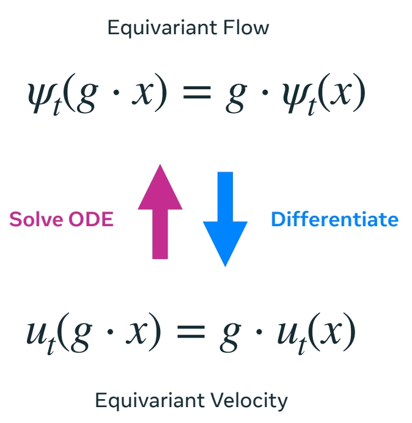
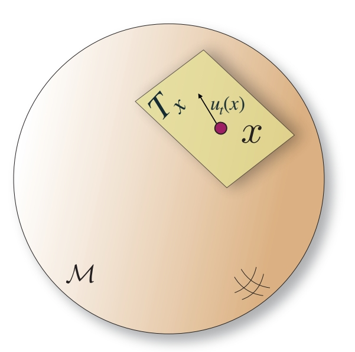
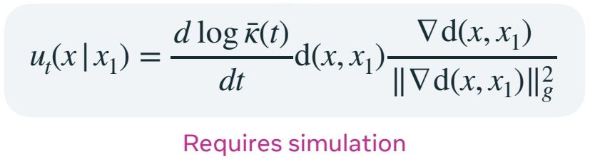
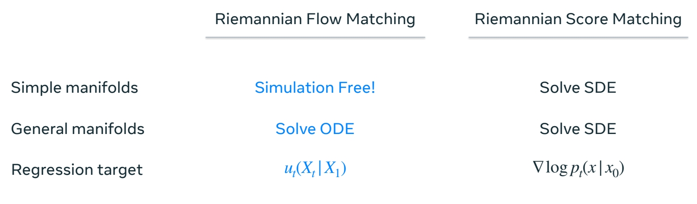

P34     
# Flow Matching Advanced Designs

P35     

    

> 1．条件生成    
2．\\(P\\) 分布和 \\(Q\\) 分布耦合的场景    
3．在几何域上使用 flow matching 构造生成模型    

P37     

## Conditioning and Guidance 

问题定义：    
数据集：样本 + 标签    
生成：给定标签，从具有特标签的分布中采样     

P39     

### Conditional Models

#### 公式定义   

$$
p_ {t,1|Y} (x, x_1|y) = p_ {t|1}(x|x_1)q(x_1|y)
$$

|||
|--|--|
|   无条件  | 条件 |
| 边缘概率分布   |   |
|边缘速度   |   |

> 将条件概率路径构建为不显式依赖于条件 \\(Y\\)。     

P40    
#### 网络训练

Train same neural network on all conditions:     

     

> 对于网络训练的影响在于，数据增加一个维度来表示\\(Y\\)。     

P41    
#### Examples

    

&#x1F50E; “Flow Matching for Generative Modeling” Lipman et al. (2022)       
&#x1F50E; “GLIDE: Towards Photorealistic Image Generation and Editing with Text-Guided Diffusion Models” Nichol et al. (2021)     

#### 局限性   

> 此方法在“每个条件都有大量数据”时很有用，例如条件是类别时。      
条件是文本时不适用，因为数据集里一段文本通常只对应一张图像。     

P42     
### Condition as Guidance   

####  Score Matching 和 diffusion 

classifier Guidance：通过引入分类器，将无条件模型变成条件模型.     

    

CFG：条件生成结果与无条件生成结果外插。    

  

&#x1F50E; [CFG](<https://caterpillarstudygroup.github.io/ReadPapers/6.html>)    

P43     
#### Flow Matching with Caussian Path  

Assume a velocity field trained with **Gaussian paths**.以上来自 score matching 的公式，同样可以适配到 flow matching.          

    

P44    
相关工作：       
&#x1F50E; "Guided Flows for Generative Modeling and Decision Making" Zheng et al. (2023)     
&#x1F50E; "Mosaic-SDF for 3D Generative Models" Yariv et al. (2023)    
&#x1F50E; "Audiobox: Unified Audio Generation with Natural Language Prompts" Vyas et al. (2023)        
&#x1F50E; "Scaling Rectified Flow Transformers for High-Resolution Image Synthesis" Esser et al. (2024)       
&#x1F50E; "Movie Gen: A Cast of Media Foundation Models" Polyak et al. (2024)     

P45   

> 其中，movie Gen 发现使用 flow matching loss，在生成质量和文本一致性上，均优于 diffusion loss.     

P46    
#### 非 Gaussian Path

**Open Problem**     
How to guide FM with non-Gaussian paths?      

> CFG 要求正在学习的是具有高斯路径的 flow matching 模型，但 flow matching 不局限于高斯源。     

P52    
## Data Couplings

前面工作都假设 \\(P\\) 和 \\(Q\\) 是独立的。What about dependent couplings?     

|||
|--|--|
|   |   |
| • Non-Gaussian source distribution  • Alternative conditioning approach  • Inverse problems | • Applications to Optimal Transport   • Efficiency: straighter trajectories |

> 两种方法，利用 \\(P\\) 和 \\(Q\\) 的耦合关系优化生成过程。    
1．利用耦合关系，构造另一种条件方法，用于解决 Inverse 问题。     
2．试图找到多样本之间的耦合关系，用于优化采样效率。      

P58    
### Paired Data

#### 问题定义

     

#### 方法

Alter **source distribution** and **coupling** instead of adding **condition**      

> 改变源分布和耦合，而不是添加条件。    
从数据中取出样本\\((X_1,Y)\\)   
[&#x2753;] \\(X_1\\) 和 Y 有什么区别？   
根据Y构造\\(X_0\\)    

$$
X_0=Y+\epsilon \sim p 
$$

> 源分布不是噪声，而是 \\(Y\\) 添加噪声，损失不变。     

P61    
#### Result   

     

P63    
### Multisample Couplings   

#### 问题定义

Given uncoupled **source** and **target** distributions,can we build a coupling to induce straighter paths?      

> 有一个预训练的 flow matching 模型，构建一种耦合，使 \\(P\\) 到 \\(Q\\) 的路径更直线，或 \\(Q\\) 能更好地采样。    

     

P64    
#### 耦合的本质

> 耦合 cost 限制了动能．降低 coupling cost，就能减少动能。     

    

对于不同的耦合关系会得到不同的 \\(u_t\\) 和动能。但它有上限，降低上限能减少动能。

Marginal \\(u_t\\) with cond-OT FM and \\(π_{0,1}\\)      

P69   
#### 方法

Use mini batch optimal transport couplings     

    

> 1. 从 \\(P\\) 分布和 \\(Q\\) 分布中随机采样 \\(k\\) 个点。   
> 2. 寻找两组点之间的最优排列，来最小化 cost.    
> 3. 假设找到了最优组合，随机选择一对。    

P70    
$$
\mathrm{When} \quad k = 1 → π_{0,1} = p(X_0)q(X_1)
$$

> 当 \\(k＝1\\) 时，相当于 \\(P\\) 和 \\(Q\\) 是独立的。    

P71    

When \\(k → ∞, u_t\\) generates the Optimal Transport map    

P72    
#### Result    

    

- High dimensions-minor improvement in sampling speed compared to tailored samplers.    

> 低维时，此方法能明显降低 cost

- Shows promise in lower dimensional problems for **scientific** applications (e.g. protein backbone design  [Bose et al.'23]).    

> 高维时，路径本身已接近直线，因此效果不明显。     

P73    
## 相关工作    

**Paired data:**     
"I2SB: Image-to-Image Schrödinger Bridge" Liu et al. (2023)    
"Stochastic interpolants with data-dependent couplings" Albergo et al. (2024)    
"Simulation-Free Training of Neural ODEs on Paired Data" Kim et al. (2024)    

**Multisample couplings:**     
"Multisample Flow Matching: Straightening Flows with Minibatch Couplings" Pooladian et al. (2023)     
"Improving and generalizing flow-based generative models with minibatch optimal transport" Tong et al. (2023)    
"SE(3)-Stochastic Flow Matching for Protein Backbone Generation" Bose et al. (2023)   
"Sequence-Augmented SE(3)-Flow Matching For Conditional Protein Backbone Generation" Huguet et al. (2024)   
"Flow Straight and Fast: Learning to Generate and Transfer Data with Rectified Flow" Liu et al. (2022)          

P75    
## Geometric Flow Matching

使用 Flow Matching 生成(对称的或黎曼流型的)几何   

|||
|--|--|
| Data with Symmetries | Riemannian Manifolds |
|  |  |
| • Equivariant flows → invariant densities  • Alignment couplings | • Simulation free on simple manifolds   • General geometries |

P87    
### Data with Symmetries    

#### 问题定义

> 有些对象具有对称性，希望生成的对象也能满足这些特征。 

#### 对称性的直观理解和公式表示

 

> 原始 \\(P、Q\\) 分布与对称 \\(P、Q\\) 分布应具有相同的密度或似然性。   
边缘概率路径也应具有对称性，且原概率路径保持不变。   

$$
p_t(g\cdot x)=p_t(x)
$$

等变性：是教学中关于的群的术语，在这里简单理解为具有对称性。    
边缘概率路径具有对称性和边缘速度具有对称性，是等价的。    
等变速度场可以生成不变的概率路径和等变流。     

     

"Equivariant Flows: Exact Likelihood Generative Learning for Symmetric Densities" Köhler et al. (2020)     

    

P88    
#### 方法

因此，只需要构建一个能生成等变速度的 flow matching model。   

Equivariant Velocity     

$$ 
u^θ_t (g⋅x) = g⋅u^θ_t(x)
$$

Train with CFM:     
  
     

"Equivariant flow matching" Klein et al. (2023)     
"Equivariant Flow Matching with Hybrid Probability Transport" Song et al. (2023)    

P89    
#### 存在的问题

数据是具有对称性的。

     

> 如果没有考虑数据的对称性，仍假设 \\(P\\) 和 \\(Q\\) 是独立的，会发生这种情况。    

P90    

    

> 导致模型学到的轨迹弯曲。降低 sample 的效率。     

P91   
#### 解决方法

&#x1F50E; "Equivariant flow matching" Klein et al. (2023)    
&#x1F50E; "Equivariant Flow Matching with Hybrid Probability Transport" Song et al. (2023)    

> 这两篇 Paper 提出对齐耦合；解决以上问题。       

P92     
#### Result    

|||
|--|--|
| "Fast Point Cloud Generation with Straight Flows" Wu et al. (2022) | "Equivariant Flow Matching with Hybrid Probability Transport" Song et al. (2023)  "Equivariant flow matching" Klein et al. (2023)|
|   |  |

> 此方法适用于点云和分子。    

P94    
### Generative Modeling on Manifolds    

> 生成流形数据，例如 Nesh，轨迹、曲面等而不是整个欧拉空间。     

P95   
Need to re-define the geometric structures we have in Euclidean space.     

> 重新定义几何结构，以便定义 flow matching 模型。     
此处以黎曼流形为例。   

P98    
#### 定义几何结构

> &#x1F50E; [黎曼流形](<https://caterpillarstudygroup.github.io/mathematics_basic_for_ML/Geometry/RiemannianManifolds.html>)

> 假设只考虑黎曼流形      
1．光滑流形，即可微，能够定义切空间。    

> 切空间是某点\\(x\\)处所有方向导数的集合。      
2．选择一个内积来计算黎曼度量，描述流形上的角度和距离。    

P99   

    

Pl00      

> 构建黎曼流形时，速度定义在切空间上。    
这样速度 \\(v\\) 和流形 \\(x\\) 不在同一空间，计算出 \\(v\\) 以后，要投影回 \\(x\\)，转成流形。       

P101   
#### 构建 Riemannian Flow Matching

图像上的 flow matching 与黎曼空间上的 flow matching，具有相同的数据构造、训练方法、唯一的不同是 Loss 的定义。黎曼度量代替 L2 Loss。         

• **Riemannian Flow Matching loss:**   

       

P102    
• **Riemannian Conditional Flow Matching loss:**     

   

Losses are equivalent 的结论在这里同样适用：        

$$
∇_θℒ_{RFM}(θ) = ∇_θℒ_{RCFM}(θ)
$$

P103   
#### Conditional Flows - Simple Geometries      

> flow matching 中的直线推广到这里就是测地线，因为测地线是流形上的最短路径。      

   

**For simple manifolds** (e.g. Euclidean, sphere, torus, hyperbolic)，测地线的计算具有闭式表达：  

$$
\Psi _t(x_0|x_1)=\mathrm{exp} _{x_0}(\kappa (t)\mathrm{log} _{x_0}(x_1)),\quad t \in [0,1]
$$

$$
\mathrm{Scheduler }\quad \kappa (t):\kappa (0)=0,\quad \kappa (1)=1
$$

这种情况，无需模拟就能计算条件流。  

P104    
#### Conditional Flows - General Geometries    

对于一般的几何结构，可能存在两个问题：    

1. **Geodesics** can be hard to compute    

2. Concentrate probability at boundary    

> 因此难以计算。     

P105   

Choose a **premetric** satisfying:     
1. Non-negative:\\(d(x,y) ≥ 0\\).      
2. Positive: \\(d(x, y) = 0\\) iff \\(x = y\\).     
3. Non-degenerate:\\(∇d(x, y) ≠ 0\\) iff \\(x ≠ y\\).    

Build **conditional flow** satisfying:    

$$ 
d(ψ_t(x_0|x_1),x_1) = \tilde{κ}(t)d(x_0,x_1)
$$

$$
\mathrm{Scheduler}  \quad \tilde{κ} (t) = 1 − κ(t)
$$

> 为了解决以上问题，提出了一种新的度量方法。      

P106   

> 对时间求导，得到微分方程。     

   

"Flow Matching on General Geometries" Chen & Lipman (2023)    
 
P107   

> 新度量方法与测地距离比较。     

   

P108   
#### Riemannian Flow vs. Score Matching

   

> flow matching 的优势      
（1）simulate free，速度快。PPT例子中快20倍。        
（2）解 ODE 比解 SDE 容易     
（3）\\(u_t(X_t|X_1)\\)是精确值，\\(\nabla \mathrm{log}\\) \\(p_t(x|x_0)\\) 是近似值。    

P109    

"Riemannian Score-Based Generative Modelling" De Bortoli et al. (2022)     
"Flow Matching on General Geometries" Chen & Lipman (2023)    

P110    
### 相关工作   

**Equivariant Flow Matching:**    

"Fast Point Cloud Generation with Straight Flows" Wu et al. (2022)    
"Equivariant flow matching" Klein et al. (2023)    
"Equivariant Flow Matching with Hybrid Probability Transport" Song et al. (2023)     
"Mosaic-SDF for 3D Generative Models" Yariv et al. (2023)    

**Riemannian Flow Matching:**     

"Flow Matching on General Geometries" Chen & Lipman (2023)     
"SE(3)-Stochastic Flow Matching for Protein Backbone Generation" Bose et al. (2023)    
"Sequence-Augmented SE(3)-Flow Matching For Conditional Protein Backbone Generation" Huguet et al. (2024)    
"FlowMM: Generating Materials with Riemannian Flow Matching" Miller et al. (2024)      
"FlowLLM: Flow Matching for Material Generation with Large Language Models as Base Distributions" Sriram et al. (2024)   
"Metric Flow Matching for Smooth Interpolations on the Data Manifold" Kapuśniak et al. (2024)   

