P1     
# Flow Matching Basics

P6    
WHAT IS FLOW MATCHING?       
A scalable method to train **flow generative models**.      

HOW DOES IT WORK?      
Train by regressing a **velocity**, sample by following the **velocity**      

P8    
## The Generative Modeling Problem

   

> 正方形代表所有可能的状态所构成的空间，即图像空间。正方形中的每个点代表一个sample，即一张图像。      
\\(P\\) 是源分布，\\(Q\\) 是目标分布。     
\\(X_0\\) 和 \\(X_1\\)分别是 \\(P\\) 分布和 \\(Q\\) 分布中的 sample．     
**生成模型的目标是，找到一个可以从 \\(P\\) 中 sample 到 \\(Q\\) 中 sample 的映射**。    

P9     
### 生成模型的范式

> 生成模型有两大类范式：直接生成和增量生成。     
GAN 属于第一大类生成模型，优点是快，因为它的生成过程只需要一个forward。缺点是（1）没有一个精确的可以用于 sample 的概率模型（2）难以训练。     

P10    

> 增量生成是另一种生成范式，不是直接生成最终结果，而是逐步生成。每一次生成比上一次要好。

> Flow 的转移过程是平滑的。Diffusion 是连续但不平滑的。还有一些是不连续的，但都是基于连续时间马尔可夫过程的随机过程Continuous-time Markov process。      

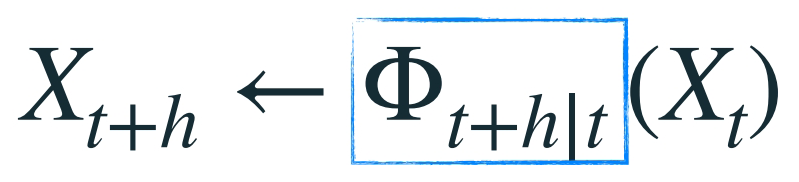

> \\(\Phi\\) 是从一次生成到另一次生成的转移函数。    
**增量生成模型的目标是学习转移函数**。      

P11    

### Marginal probability path

边缘概率路径是指，任意一个特定的 \\(t\\) 时刻，\\(X_t\\) 所属于的分布 \\(p_t\\)。 即连续时间上的分布簇。    

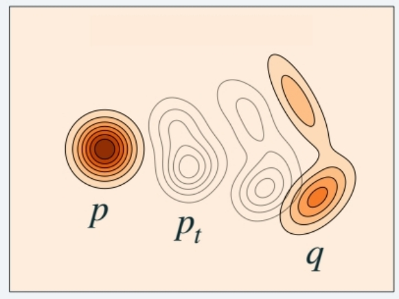

> **生成模型最重要的是，边缘概率路径以 \\(P\\) 分布开始，以 \\(Q\\) 分布结束**。     

P12   
### 三种增量生成模型的特点   

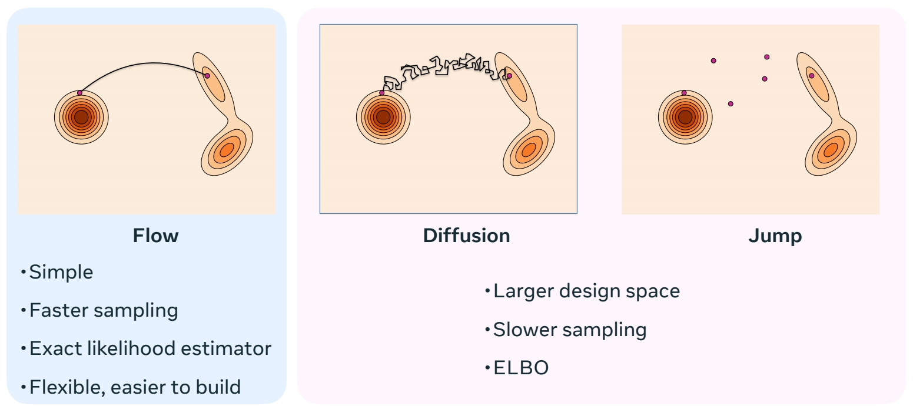

> 流的特点：(1) 确定性，已知 \\(X_t\\)，那么 \\(X_{t+h}\\) 是确定的。(2) 平滑       
流的优势：(1) sample 速度快 (2) 可以构建模型似然的无偏估计器。      
Diffusion 和 Jump 具有更大的设计空间，因此具有更多生成能力。    

P13    
## Flow 生成模型   

### Flow 的参数化 

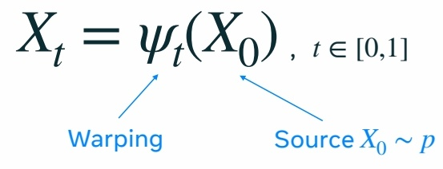

> \\(\Psi_t\\) 是 flow 生成模型的转移函数。    
\\(\Psi_t\\) 是一个双射函数，因此它可以重塑空间而不丢失信息。    
通过对高维空间的 warping，使 \\(P\\) 分布逐步变为 \\(Q\\) 分布。  
**双射函数**的特性：
- **一一对应**：每个输入对应唯一的输出，且每个输出都被某个输入映射到。
- **可逆性**：存在逆函数 \\( f^{-1}: Y \to X \\)，满足 \\( f^{-1}(f(x)) = x \\) 且 \\( f(f^{-1}(y)) = y \\)。

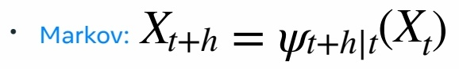

> flow Model 是一个马尔可夫过程。   
马尔可夫过程（Markov Process）是一类具有**无记忆性**（马尔可夫性质）的随机过程，其核心特点是**未来状态仅依赖于当前状态，而与历史状态无关**。

#### 直接参数化会遇到的问题  

> 对两个双射函数做线性组合，得到的函数不能保持其双射的特性，因此，基于双射函数的模型难以被参数化。

$$
\alpha X_ {t|1}+\beta X_ {t|2}\ne \Psi _ t(\alpha X_ {t|1}+\beta X_ {t|2})
$$

> 网络模型中通常包含大量线性组合，激活函数等会破坏双射性的结构，因此很难让网络学到一个双射函数。     
“模型的参数化”（**Parameterization of a Model**）是指**用一组可调整的参数（Parameters）来定义模型的结构和功能**的过程。它是模型设计的核心步骤，决定了模型如何从输入数据中学习规律、进行预测或生成输出。包括（设计模型结构、连接方式，定义参数如何初始化，哪些参数可以被优化）。   

P14     
#### 利用速度对流做参数化      

> 因此利用速度对流做参数化。在这里，速度是指 \\(P_t\\) 分布中的每个 sample 向 \\(Q\\) 分布中对应 sample 变化的速度（快慢和方向）。    
Flow 和 velocity 是可以互相转化的。对 Flow 做微分可以得到 velocity，对 velocily 解常微分方程，可以得到 Flow.    

    

> 使用速度的好处：速度是线性的，可以相加或分解，因此可以对速度做参数化。       
使用速度的缺点：需要对 sample 出速度做 ODE，解出图像。   

$$
\frac{d}{dt} \Psi  _t(x)=u_t(\Psi _t(x))
$$

$$
\frac{d}{dt}\Psi  _t(\alpha X_1+\beta X_2)=\alpha u_t(\psi _t(X_1))+\beta u_t(\psi _t(X_2)) 
$$

P15    

Velocity \\(u_t\\) **generates** \\(p_t\\) if     

$$
X _t=\Psi _t(X_0)\sim p_t
$$

> 使用速度来定义边缘概率路径，\\(\Psi_t\\) 是基于速度的转移函数。   

P16        

#### Flow Matching 的训练    
学习一个速度模型，由速度得到边缘路径概率 \\(P_t\\)，使得 \\(P_0 = P\\)， \\(P_1= Q\\)     

P17    
#### Sampling a flow model

> Flow Matching 的推断：    
(1) 从 \\(P\\) 分布中 sample 一个 noise      
(2) 根随速度（解ODE）得到对应在 \\(Q\\) 分布中的 sample。    

    

$$
\frac{d}{dt} X_t=u^0_t(X_t)
$$

Use any ODE numerical solver.      
One that works well: **Midpoint**     

P19    
## Simplest version of Flow Matching 

### flow matching 的训练    

(1) 随机构造源 \\(X_0\\) 和目标 \\(X_1\\)。     
(2) 在 [0，1] 区间随机采样一个时间步 \\(t\\)。    
(3) \\(X_t\\) 是 \\(X_0\\) 与 \\(X_1\\) 的线性组合。     
(4) \\(X_t\\) 是网络输入，让网络输出逼近\\(X_1-X_0\\)。    

    
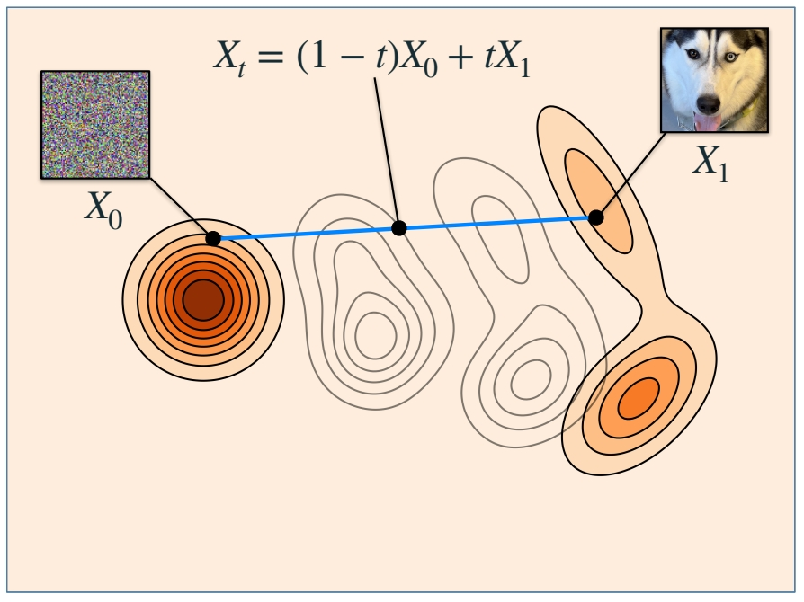    

$$
\mathbb{E } _{t,X_0,X_1}||u_t^0(X_t)-(X_1-X_0)||^2
$$

🔎 "Flow Matching for Generative Modeling" Lipman el al. (2022)      
🔎 "Flow Straight and Fast: Learning to Generate and Transfer Data with Rectified Flow" Liu et al. (2022)       
🔎 "Building Normalizing Flows with Stochastic Interpolants" Albergo et al. (2022)    

 

P20      

> 这里没有对 \\(X_0\\) 和 \\(X_1\\) 所属的分布作限制。 \\(X_0\\) 和 \\(X_1\\) 可以是独立的噪声和图像，也可以是具有某种关系（例如黑白与彩色）的 pair data。    

### Why does it work?      
• Build flow from conditional flows      
> 如何从一个更简单的速度或流（称为条件流）构建一个速度或流。条件流是指一些简单的，固定的部分。      

• Regress conditional flows      

> 通过观察更简单的条件流来学习复杂的部分。

P21    
#### 局部问题   

> 假设目标分布只有 \\(X_1\\) 这一个点，那么流和速度是这样的。    

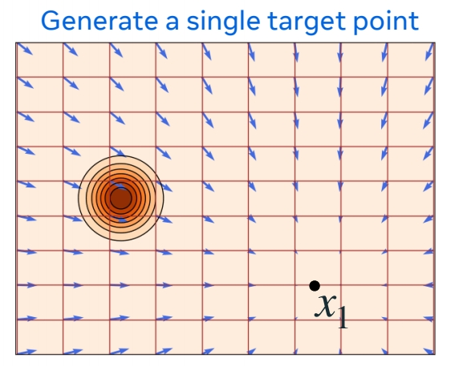    

$$
X_t=\Psi _t(X_0|x_1)=(1-t)X_0+tx_1
$$

这是一个条件流。    
\\(p_{t|1}(x|x_1)\\) 是 conditional probability     
\\(u_t(x|x_1)\\) 是 conditional velocity，是常数。        

P22    
#### 全局问题   
  
> 实际的 \\(Q\\) 分布包含很多 \\(x_1\\) 这样的 sample，每一个 sample 都可以作为一个 condition，得到一个 \\(P_{t|条件}\\) ，综合所有 \\(P_{t|条件}\\) 得到的 \\(p_t(X)\\) 是这 \\(P_{t|条件}\\) 的期望。可以证明，\\(p_t(X)\\) 以 \\(P\\) 开始，以 \\(Q\\) 结束。对 \\(Q\\) 分布中的所有的 \\(x_1\\)，对 \\(U_t(X|X_1)\\) 取平均，得到生成“边缘概率路径”的速度。  
\\(p_t(x)= \mathbb{E} _ {X_ 1}p_{t|1}(x|X_ 1)\\)       
\\(u_t(X)\\) 也可以以这种方式得出。    

\\(u_t(x)=\mathbb{E} [u_t(X_t|X_1)|X_t=x]\\)    

这个速度场称为边缘速度。   

P23    

Theorem*: The **marginal velocity** (边缘速度) generates the **marginal probability** path (边缘概率路径)。   

以上公式中的期望，实际含义是“平均”。    

P24    
#### conditional loss  

目标函数：回归边缘速度场。   

(1) 直接回归边缘速度场  

$$
ℒ_{FM}(θ) = \mathbb{E}  _{t,X_t}||u^θ_t (X_t) − u_t(X_t)||^ 2 
$$

其中，\\(u_t(X_t)\\) 是通过许多数据计算出的均值(根据上文中的公式)。    
(2) 回归条件速度   

$$
ℒ_{CFM}(θ) = \mathbb{E}  _{t,X_1,X_t}||u^θ_t (X_t) − u_t(X_t|X_1)||^ 2 
$$

**Theorem:** Losses are equivalent,     

$$
\nabla_θℒ_{FM}(θ) = \nabla_θℒ_{CFM}(θ)
$$
  
> 结论：仅回归条件速度，与直接回归速度相同。    
使用条件分布(公式 2)相比于公式 1 的好处是，可以逐个样本去计算，而不需要对整个数集做平均。    

P25    
**Theorem:** Losses are equivalent **if** \\(D\\) is a **Bregman divergence**.      

> 更进一步，使用任意的 Bregman Divergence Loss \\((D(\cdot ,\cdot ))\\) 散度代替 \\(L2(||\cdot ,\cdot ||^2)\\)，都能得到相同结论，L2 Loss 只是其中一种。

P26      

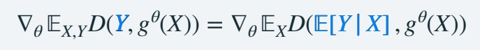    

> 因为要学习的是一个“期望”。    

P27    
## How to choose \\(ψ_t(x|x_1)\\)?      

### Optimal Transport minimizes Kinetic Energy    

在上文中，定义     

$$
ψ _t(x|x_1)=tx_1+(1-t)x
$$

这样定义，是基于“最小化动能”的考虑。    
> 如果最小化动能，能让路径变得直，且速度恒定。   
所以将 \\(ψ _t(X_0|X_1)\\) 定义为 \\(X_0\\) 和 \\(X_1\\) 连线上的一个点，其中 \\(X_0\\) 可以是空间中任意一点定义为 \\(X\\) 。 

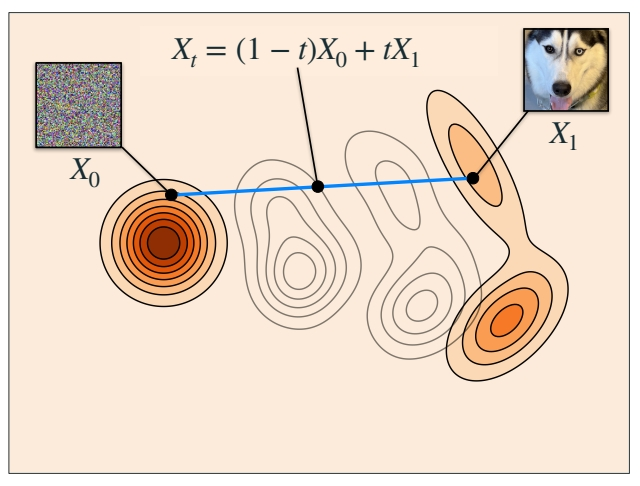    

> 直接优化动能不容易，因为它不依赖于具体的条件。因此给它设定一个 Jensen bound，来限制边缘速度的动能。    

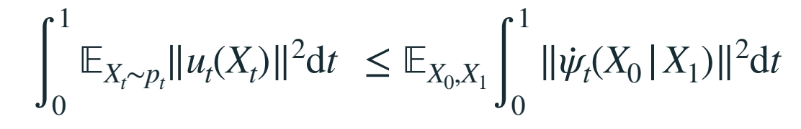    

Jensen bound 是具体的条件 \\((X_0,X_1)\\) 下的期望。   
当 \\(X_0\\) 和 \\(X_1\\) 确定时，Jensen bound 可以被算出来，也可以(通过优化\\(ψ _t\\))被最小化。    

**结论：** 当 \\(ψ _t(x|x_1)\\) 定义为 \\(tX_1+(1-t)X\\) 时，Jensen bound 被最小化，此时 \\(X_0\\) 到 \\(X_1\\) 是直线。   

**Linear conditional flow总结:**      
• Minimizes bound，而不是直接优化动能。      
• Reduces Kinetic Energy of initial coupling      
把 \\(ψ _t\\) 代入 Jensen bound 公式可得出此结论。   

• Exact Optimal Transport for single data points     
如果 \\(Q\\) 分布中只有一个 \\(X_1\\)。此时公式左右两边相等，是最优传输。  

• <u>**Not**</u> Optimal Transport (but in high dim straighter)      
如果 \\(Q\\) 分布里不止一个点，不是最优传输，\\(X_0\\) 到 \\(X_1\\) 也不是直线。   

&#x1F50E; "Flow Straight and Fast: Learning to Generate and Transfer Data with Rectified Flow" Liu et al. (2022)      
&#x1F50E; "On Kinetic Optimal Probability Paths for Generative Models" Shaul et al. (2023)     
   

P29    
好的最优传输，可以通过单个欧拉步骤采样。

$$
\frac{d}{dt} \Psi  _t(x)=u_t(\Psi _t(x))
$$

$$
ℒ_{CFM}(θ) = \mathbb{E}D(u^θ_t (X_t),u_t(X_t|X_1))
$$

> D 是一个 Bregman 散度，L2 Loss 是其中一种，根据上文中 \\(ψ _t\\) 的定义，把L2 和条件速度代入公式得：对于特定的 \\(X_0\\) 和 \\(X_1\\) ， \\(X_1-X_0\\) 是条件路径的条件速度。   

$$
ℒ_{CFM}(θ) = \mathbb{E}||u^θ_t (X_t)-(X_1-X_0)||^ 2 
$$

因此，这个算法是特定条件流 + 特定 Loss 下的一个 flow matching 实例。   

P30    
### Affine paths

> 在前面的方法中，\\(ψ_t(x|x_1)\\) 是 \\(x\\) 与 \\(x_1\\) 的线性组合，这只是一种选择。现在假设其为仿射组合。  

    
  
这种情况下，\\(X_0\\) 到 \\(X_1\\) 不再是直线。    
由此得到不同的参数化速度的方式，例如：      
(1) \\(u_t(x)=\frac{d\psi t}{dt}\\) ，直接预测速度    

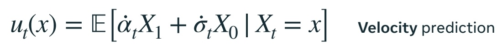 

(2) 源预测：通过 \\(X_0\\) 的条件期望来参数化速度。预测 \\(X_0\\) ，再转化为 \\(x\\) 的速度     

     

(3) 目标预测类似，预测 \\(X_1\\) ，再转化为 \\(x\\)的速度       
  

根据 \\(\alpha _t\\) 和 \\(\sigma _t\\) 的定义不同，推导出的 \\(a_t,b_t,c_t,d_t\\) 不同。    
以上公式中的“期望”部分，都是网络要预测的部分。预测的内容不同，最终目的都是为了求 \\(x\\) 的速度。    

P31    
### Gaussian paths   

> 目前为止，没有对源分布 \\(P\\) 和目标分布 \\(Q\\) 做任何假设。    
如果假设 \\(P\\) 是一个高斯分布，\\(P\\) 和 \\(Q\\) 是独立的，这个过程即与 diffusion 的 ODE 过程吻合。

$$
p(x) = 𝒩(x |0 , I) \quad  π_{0,1}(x_0, x_1) = p(x_0)q(x_1)
$$

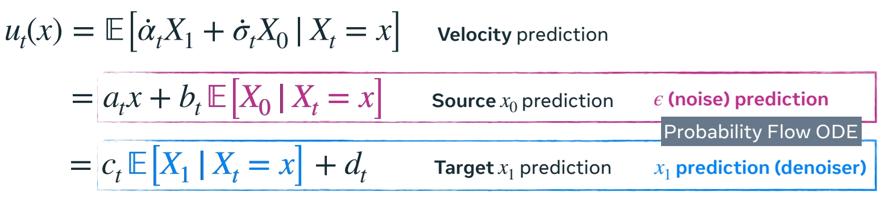    

> diffusion 的噪声预测，在 \\(x\\) 接近噪声时(初始 steps)会有奇异性问题。   

P32   　
### Affine and Gaussian paths    

#### 参数比较

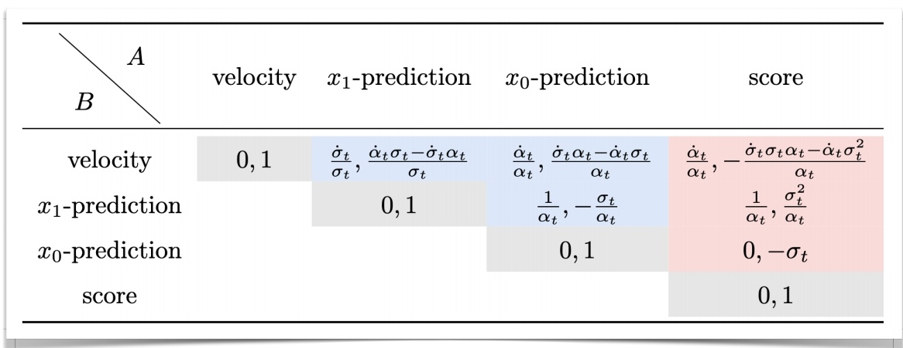    

> 蓝色部分适用于所有的仿射路径(包括高斯 path)。粉色部分仅适用于高斯 path.     
[&#x2753;] 表格怎么看？    

P33     

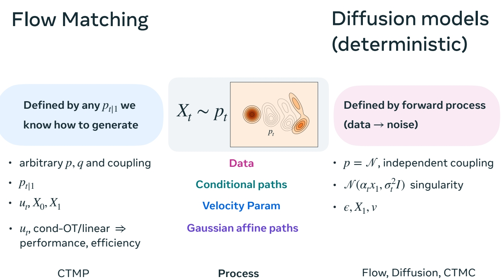    
  
> flow matching 与确定性 diffusion 之间的关系:   
1.diffusion 通过定义 forward process 然后再反转来生成概率路径。    
flow matching 通过将所有已知的条件概率路径的聚合来生成概率路径。    
2.diffusion 构造了 forward prossess，需要一个根据 forward process 构造条件概率的闭式解，因此会要求 \\(P\\) 是高斯，且 \\(P\\) 和 \\(Q\\) 独立。    
flow matching 没有这样的限制，\\(P\\) 和 \\(Q\\) 可以是任意的分布。

 

---------------------------------------
> 本文出自CaterpillarStudyGroup，转载请注明出处。
>
> https://caterpillarstudygroup.github.io/ImportantArticles/

    

  