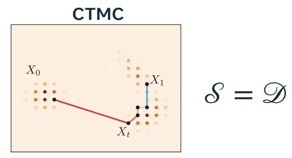
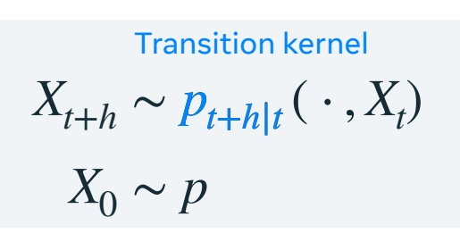
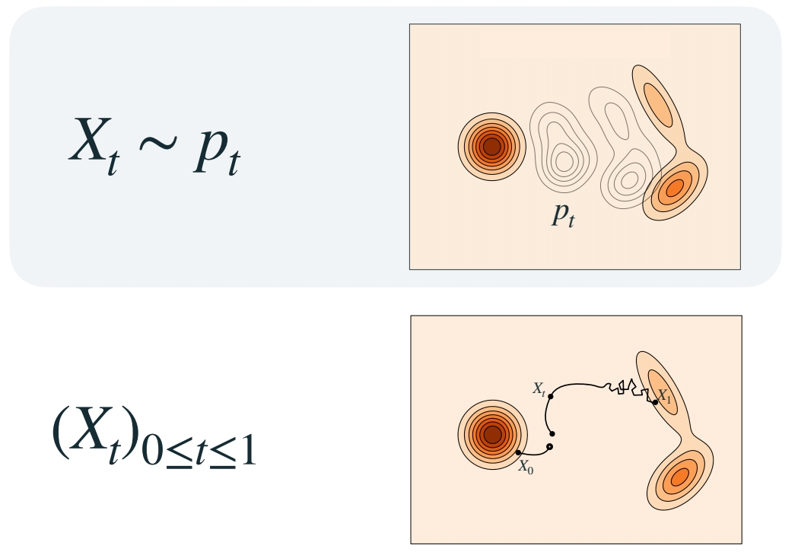
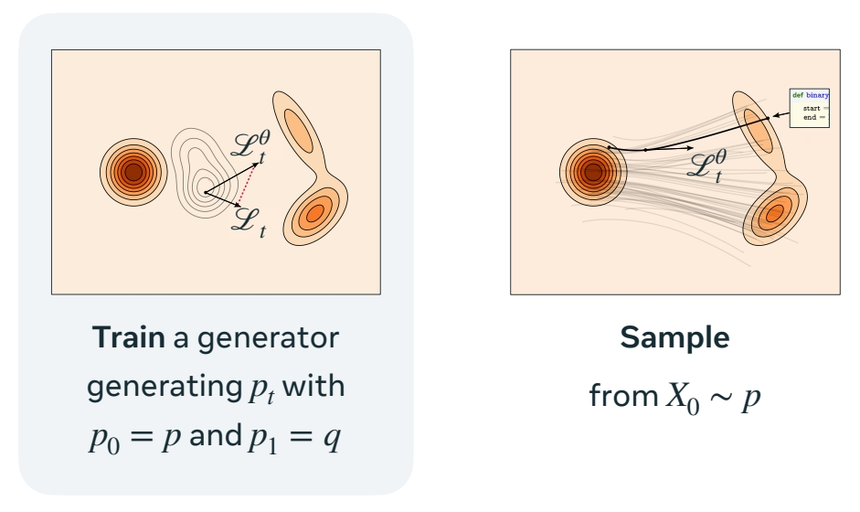
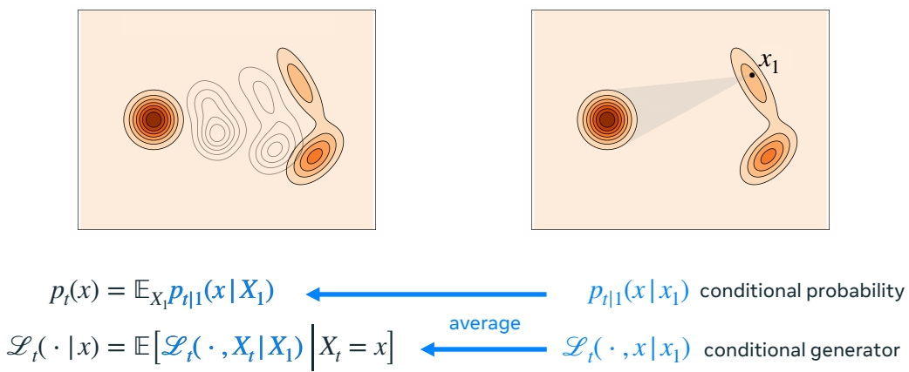

P153    
# Generator Matching and Discrete Flows

P155     
## Continuous Time Markov Processes    

> flow：通过特定的“宏观的随机的过程”，将 source 平滑转换为 target.     
这个过程称为连续时间马尔可夫过程。转移空间可以是连续的或偏散的。    
CTMC 是一个离散空间上的过程转移的例子。所有的状态来自某个离散的集合。       
状态转移的过程称为 transition kernel. 输入当前状态，输出下一个状态的概率分布，根据分布采样，得到下一个状态。     

P156    
## Generator

Generalize the notion of velocity to arbitrary CTMP 

"Generator Matching: Generative modeling with arbitrary Markov processes" Holderrieth et al. (2024)      

> 如果要以离散状态转换的方式实现 flow matching，关键是找出线性的 transition kernal.     
速度是线性的关键。    
transition kernel 的导数被称为生成器       

P157    
## CTMP via generator

> 取一个速度，并用它定义流。类似于用生成器定义一个连续时间过程的轨迹。   

P158     
## Marginal probability path

P159    
> 这里与前面的区别是速度改成了生成器。     

P160    
## Sampling

P161     
## Generator Matching    

P163      
## Building generator from conditional generators

Repeating the Kata from flows……      

"Generator Matching: Generative modeling with arbitrary Markov processes" Holderrieth et al. (2024)     

P164     
## The Marginalization Trick 

"Generator Matching: Generative modeling with arbitrary Markov processes" Holderrieth et al. (2024)     

P165    
## Discrete Flow Matching

“Generative Flows on Discrete State-Spaces: Enabling Multimodal Flows with Applications to Protein Co-Design” Campbell et al. (2024)      
“Discrete Flow Matching” Gat el al. (2024)       

P166    
## Factorized velocities

Similar to continuous case \\(𝒮 = ℝ^d\\) :    

$$
u_t(x) = [u^1_t (x),…, u^d_t (x)]
$$

“A Continuous Time Framework for Discrete Denoising Models” Campbell et al. (2022)     

P167    
## Build (factorized) velocities

“Generative Flows on Discrete State-Spaces: Enabling Multimodal Flows with Applications to Protein Co-Design” Campbell et al. (2024)     
“Discrete Flow Matching” Gat el al. (2024)     

P168    
## Discrete Flow Matching Loss

$$
ℒ_{CDFM}(\theta )=\mathbb{E}_{t,X_1,X_t} \sum_{i}^{} D_{X_t}(\frac{1}{1-t}\delta (\cdot ,X_1^i),u_t^{\theta,i}(\cdot ,X_t))  
$$

“Discrete Flow Matching” Gat el al. (2024)    
"Flow Matching with General Discrete Paths: A Kinetic-Optimal Perspective” Shaul et al. (2024)    
“Discrete Diffusion Modeling by Estimating the Ratios of the Data Distribution” Lou et al. (2024)     

P169    
## Example: code generation model (1.7B)    

“Discrete Flow Matching” Gat el al. (2024)     

P171    

OPEN PROBLEMS FOR DISCRETE FLOWS     

How to go beyond the factorized velocity?     
Better sampling?    
How to explore the (huge) design space?     

P172    
## Flow Matching blueprint   

