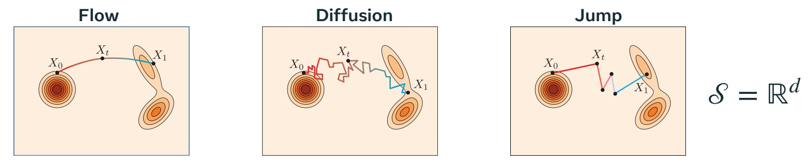
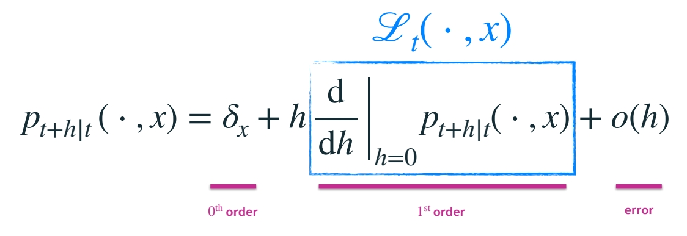
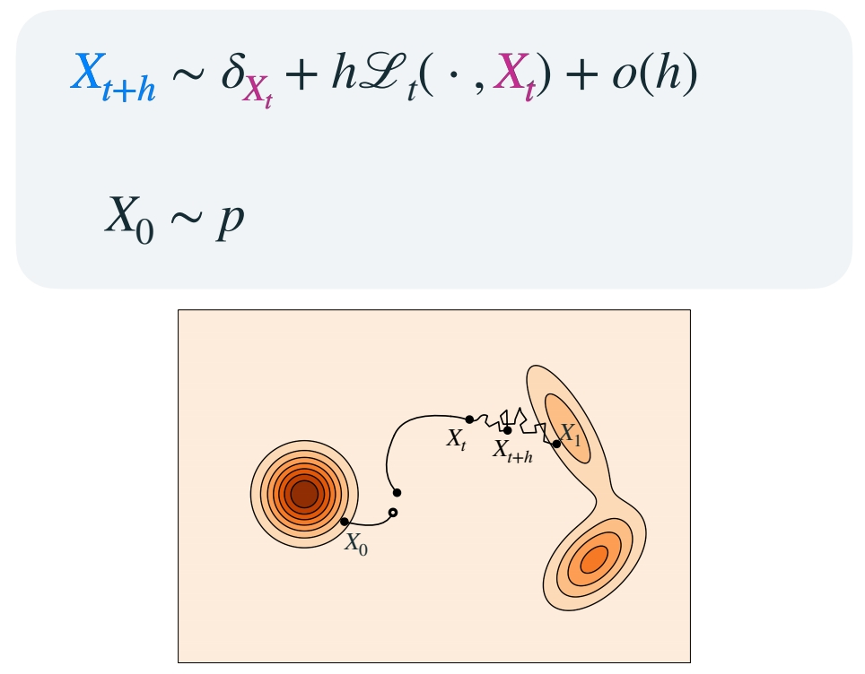
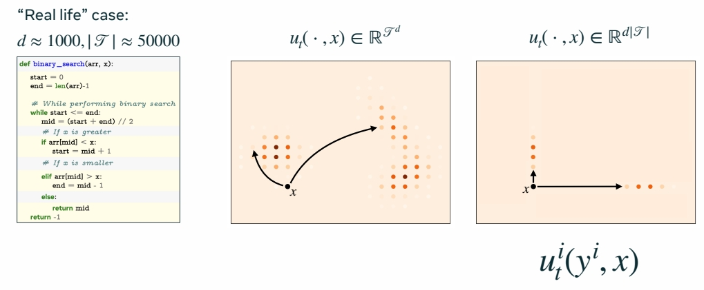
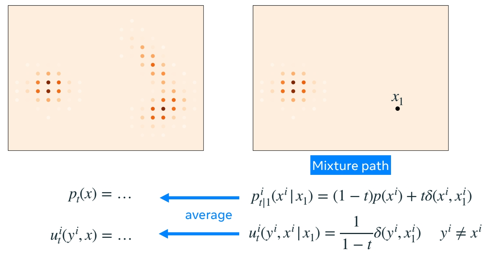
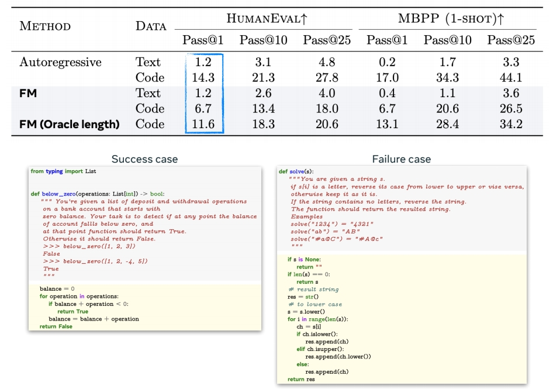

P153    
# Generator Matching and Discrete Flows

P155     
> 这一节比较抽象，旨在提供思考的素材，以及这个框架还能用来做什么。 

## Continuous Time Markov Processes    

> flow：通过特定的“宏观的随机的过程”，将 source 平滑转换为 target.     
这个过程称为连续时间马尔可夫过程。转移空间可以是连续的或偏散的。 

> CTMC 是一个离散空间上的过程转移的例子。所有的状态来自某个离散的集合。       

||||
|--|--|--|
|  | 连续时间 | 不连续时间 |
|连续空间 | flow,score matching | diffusion |
|不连续空间 | CTMC |  |

> 状态转移的过程称为 transition kernel. 输入当前状态，输出下一个状态的概率分布，根据分布采样，得到下一个状态。     

P156    
## Generator

> 如果要以离散状态转换的方式实现 flow matching，关键是找出线性的 transition kernal.     
速度是线性的关键。    
transition kernel 的导数被称为生成器       

Generalize the notion of **velocity** to arbitrary CTMP 

"Generator Matching: Generative modeling with arbitrary Markov processes" Holderrieth et al. (2024)      

P157    
## CTMP via generator

> 取一个速度，并用它定义流。类似于用生成器定义一个连续时间过程的轨迹。   

P158     

> 训练的目标仍然是让边缘概率路径以 \\(p\\) 分布开始，以 \\(Q\\) 分布结束。   

P159    

P160    

P161     

P163      
## Building generator from conditional generators

Repeating the Kata from flows……      

  

P164     

> 也可以从简单 condition 推广到所有数据，之前的结论同样适用。   

"Generator Matching: Generative modeling with arbitrary Markov processes" Holderrieth et al. (2024)     

P165    
## Discrete Flow Matching

> 这里讲的是与具体场景无关的通用方法。   

> \\(u_t\\) 是一个巨大的转移矩阵。    
彩色圆点代表质量函数，类似于前面的概率密度的概念。    

“Generative Flows on Discrete State-Spaces: Enabling Multimodal Flows with Applications to Protein Co-Design” Campbell et al. (2024)      
“Discrete Flow Matching” Gat el al. (2024)       

P166    
## Factorized velocities

Similar to continuous case \\(𝒮 = ℝ^d\\) :    

$$
u_t(x) = [u^1_t (x),…, u^d_t (x)]
$$

> 但如果状态表太多这种方法不可行。解决方法是分解速度，一次只修改矩阵某一个维度上的某一个数值。   

“A Continuous Time Framework for Discrete Denoising Models” Campbell et al. (2022)     

P167    
## Build (factorized) velocities

“Generative Flows on Discrete State-Spaces: Enabling Multimodal Flows with Applications to Protein Co-Design” Campbell et al. (2024)     
“Discrete Flow Matching” Gat el al. (2024)     

P168    
## Discrete Flow Matching Loss

$$
ℒ _ {CDFM}(\theta )=\mathbb{E} _ {t,X_1,X_t} \sum _ {i}^{} D_{X_t}(\frac{1}{1-t}\delta (\cdot ,X_1^i),u_t^{\theta,i}(\cdot ,X_t))  
$$

“Discrete Flow Matching” Gat el al. (2024)    
"Flow Matching with General Discrete Paths: A Kinetic-Optimal Perspective” Shaul et al. (2024)    
“Discrete Diffusion Modeling by Estimating the Ratios of the Data Distribution” Lou et al. (2024)     

P169    
## Example: code generation model (1.7B)    

“Discrete Flow Matching” Gat el al. (2024)     

P171    

OPEN PROBLEMS FOR DISCRETE FLOWS     

How to go beyond the factorized velocity?     
Better sampling?    
How to explore the (huge) design space?     

**Design choices:**    
- Process    
- Marginal Path    
- Corrector steps     
- Models superposition     

P172    
## Flow Matching blueprint   

---------------------------------------
> 本文出自CaterpillarStudyGroup，转载请注明出处。
>
> https://caterpillarstudygroup.github.io/ImportantArticles/