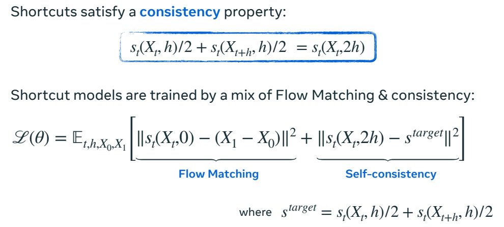
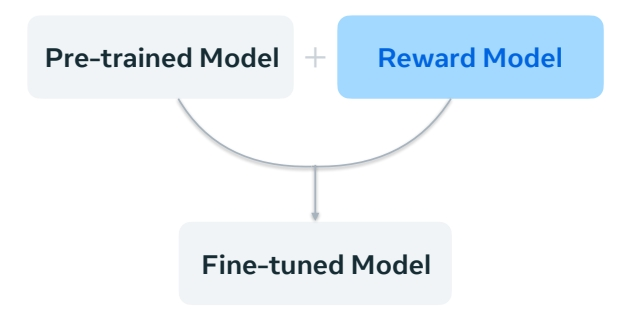
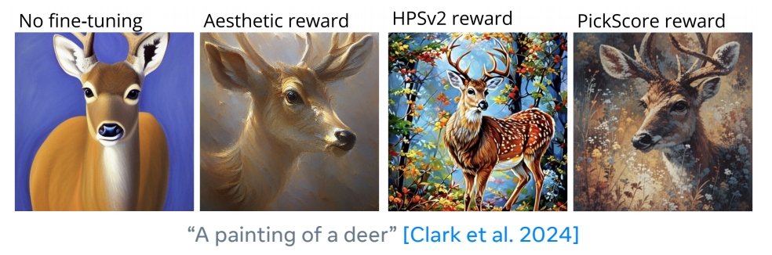

P111  
# Model Adaptation  

P112    
## You’ve trained a model. What next?

    

> 已有一个预训练模，可以做什么？    

P113    
## Faster Sampling   

P114    
### Recitde Flow-Faster sampling by straightening the flow   

#### 方法

    

$$
ℒ(θ) = \mathbb{E} _ {t,(X_0,X_1)∼π_ {0,1}^0}||u^θ_t (X_t) − (X_1 − X_0)||^2
$$

Rectified Flow refits using the **pre-trained (noise, data) coupling**.      
**Leads to straight flows**.     

> Rectified Flow：让 flow 从源直接到目标。     
第1步：训练 flow matching，flow matching 模型定义了源和目标的耦合关系，也得到了噪声与数据的 pair data.    
第2步：用 pair data 继续训练。      

“Flow Straight and Fast: Learning to Generate and Transfer Data with Rectified Flow” Liu et al. (2022)       

P115     

P116    
#### Result    

> Diffusion 对比 Rectified Flow      

    

#### 局限性

Enforcing **straightness restricts** the model. Often a slight drop in sample quality

“InstaFlow: One Step is Enough for High-Quality Diffusion-Based Text-to-Image Generation” Liu et al. (2022)    

P118    
### Faster sampling by self-consistency loss   

> 增大 \\(h\\)，在 \\(x_t\\) 和 \\(X_{t＋h}\\) 之间建立 shortcut，类似于 diffusion 中的蒸馏方法。     

#### 原理

    

P119    
#### 方法   

    

P121    
#### Result    

    

#### 局限性

Shortcuts with \\(h\\) >0 **do not work with classifier-free guidance** (CFG).    
CFG weight can & must be specified before training.

> short cuts 直接预测流而不是速度，流是非线性的，不能对结果加权组合，因此不能结合 CFG.       
针对此问题的 workaround：预置 CFG 权重         

“One Step Diffusion via Shortcut Models” Frans et al. (2024)    

P124   
### Faster sampling by only modifying the solver   

> 以上两种方法，都需训练。此方法不需要训练，而是修改 solver.     

#### 补充：关于调度器．\\(\beta, \alpha _t\\) 和 \\(\sigma _t\\)的 trick．     

**Can adapt pre-trainedmodels to different schedulers**.  

有一个用 scheduler A 训练好的模型，现在要一个用 scheduler B 继续训练，这两个模型是什么关系？   

    

> 结论：这两个 scheduler 及其 flow 可以通过 \\(X\\) 的缩放和时间的重参数化关联起来。       
时间重参数化是指，匹配两个 scheduler 的 SNR 和 scaling。   

Related by a **scaling & time** transformation:    

    

    

> 如图所示，调整 scheduler,流会表现出不同，但 \\(X_0\\) 与 \\(X_1\\) 的耦合关系不变。  

“Elucidating the design space of diffusion-based generative models” Karras et al. (2023)    

P126   
#### 修改 scheduler 的例子   

    

**Bespoke solvers:**    
**Decouples** model & solver.     
Model is left unchanged.    
Parameterize solver and optimize.   

模型与 solver 解耦：模型不变，仅优化求 solver.      
向 solver 中传入参数(表达 scheduler)，优化这些参数相当于在优化 scheduler。     

**Can be interpreted as** finding best scheduler + more.   

**Solver consistency:** sample quality is retained as NFE → ∞.    

由于仅优化solver，好处：    
1．可以利用 solver 的一致性，把步数取到无穷大，仍然能准确地解 ODE。做法是，用数据集 A 训练生成模型后，用数据集 B 训练 scheduler 的新参数。       
2．在不同的模型(不同数据集、分辨率等训练出来的模型)之间可迁移。   

Bespoke solvers can t**ransfer across different data sets and resolutions**.     
  
#### 局限性：    

虽然能(不重训生成模型)直接迁移到另一个模型，但比在另一个模型上蒸馏(重训)效果要差一点。       

P127    

However, **does not reach distillation performance at extremely low NFEs.**    

P128   
### 相关工作  

**Rectified flows:**    
“Flow Straight and Fast: Learning to Generate and Transfer Data with Rectified Flow” Liu et al. (2022)     
“InstaFlow: One Step is Enough for High-Quality Diffusion-Based Text-to-Image Generation” Liu et al. (2024)     
“Improving the Training of Rectified Flows” Lee et al. (2024)    

**Consistency & shortcut models:**      
“Consistency Models” Song et al. (2023)    
“Improved Techniques for Training Consistency Models” Song & Dhariwal (2023)    
“One Step Diffusion via Shortcut Models” Frans et al. (2024)    

**Trained & bespoke solvers:**    

“DPM-Solver-v3: Improved Diffusion ODE Solver with Empirical Model Statistics” Zheng et al. (2023)     
“Bespoke Solvers for Generative Flow Models” Shaul et al. (2023)     
“Bespoke Non-Stationary Solvers for Fast Sampling of Diffusion and Flow Models” Shaul et al. (2024)     

P129   
## Inverse Problems (Training-Free)     

> Inverse Problem：填充、去糊、超分、编辑。       
与上节中的 data coupling 中要解决的问题不同的是，这里要利用在完全干净的数据集上训好的预训练模型，不经过重训，得到解决 Inverse Problem 的效果。  

P133    
### Solving inverse problems by posterior inference   

\\(x_1\\) 为干净图像，\\(y\\) 为噪声图像。    

    

> 用高斯来近似其中未知的部分 (score function)      
score function 可能是 multi 的，但实验证明仅用高斯也能有比较好的效果。     

P134   

#### 局限性

Typically requires known **linear** corruption and **Gaussian prob path**.     
Can randomly fail due to the **heuristic** sampling.    

“Pseudoinverse-Guided Diffusion Models for Inverse Problems” Song et al. (2023)      
“Training-free Linear Image Inverses via Flows” Pokle et al. (2024)    

P135      

### Solving inverse problems by optimizing the source

#### 观察结论

1. Don’t want to rely on **likelihoods / densities**.     

> 预训练一个生成模型，然后有这个模型来评估数据，评估结果很不可靠，它把数据集中的数据评估为低密度，非数据集中的数据评估为低密度。       
因为，高密度\\(\ne\\) 高采样率。     

2. Have observation \\(y\\) being nonlinear in \\(x_1\\).     

> \\(y\\) 是真实图像，\\(X_1\\) 是模型 sample,\\(X_1\\) 与 \\(y\\) 之间差了一个 Decoder.因此它们的关系是非线性的。   

    

“Do Deep Generative Models Know What They Don't Know?” Nalisnick et al. (2018)      

P138     
#### 方法

> 逆问题转化为优化问题。     

    

$$
X_1=\psi (X_0)
$$

> \\(\psi \\) 是预训练的生成模型，不优化 \\(\psi \\) 的参数，那就优化\\(X_0\\) 。因为 \\(\psi \\) 是一个平滑、可逆、可微的函数。     

      

P139    
#### 特点与局限性

$$ 
\min_{x_0} L(\psi ^\theta _1(x_0))
$$

**Theory:** Jacobian of the flow \\(\nabla _{x_0}\psi ^\theta_1\\) projects the gradient along the data manifold.      

**Intuition:** Diffeomorphism enables **mode hopping**!      

P140    

**Simplicity** allows application in **multiple domains**.      

**Caveat:** Requires multiple simulations and differentiation of \\(\psi ^\theta _1\\).     

> 求导链路很长，计算成本很高。   

“D-Flow: Differentiating through Flows for Controlled Generation” Ben-Hamu et al. (2024)     

P141    

### Inverse problems references    

**Online sampling methods inspired by posterior inference:**     

“Diffusion Posterior Sampling for General Noisy Inverse Problems” Chung et al. (2022)     
“A Variational Perspective on Solving Inverse Problems with Diffusion Models” Mardani et al. (2023)      
“Pseudoinverse-Guided Diffusion Models for Inverse Problems” Song et al. (2023)     
“Training-free Linear Image Inverses via Flows” Pokle et al. (2023)     
“Practical and Asymptotically Exact Conditional Sampling in Diffusion Models” Wu et al. (2023)      
“Monte Carlo guided Diffusion for Bayesian linear inverse problems” Cardoso et al. (2023)     

**Source point optimization:**     

“Differentiable Gaussianization Layers for Inverse Problems Regularized by Deep Generative Models" Li (2021)     
“End-to-End Diffusion Latent Optimization Improves Classifier Guidance” Wallace et al. (2023)      
“D-Flow: Differentiating through Flows for Controlled Generation” Ben-Hamu et al. (2024)      

> 方法 1：通过修改 sample 方法来逐步接近目标。这些方法大多数受到某种后验推断的启发，可以在准确性和效率之间 trade off.     
方法 2：简单但开销很大。        

P144    
## Reward Fine-tuning

### Data-driven and reward-driven fine-tuning    

|||
|--|--|
|   |   |
| A lot of focus put into **data set curation** through human filtering. | Can use **human preference models** or text-to-image alignment. | 

> Data-driven 的关键在于精心准备数据集。     
Reward-driven 不增加训练数据，而是给模型输出一个 reward。finetune 的目标是生成得分高的 sample.      
此处仅介绍后者。    

P145    
### Reward fine-tuning by gradient descent   

Initializing with a pre-trained flow model \\(p^\theta\\)：    

$$
\max_{\theta } \mathbb{E} _{X_1\sim p^\theta }[r(X_1)]
$$

Optimize the reward model with RL [Black et al. 2023]       
or direct gradients [Xu et al. 2023, Clark et al. 2024]      

P146    
优点：    
不同的奖励模型可以组合，得到综合的效果。    

局限性：     
Requires using **LoRA** to heuristically stay close to the original model.       
Still relatively easy to **over-optimize** reward models; **“reward hacking”**.       

> 这种方法没有 GT，所以生成结果有可能对 reward model 过拟合。因此需要使用 LoRA.      

“Training diffusion models with reinforcement learning” Black et al. (2023)      
“Imagereward: Learning and evaluating human preferences for text-to-image generation.” Xu et al. (2023)       
“Directly fine-tuning diffusion models on differentiable rewards.” Clark et al. (2024)      

P149    
### Reward fine-tuning by stochastic optimal control   

#### 方法1：RLHF

和直接优化相比，RLHF 将一个预训练分布倾科为能得到更高奖励的分布。      

     

> 正则化：微调模型分布应与预训练模型分布接近。常用方法是增加KL 项，如下面公式蓝色部分。但这里不这样用。因为，我们要优化的不是概率路径，而是与 \\(X_0\\) 相关的 something.         
这里采用公式（3），即引入 value function bias．     
value function bias 是 \\(X＝X_0\\)时，所有可能的 \\(X_1\\) 的期望。    

P150    
原理：    

**Intuition:** Both initial noise \\(p(X_0)\\) and the model \\(u_t^{base}\\) affect \\(p^{base}(X_1)\\).    

> 原理：某一时刻的分布受到 noise 分布和模型的共同影响，即使是同一个预预训练模型改变 noise 的分布，那么 \\(X_1\\) 的分布也会改变。    
由于 \\(X_1\\) 同时受模型和 noise 分布的影响，那么 RLHF 同时优化这两个因素。       

[Uehara et al. 2024] (即 RLHF) proposes to learn the optimal source distribution \\(p^\ast (X_0)\\).      
     
#### 方法2：Adjoint Matching   

> 或者，改变采样方法，让 \\(X_0\\) 分布与 \\(X_1\\) 分布独立。那么此时，value function 是一个常数。     

[Domingo-Enrich et al. 2024] proposes to **remove the dependency** between \\(X_0, X_1\\).     

$$
p^\ast (X_{(0,1)})=p^{base}(X_{(0,1)})\mathrm{exp} (r(X_1)+const.)\Rightarrow p^\ast (X_1)\propto p^{base}(X_1)\mathrm{exp} (r(X_1))
$$

“Fine-tuning of continuous-time diffusion models as entropy regularized control” Uehara et al. (2024)      

P151    

   

“Adjoint matching: Fine-tuning flow and diffusion generative models with memoryless stochastic optimal control” Domingo-Enrich et al. (2024)    

> 这篇论文的主要内容：     
1．使用 flow matching 在真实图像上训练后，再使用 ODE 采样，能得到真实的输出。    
2．把 ODE 过程改成无记忆 SDE（强制 \\(X_0\\) 与 \\(X_1\\) 独立），那么在早期的 sample step 实际上没有什么收益，因为那时候 \\(X\\) 大部分都是噪声。因此 SD 的采样结果不符合预训练的分布。     
3．把 2 用于 finetune 的过程，因此 finetune 过程，不使用 flow 的 sample 方式，而是 SDE 的 sample 方式。     
4．finetune 之后，可以把 SDE 换回成 ODE。     

P152    
### Reward fine-tuning 总结

**Gradient-based optimization:**     

“DPOK: Reinforcement Learning for Fine-tuning Text-to-Image Diffusion Models” Fan et al. (2023)     
“Training diffusion models with reinforcement learning” Black et al. (2023)     
“Imagereward: Learning and evaluating human preferences for text-to-image generation.” Xu et al. (2023)     
“Directly fine-tuning diffusion models on differentiable rewards.” Clark et al. (2024)     

**Stochastic optimal control:**     

“Fine-tuning of continuous-time diffusion models as entropy regularized control” Uehara et al. (2024)      
“Adjoint matching: Fine-tuning flow and diffusion generative models with memoryless stochastic optimal control” 
Domingo-Enrich et al. (2024)     

---------------------------------------
> 本文出自CaterpillarStudyGroup，转载请注明出处。
>
> https://caterpillarstudygroup.github.io/ImportantArticles/