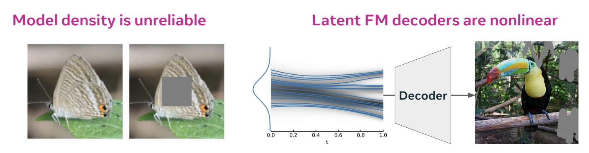
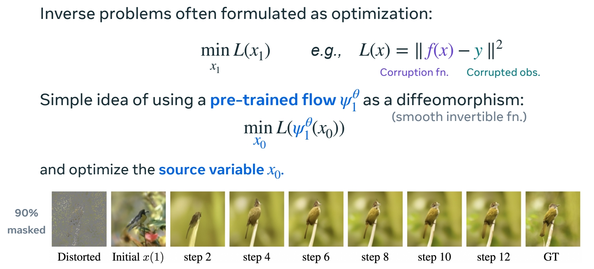

P111  
# Model Adaptation  

P112    
## You’ve trained a model. What next?

    

> 已有一个预训练模，可以做什么？    

P113    
Faster Sampling   

P114    
## Faster sampling by straightening the flow   

    

$$
ℒ(θ) = \mathbb{E} _ {t,(X_0,X_1)∼π_ {0,1}^0}||u^θ_t (X_t) − (X_1 − X_0)||^2
$$

Rectified Flow refits using the **pre-trained (noise, data) coupling**.      
**Leads to straight flows**.     

“Flow Straight and Fast: Learning to Generate and Transfer Data with Rectified Flow” Liu et al. (2022)      
“InstaFlow: One Step is Enough for High-Quality Diffusion-Based Text-to-Image Generation” Liu et al. (2022)    

> Rectified Flow：让 flow 从源直接到目标。     
第1步：训练 flow matching，flow matching 模型定义了源和目标的耦合关系，也得到了噪声与数据的 pair data.    
第2步：用 pair data 继续训练。      

P115     

P116    
## Faster sampling by straightening the flow    

    

> Result，Diffusion 对比 Rectified Flow      

$$
\mathrm{Caveat} 
$$

Enforcing **straightness restricts** the model. Often a slight drop in sample quality

“InstaFlow: One Step is Enough for High-Quality Diffusion-Based Text-to-Image Generation” Liu et al. (2022)    

P118    
## Faster sampling by self-consistency loss   

    

“One Step Diffusion via Shortcut Models” Frans et al. (2024)    

> 增大 \\(h\\)，在 \\(x_t\\) 和 \\(X_{t＋h}\\) 之间建立 shortcut，类似于 diffusion 中的蒸馏方法。     

P119    
## Faster sampling by self-consistency loss   

    

“One Step Diffusion via Shortcut Models” Frans et al. (2024)    

P121    
## Faster sampling by self-consistency loss    

    

“One Step Diffusion via Shortcut Models” Frans et al. (2024)    

> short cuts 直接预测流而不是速度，因此不能结合 CFG.       
预置 CFG 权重针对此问题的 workaround.     

P124   
## Faster sampling by only modifying the solver   

**Can adapt pre-trainedmodels to different schedulers**.  

    

> 以上两种方法，都需训练。此方法不需要训练，而是修改 solver.     

Related by a **scaling & time** transformation:    

    

> 补充：关于调度器．\\(\alpha _t\\) 和 \\(\sigma _t\\)．     
有一个用 scheduler A 训练好的模型，现在预要一个用 scheduler B 训练，这两个模型是什么关系？       

    

> 结论：这两个 scheduler 及其 flow 可以通过 \\(X\\) 的缩放和时间的重参数化关联起来。       
时间重参数化是指，调整 scheduler 的 SNR.     

“Elucidating the design space of diffusion-based generative models” Karras et al. (2023)    
“Bespoke Solvers for Generative Flow Models” Shaul et al. (2023)     

P126   
## Faster sampling by only modifying the solver   

**Bespoke solvers:**    
**Decouples** model & solver.     
Model is left unchanged.    
Parameterize solver and optimize.   

**Can be interpreted as** finding best scheduler + more.   

**Solver consistency:** sample quality is retained as NFE → ∞.    

    

“Bespoke Solvers for Generative Flow Models” Shaul et al. (2023)    
“Bespoke Non-Stationary Solvers for Fast Sampling of Diffusion and Flow Models” Shaul et al. (2024)    

> Bespoke Solver：      
1．模型与 solver 解耦，模型不变，仅优化求 solver.      
2．向 solver 中仅入参数(表达 scheduler)，优化这些参数。     
由于仅优化solver，好处：    
1．可以保持 solver 的一致性。     
2．在不同的模型(不同数据集、分辨率等训练出来的模型)之间可迁移。     
局限性：    
虽然能(不重训)直接迁移到另一个模型，但比在另一个模型上蒸馏(重训)效果要差一点。       

P127    
## Faster sampling by only modifying the solver

Bespoke solvers can t**ransfer across different data sets and resolutions**.     

$$
\mathrm{Caveat} 
$$

However, **does not reach distillation performance at extremely low NFEs.**    

“Bespoke Solvers for Generative Flow Models” Shaul et al. (2023)     
“Bespoke Non-Stationary Solvers for Fast Sampling of Diffusion and Flow Models” Shaul et al. (2024)     

P128   
## Faster sampling references   

**Rectified flows:**    
“Flow Straight and Fast: Learning to Generate and Transfer Data with Rectified Flow” Liu et al. (2022)     
“InstaFlow: One Step is Enough for High-Quality Diffusion-Based Text-to-Image Generation” Liu et al. (2024)     
“Improving the Training of Rectified Flows” Lee et al. (2024)    

**Consistency & shortcut models:**      
“Consistency Models” Song et al. (2023)    
“Improved Techniques for Training Consistency Models” Song & Dhariwal (2023)    
“One Step Diffusion via Shortcut Models” Frans et al. (2024)    

**Trained & bespoke solvers:**    

“DPM-Solver-v3: Improved Diffusion ODE Solver with Empirical Model Statistics” Zheng et al. (2023)     
“Bespoke Solvers for Generative Flow Models” Shaul et al. (2023)     
“Bespoke Non-Stationary Solvers for Fast Sampling of Diffusion and Flow Models” Shaul et al. (2024)     

P129   
## You’ve trained a model. What next?   

Inverse Problems (Training-Free)     

> Inverse Problem：填充、去糊、超分、编辑。       

P133    
## Solving inverse problems by posterior inference   

    

“Pseudoinverse-Guided Diffusion Models for Inverse Problems” Song et al. (2023)    
“Training-free Linear Image Inverses via Flows” Pokle et al. (2024)    

> \\(x_1\\) 为干净图像，\\(y\\) 为噪声图像。    
用高斯来近似其中未知的部分 (score function)      
score function 可能是 multi 的，但实验证明仅用高斯也能有比较好的效果。     

P134   

$$
\mathrm{Caveats} 
$$

Typically requires known **linear** corruption and **Gaussian prob path**.     
Can randomly fail due to the **heuristic** sampling.    

“Pseudoinverse-Guided Diffusion Models for Inverse Problems” Song et al. (2023)      
“Training-free Linear Image Inverses via Flows” Pokle et al. (2024)    

P135      

## Solving inverse problems by optimizing the source

1. Don’t want to rely on **likelihoods / densities**.     
2. Have observation \\(y\\) being nonlinear in \\(x_1\\).     

    

“Do Deep Generative Models Know What They Don't Know?” Nalisnick et al. (2018)      
“D-Flow: Differentiating through Flows for Controlled Generation” Ben-Hamu et al. (2024)     

> 预训练一个生成模型，然后有这个模型来评估数据，评估结果很不可靠，它把真实数据评估为高密度，非真实数据评估为低密度。       
因为，高密度\\(\ne\\) 高采样率。     

P138     
## Solving inverse problems by optimizing the source

    

“D-Flow: Differentiating through Flows for Controlled Generation” Ben-Hamu et al. (2024)     

> 逆问题转化为优化问题。     

$$
X_1=\psi (X_0)
$$

\\(\psi \\) 是预训练的生成模型，不优化 \\(\psi \\) 的参数，那就优化\\(X_0\\) 因为 \\(\psi \\) 是一个平滑、可逆、可微的函数。     

P139    
## Solving inverse problems by optimizing the source

$$ 
\min_{x_0} L(\psi ^\theta _1(x_0))
$$

**Theory:** Jacobian of the flow \\(\nabla _{x_0}\psi ^\theta_1\\) projects the gradient along the data manifold.      

**Intuition:** Diffeomorphism enables **mode hopping**!      

P140    

**Simplicity** allows application in **multiple domains**.      

**Caveat:** Requires multiple simulations and differentiation of \\(\psi ^\theta _1\\).     

“D-Flow: Differentiating through Flows for Controlled Generation” Ben-Hamu et al. (2024)     

P141    

## Inverse problems references    

**Online sampling methods inspired by posterior inference:**     

“Diffusion Posterior Sampling for General Noisy Inverse Problems” Chung et al. (2022)     
“A Variational Perspective on Solving Inverse Problems with Diffusion Models” Mardani et al. (2023)      
“Pseudoinverse-Guided Diffusion Models for Inverse Problems” Song et al. (2023)     
“Training-free Linear Image Inverses via Flows” Pokle et al. (2023)     
“Practical and Asymptotically Exact Conditional Sampling in Diffusion Models” Wu et al. (2023)      
“Monte Carlo guided Diffusion for Bayesian linear inverse problems” Cardoso et al. (2023)     

**Source point optimization:**     

“Differentiable Gaussianization Layers for Inverse Problems Regularized by Deep Generative Models" Li (2021)     
“End-to-End Diffusion Latent Optimization Improves Classifier Guidance” Wallace et al. (2023)      
“D-Flow: Differentiating through Flows for Controlled Generation” Ben-Hamu et al. (2024)      

> 方法 1：通过修改 sample 方法来逐步接近目标。这些方法大多数受到某种后验推断的启发，可以在准确性和效率之间 trade off.     
方法 2：简单但开销很大。        

P144     
## Data-driven and reward-driven fine-tuning    

|||
|--|--|
|   |   |
| A lot of focus put into **data set curation** through human filtering. | Can use **human preference models** or text-to-image alignment. | 

> Data-driven 的关键在于精心准备数据集。     
Reward-driven 不增加训练数据，而是给模型输出一个 reward。finetune 的目标是生成得分高的 sample.      

P145    
## Reward fine-tuning by gradient descent   

Initializing with a pre-trained flow model \\(p^\theta\\)：    

$$
\max_{\theta } \mathbb{E} _{X_1\sim p^\theta }[r(X_1)]
$$

Optimize the reward model with RL [Black et al. 2023]       
or direct gradients [Xu et al. 2023, Clark et al. 2024]      

“Training diffusion models with reinforcement learning” Black et al. (2023)      
“Imagereward: Learning and evaluating human preferences for text-to-image generation.” Xu et al. (2023)       
“Directly fine-tuning diffusion models on differentiable rewards.” Clark et al. (2024)      

P146    

$$
\mathrm{Caveats} 
$$

Requires using **LoRA** to heuristically stay close to the original model.       
Still relatively easy to **over-optimize** reward models; **“reward hacking”**.     

“Directly fine-tuning diffusion models on differentiable rewards.” Clark et al. (2024)       

> 这种方法没有 GT，所以生成结果有可能对 reward model 过拟合。因此需要使用 LoRA.      

P149    
## Reward fine-tuning by stochastic optimal control   

“Fine-tuning of continuous-time diffusion models as entropy regularized control” Uehara et al. (2024)      
“Adjoint matching: Fine-tuning flow and diffusion generative models with memoryless stochastic optimal control” Domingo-Enrich et al. (2024)      

> 和直接优化相比，RLHF 通常针对 tilted（倾斜的）分布。即将一个预训练分布倾科为能得到更高奖励的分布。      
公式（2）蓝色项：微调模型应与预训练模型接近。这是用于 tilted 分布的常用方法。但这里不这样用。      
这里采用公式（3），即引入 value function bias．     
value function bias 是 \\(X＝X_0\\)时，所有可能的 \\(X_1\\) 的期望。    

P150    

**Intuition:** Both initial noise \\(p(X_0)\\) and the model \\(u_t^{base}\\) affect \\(p^{base}(X_1)\\).    

[Uehara et al. 2024] proposes to learn the optimal source distribution \\(p^\ast (X_0)\\).      
[Domingo-Enrich et al. 2024] proposes to **remove the dependency** between \\(X_0, X_1\\).     

$$
p^\ast (X_{(0,1)})=p^{base}(X_{(0,1)})\mathrm{exp} (r(X_1)+const.)\Rightarrow p^\ast (X_1)\propto p^{base}(X_1)\mathrm{exp} (r(X_1))
$$

“Fine-tuning of continuous-time diffusion models as entropy regularized control” Uehara et al. (2024)      
“Adjoint matching: Fine-tuning flow and diffusion generative models with memoryless stochastic optimal control” Domingo-Enrich et al. (2024)     

> 原理：某一时刻的分布受到 noise 分布和模型的共同影响，即使是同一个预预训练模型改变 noise 的分布，那么 \\(X_1\\) 的分布也会改变。    
由于 \\(X_1\\) 同时受模型和 noise 分布的影响，那么 RLHF 同时优化这两个因素。     
或者，改变采样方法，让 \\(X_0\\) 分布与 \\(X_1\\) 分布独立。那么此时，value function 是一个常数。     
     

P151    
## Reward fine-tuning by stochastic optimal control

   

“Adjoint matching: Fine-tuning flow and diffusion generative models with memoryless stochastic optimal control” Domingo-Enrich et al. (2024)    

> 这篇论文的主要内容：     
1．使用 flow matching 在真实图像上训练后，再使用 ODE 采样，能得到真实的输出。    
2．把 ODE 过程改成无记忆 SDE（强制 \\(X_0\\) 与 \\(X_1\\) 独立），那么在早期的 sample step 实际上没有什么收益，因为那时候 \\(X\\) 大部分都是噪声。因此 SD 的采样结果不符合预训练的分布。     
3．2 其实是 finetune 的过程，因为 finetune 过程，不使用 flow 的 sample 方式，而是 SDE 的 sample 方式。     
4．finetune 之后，可以把 SDE 换回成 DDE。     

P152    
## Reward fine-tuning 总结

**Gradient-based optimization:**     

“DPOK: Reinforcement Learning for Fine-tuning Text-to-Image Diffusion Models” Fan et al. (2023)     
“Training diffusion models with reinforcement learning” Black et al. (2023)     
“Imagereward: Learning and evaluating human preferences for text-to-image generation.” Xu et al. (2023)     
“Directly fine-tuning diffusion models on differentiable rewards.” Clark et al. (2024)     

**Stochastic optimal control:**     

“Fine-tuning of continuous-time diffusion models as entropy regularized control” Uehara et al. (2024)      
“Adjoint matching: Fine-tuning flow and diffusion generative models with memoryless stochastic optimal control” 
Domingo-Enrich et al. (2024)     