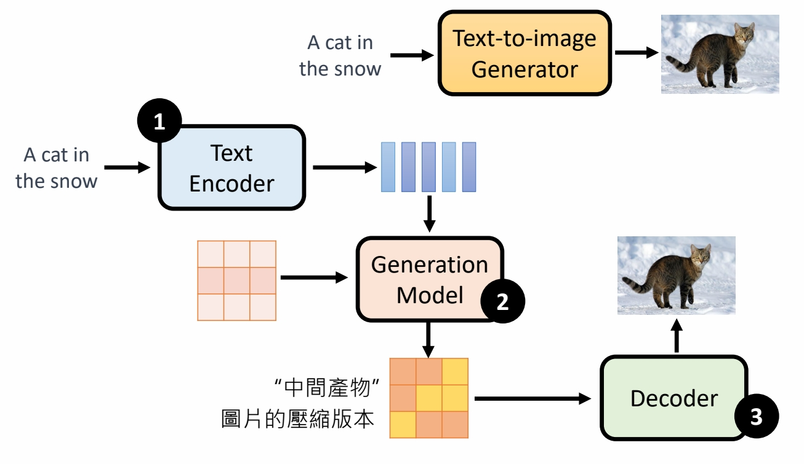
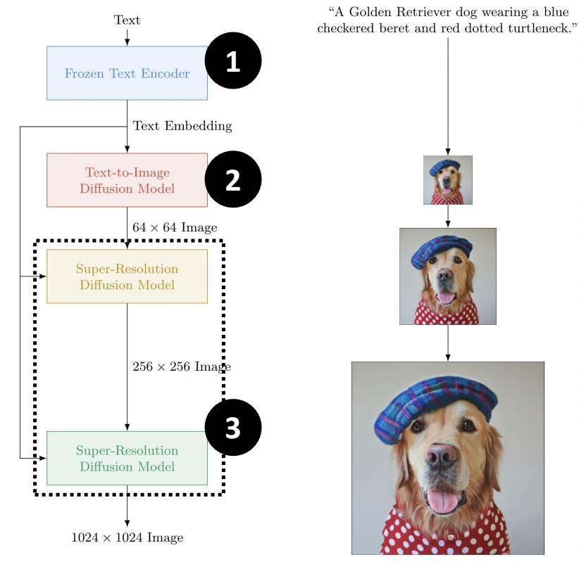
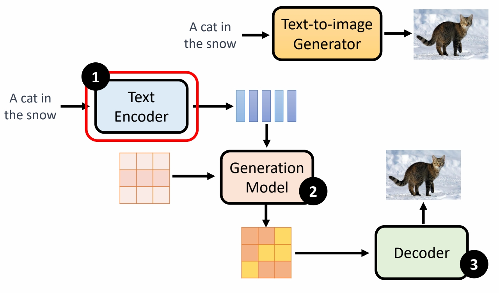
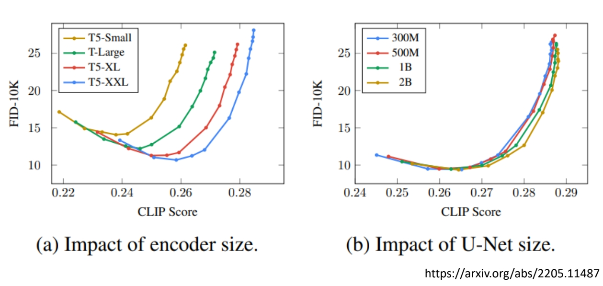
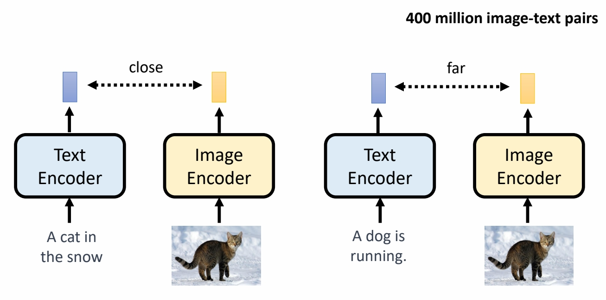
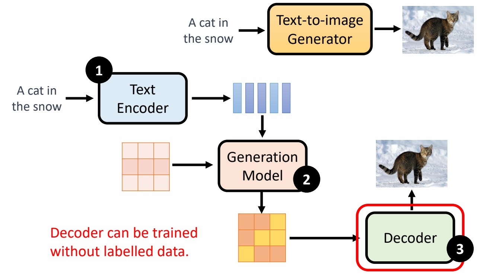
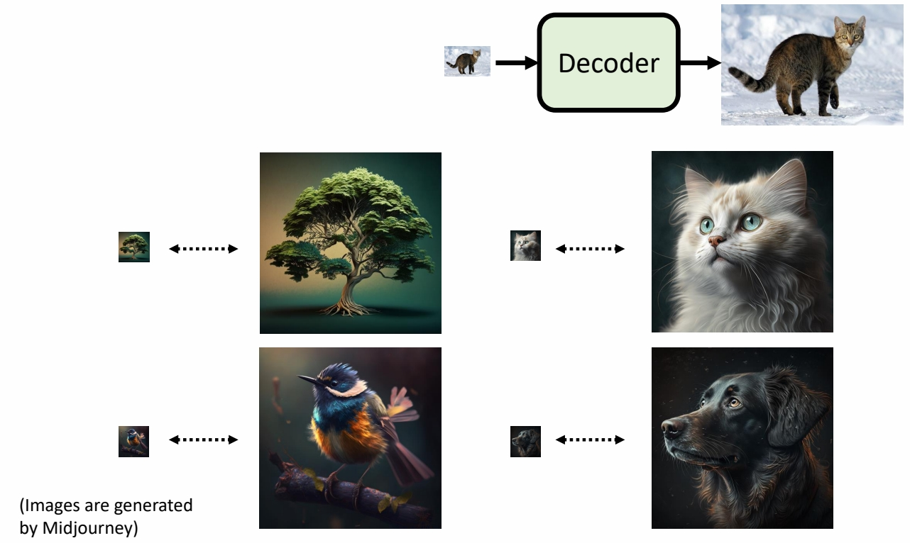
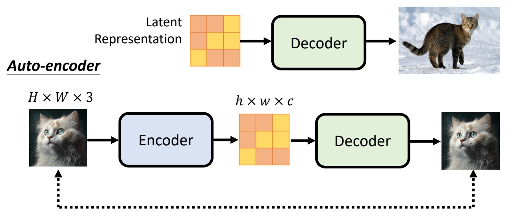
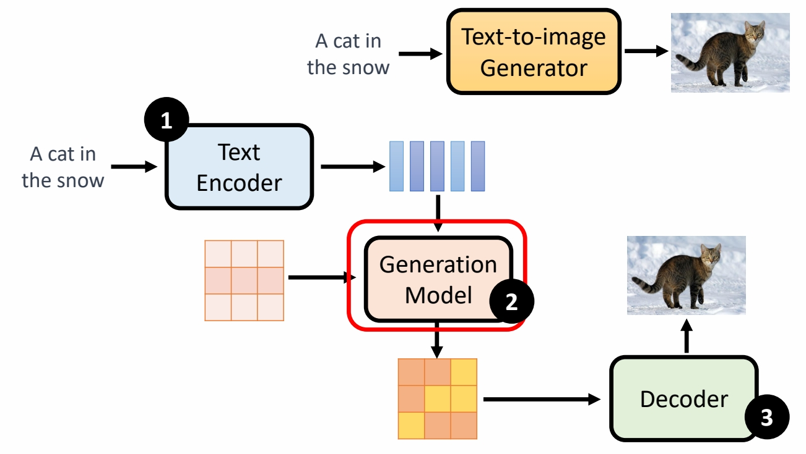
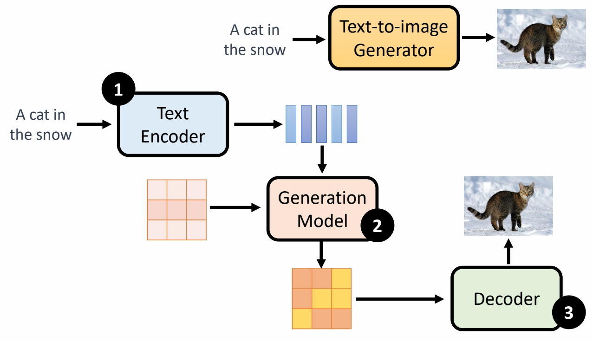

P1   
# Stable Diffusion

 

P2   
## Framework 

 

P3   
## Stable Diffusion 

<https://arxiv.org/abs/2112.10752>  

 

P4   
## DALL-E series 
<https://arxiv.org/abs/2204.06125>

<https://arxiv.org/abs/2102.12092>

 

P5   
## Imagen 

<https://imagen.research.google/>

<https://arxiv.org/abs/2205.11487>

 

P6   
## Framework 

 

P7   

 

P8   
## Fréchet Inception Distance (FID)

<https://arxiv.org/abs/1706.08500>

 

P9   
## Contrastive Language-Image Pre-Training (CLIP) 

<https://arxiv.org/abs/2103.00020>

 

P10   
## Framework

 

P11  
## 「中間產物」為小圖

 

P12   
## 「中間產物」為「Latent Representation」

 

P13   
## Framework 

 

P14   
 

P15   
 

P16   
 

P17   
## Stable Diffusion 

<https://arxiv.org/abs/2112.10752>

 

P18   
## Framework 

 
