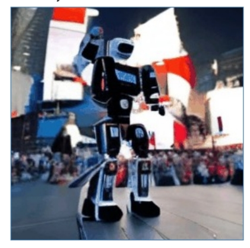

P67   

|ID|Year|Name|Note|Tags|Link|
|---|---|---|---|---|---|
|58|2023|Wang et al., “ModelScope Text-to-Video Technical Report,”| ||[link](https://caterpillarstudygroup.github.io/ReadPapers/58.html)|
||2023|ZeroScope| &#x2705; ZeroScope 在 ModelScope 上 finetune，使用了非常小但质量非常高的数据，得到了高分辨率的生成效果。   |
|50|2023|Stable Video Diffusion: Scaling Latent Video Diffusion Models to Large Datasets|Scaling latent video diffusion models to large datasets **Data Processing and Annotation**||[link](https://caterpillarstudygroup.github.io/ReadPapers/50.html)|
||2024|CogVideo|Transformer Based|
||2023|Wang et al., “LAVIE: High-Quality Video Generation with Cascaded Latent Diffusion Models,”|Joint image-video finetuning with curriculum learning  &#x2705; 提供了一套高质量数据集，生成的视频质量也更好（训练集很重要）。| |
||2023| Chen et al., “VideoCrafter1: Open Diffusion Models for High-Quality Video Generation,”|  Latent diffusion inserted with temporal layers| |

P74  
### 其它相关工作

|||||
|--|--|--|--|
| " Robot dancing in times square,” arXiv 2023.  | " Clown fish swimming through the coral reef,” arXiv 2023.| " Melting ice cream dripping down the cone,” arXiv 2023.| " Hyper-realistic photo of an abandoned industrial site during a storm,” arXiv 2023.|
|   |   |   |   |  

---------------------------------------
> 本文出自CaterpillarStudyGroup，转载请注明出处。
>
> https://caterpillarstudygroup.github.io/ImportantArticles/