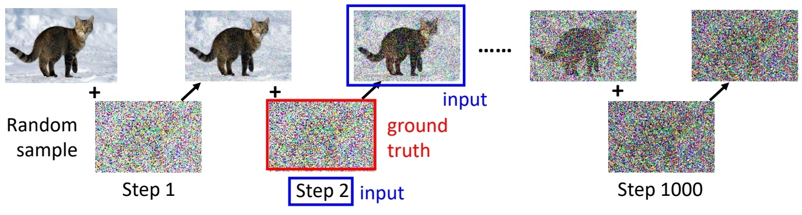

P12  
# Diffusion Model 是如何运作的？

P13   

Denoising diffusion models consist of two processes:    
 - Forward diffusion process that gradually adds noise to input   
 - Reverse denoising process that learns to generate data by denoising    

 

P14   
## Forward Diffusion Process

The formal definition of the forward process in T steps:    

### 直观理解

> 真正的加噪过程，**不是直接的image + noise**。  

### 从数学上理解

> &#x2705; 从第一张图像到最后的纯噪声，实际上是分布的改变。

 

通过逐步的 scale down 让均值趋近于 0。通过引入噪声使方差趋近于 1。使得原始分布逐步逼近 \\(\mathcal{N} (0,1 )\\)分布，   

> &#x2753; 求联合分布有什么用?    

### 从操作层面理解

 

> &#x2705; 实际上，在给定一张图像x0时，想要获得第t张加噪图像时，不需要真的通过公式\\(q(x_t|x_{t-1})\\)从 \\(\mathbf{x} _{t-1}\\)到 \\(\mathbf{x} _{t}\\)一步一步计算出来，可以直接从 \\(\mathbf{x}_0\\)生成任意的 \\(\mathbf{x}_t\\)。 

 

从数学上可以证明，从x0逐步计算到xt和从x0直接计算到xt，这两种行为是等价的。  

根据公式 \\(\mathbf{x} _t=\sqrt{\bar{a} _t}   \mathbf{x} _0+\sqrt{(1-\bar{a} _t) }  \varepsilon  \\)可知，当 \\(\bar{a} _T  → 0\\)，分布\\(q(x_T)\\)的均值趋于0，方差趋于1，变成纯高斯噪声。

P16   
### What happens to a distribution in the forward diffusion?

So far, we discussed the diffusion kernel \\(q(\mathbf{x} _t|\mathbf{x} _0)\\) but what about \\(q(\mathbf{x}_t)\\)?   

 

The diffusion kernel is Gaussian convolution.    

> &#x2705; convolution 是一种信号平滑方法。    
> &#x2705; \\(q(\mathbf{x} _ t|\mathbf{x} _ 0)\\) 是标准高斯分布，因此 \\(q(\mathbf{x} _ t)\\) 是以高斯分布为权重的真实数据的加权平均。     

 

We can sample \\(\mathbf{x}_t \sim q(\mathbf{x}_t)\\) by first sampling and then sampling \\(\mathbf{x}_t \sim q(\mathbf{x}_t|\mathbf{x}_0)\\) (i.e., ancestral sampling).   

> &#x2705; 实际上，没有任意一个时间步的 \\(q(\mathbf{x})\\) 的真实分布，只有这些分布的 sample.    

## Reverse Denoising Process

> &#x2705; 把 \\(\mathbf{x}_0\\) 加噪为 init-noise，再从 init-noise 恢复出 \\(\mathbf{x}_0\\)，这个操作是不可行的。     
> &#x2705; 因为，根据公式 \\(\mathbf{x} _t=\sqrt{\bar{a} _t}   \mathbf{x} _0+\sqrt{(1-\bar{a} _t) }  \varepsilon  \\), 且 \\(\bar{a} _T  → 0\\)，那么经过 \\(T\\) 步加噪后，\\(\mathbf{x} _t\approx \varepsilon \\). 而是 \\(\varepsilon \\) 是一个与 \\(\mathbf{x} _ 0\\) 没有任务关系的噪声，所以不可能从中恢复出 \\(\mathbf{x} _ 0\\).     

P17   
### Generative Learning by Denoising   

Recall, that the diffusion parameters are designed such that 
\\(q(\mathbf{x}_T)\approx (\mathbf{x}_T；\mathbf{0,I})\\)    

 

 

Can we approximate \\(q(\mathbf{x}_{t-1}|\mathbf{x}_t)\\)? Yes, we can use a **Normal distribution** if \\(\beta _t\\) is small in each forward diffusion step.    

> &#x2705; Nomal distribution 是特定均值和方差的高斯分布，不一定是 std 高斯。    

P18    
### Reverse Denoising Process

Formal definition of forward and reverse processes in T steps:    

 

> &#x2705; 虽然 \\(p(\mathbf{x} _ T)\\) 的真实分布未知，只有 \\(p (\mathbf{x} _ T)\\) 的 sample，但这里假设它是 \\( \mathcal{N} (0,1)\\).   

P19   
### Learning Denoising Model   

 

> &#x2753; 网络只能产生 \\(\mathbf{x} _ t\\) 的均值，方差会有什么样的变化，对结果会有什么影响呢？   
> &#x2753; 求联合分布有什么用？     

P20   
# 训练与推断

 

P21    
## Implementation Considerations   

Diffusion models often use U-Net architectures with ResNet blocks and self-attention layers to represent \\(\epsilon _\theta (\mathbf{x}_t,t)\\).    

 

Time representation: sinusoidal positional embeddings or random Fourier features.    

Time features are fed to the residual blocks using either simple spatial addition or using adaptive group normalization layers. (see <u>Dharivwal and Nichol NeurIPS 2021</u>).    

> &#x2705; \\(\sigma \\) 是怎么定义的？    

# 数学原理

# Reference 

<u>Sohl-Dickstein et al., Deep Unsupervised Learning using Nonequilibrium Thermodynamics, ICML 2015</u>     
<u>Ho et al., Denoising Diffusion Probabilistic Models, NeurIPS 2020</u>   
<u>Song et al., Score-Based Generative Modeling through Stochastic Differential Equations, ICLR 2021</u>    
> 详细推导过程：[link](https://caterpillarstudygroup.github.io/ImportantArticles/%E6%9D%8E%E5%AE%8F%E6%AF%85DiffusionModel/DiffusionModel%E8%83%8C%E5%90%8E%E7%9A%84%E6%95%B0%E6%8E%8C%E5%8E%9F%E7%90%86.html)

---------------------------------------
> 本文出自CaterpillarStudyGroup，转载请注明出处。
>
> https://caterpillarstudygroup.github.io/ImportantArticles/