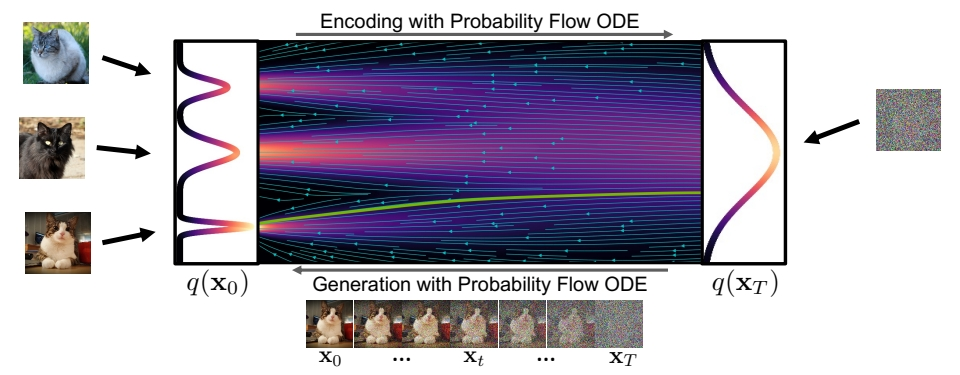

P22  

# Score-based Generative Modeling with Differential Equations

|ID|Year|Name|Note|Tags|Link|
|---|---|---|---|---|---|
||2021|Score-Based Generative Modeling through Stochastic Differential Equations|||[link](https://caterpillarstudygroup.github.io/ReadPapers/8.html)

P26   
## DDPM VS Stochastic Differential Equation

> &#x1F50E; [SDE](https://caterpillarstudygroup.github.io/mathematics_basic_for_ML/NumericalComputation/ODE_SDE.html)
 

> &#x2705; DDPM 是在时间上做了离散化的 SDE．    

P27    
### Forward Diffusion Process as Stochastic Differential Equation

 

> &#x2705; drift term 使 \\( \mathbf{x} _ t\\) 趋向于 Origin.    
> &#x2705; Origin 我理解为 \\( \vec{0} \\) 向量的意思。    
> &#x2705; \\( \mathbf{x} _ t\\) 最终趋向于 std normal.    

P29  
### The Generative Reverse Stochastic Differential Equation

 

> &#x1F50E; <u>Anderson, in Stochastic Processes and their Applications, 1982</u>    

> &#x2705; \\(q _ t(\cdot )\\) 描述 \\(t\\) 时刻的分布。    
> &#x2705; \\(q _ t(\mathbf{x} _ t)\\) 为 \\(\mathbf{x} _ t\\) 在 \\(q _ t\\) 分布中的概率。    
> &#x2705; Generative 的关键是拟合 score funchon．    

**But how to get the score function** \\(\nabla \mathbf{x} _t \log q_t(\mathbf{x} _t)\\)?   

P32   
## Score Matching

Naïve idea, learn model for the score function by direct regression?    

 

> &#x2705; 直接用一个网络拟合 score function．    

**But** \\(\nabla \mathbf{x} _t \log q_t(\mathbf{x} _t)\\) **(score of the** ***marginal diffused density*** \\(q_t(\mathbf{x} _t)\\)**) is not tractable!**   

> &#x2705; 存在的问题：只能 sample from \\(q_t\\)，但没有 \\(q_t\\) 的 close form.    

<u>Vincent, “A Connection Between Score Matching and Denoising Autoencoders”, Neural Computation, 2011</u>    

<u>Song and Ermon, “Generative Modeling by Estimating Gradients of the Data Distribution”, NeurIPS, 2019</u>    

P33   
### Denoising Score Matching

Instead, diffuse individual data points \\(\mathbf{x}_0\\). Diffused \\(q_t(\mathbf{x}_t|\mathbf{x}_0)\\) ***is*** tractable!     

> &#x1F50E; <u>Vincent, in Neural Computation, 2011</u>      

 

> &#x2753; \\(\gamma _ t\\) 和 \\(\sigma\\) 怎么定义？ 答：见上一页DDPM的推导。   

因此**Denoising Score Matching**的目标函数变为:     

 
  
**After expectations**, \\(\mathbf{s} _ \theta (\mathbf{x} _ t,t)\approx \nabla _ {\mathbf{x} _ t}\log q _ t(\mathbf{x} _ t)\\)**!**    

> &#x1F50E; <u>Song and Ermon, NeurIPS, 2019</u>   

> &#x2705; 最后 \\(\mathbf{s} _ \theta (\mathbf{x} _ t,t)\\) 学到的是所有 \\(\mathbf{x} _ 0\\) 对应的 score 的均值。    

> &#x2705; 结果发现时间离散的 diffusion model(DDPM) 和时间连续的 diffusion model(SDE),其目标函数是一致的，且两个版本可以互相转化。    

$$
\min_ {\mathbf{\theta}  } \mathbb{E} _ {t\sim u(0,T)}\mathbb{E} _ {\mathbf{x} _ 0\sim q_ 0(\mathbf{x} _ 0)}\mathbb{E} _{\epsilon \sim \mathcal{N}(\mathbf{0,I} ) }\frac{1}{\sigma ^2_t} ||\epsilon -\epsilon _ \theta (\mathbf{x} _ t,t)||^2_2 
$$

P35    
## Different Parameterizations

> &#x1F50E; Karras et al., <u>"Elucidating the Design Space of Diffusion-Based Generative Models",</u> NeurIPS 2022 [link](https://caterpillarstudygroup.github.io/ReadPapers/9.html)   

> &#x2705; 调参对生成质量影响很大。       

P36   
## Synthesis with SDE vs. ODE

**Generative Reverse Diffusion SDE (stochastic):**    

$$
d\mathbf{x} _ t=-\frac{1}{2} \beta (t)[\mathbf{x} _ t+2s_ \theta (\mathbf{x} _ t,t)]dt+\sqrt{\beta (t)} d\varpi _ t
$$

**Generative Probability Flow ODE (deterministic):**   

$$
d\mathbf{x} _ t=-\frac{1}{2} \beta (t)[\mathbf{x} _ t+s_ \theta (\mathbf{x} _ t,t)]dt
$$
 
> &#x2705; [Song et al., ICLR, 2021](https://caterpillarstudygroup.github.io/ReadPapers/9.html)表明，可以把 SDE 模型转换为ODE模型。只需要对sample过程进行公式修改即可。每个噪声对应特定的输出。  

P37   

#### Diffusion Models as Neural ODEs  

   

使用ODE的sample公式有以下好处：
 - ODE 推断，可以使用成熟的 ODE solver 进行 sample 加速。     
 - **Deterministic encoding and generation** (semantic image interpolation, etc.)     
 - **Log-likelihood computation** (instantaneous change of variables):       

> &#x2753; 第三条没听懂，把 model 当成基于数据的 ODE 来用？    

## More

 - **ScoreSDE**: simple linear problems, e.g., inpainting, colorization; later extended to MRI and CT.   
 - **ILVR**: more linear problems, e.g., super-resolution.   
 - **SNIP**S: slow solution for noisy linear problems.   
 - **CCDF**: better initializations.    
 - **DDRM**: fast solution for all noisy linear problems, and JPEG.  
 
---------------------------------------
> 本文出自CaterpillarStudyGroup，转载请注明出处。
>
> https://caterpillarstudygroup.github.io/ImportantArticles/