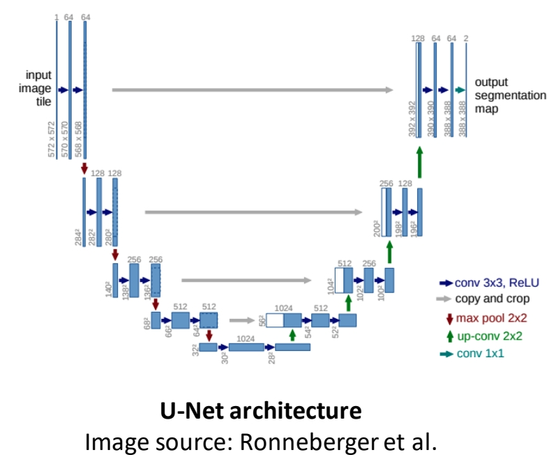
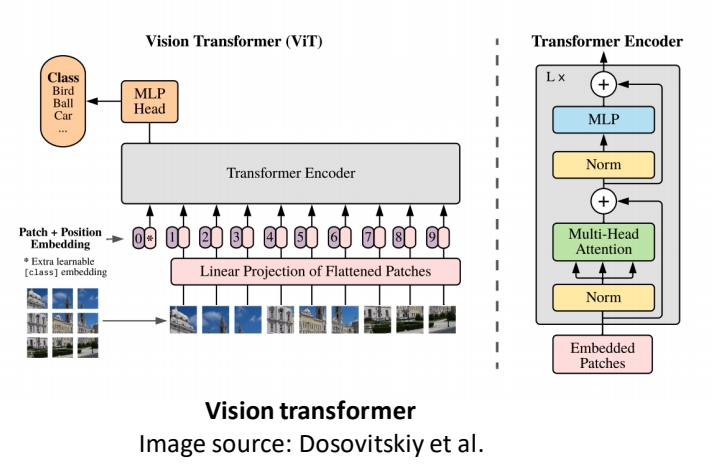
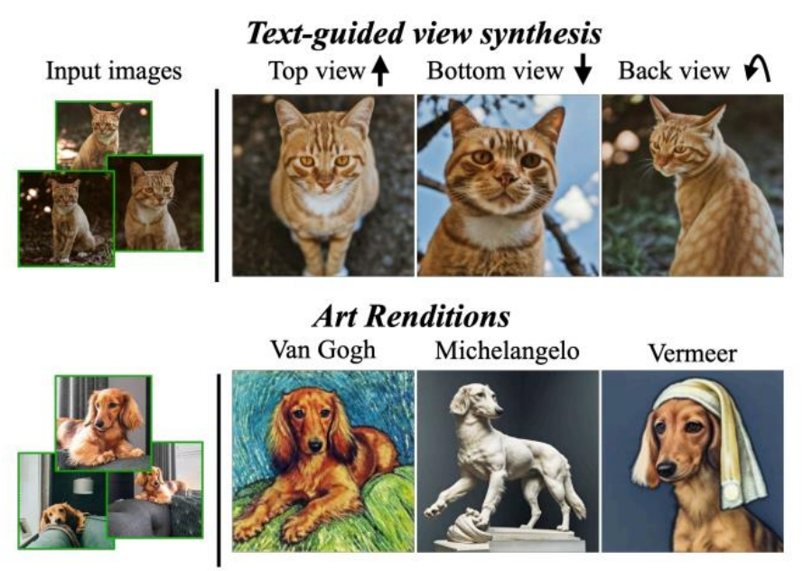
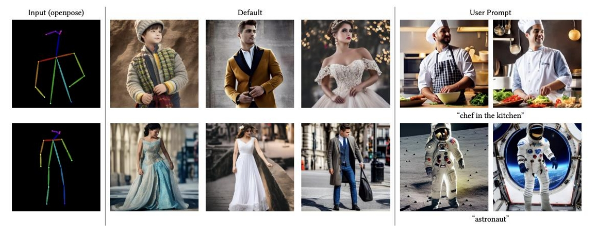
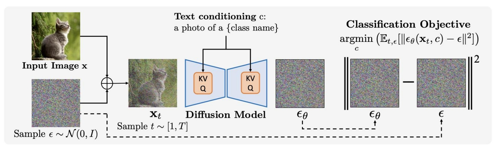

P1   
## Applications of Denoising Diffusion Models on Images

P2   
## Outline

 - **Diffusion model architectures**    
 - **Editing and customization with diffusion models**    
 - **Other applications of diffusion models**    

P4   
## Architecture

P5   
## U-Net Architecture

 

 

Ronneberger et al., <u>“U-Net: Convolutional Networks for Biomedical Image Segmentation”, </u>MICCAI 2015      
Rombach et al., <u>"High-Resolution Image Synthesis with Latent Diffusion Models",</u> CVPR 2022    

> &#x2705; Condition 通常用 Concat 或 Cross attention 的方式与 Content 相结合。    

P6   
## U-Net Architecture

**Imagen** aharia et al.   
**Stable Diffusion** Rombach et al.    
**eDiff-I** Balaji et al.    
 
Saharia et al. <u>“Photorealistic text-to-image diffusion models with deep language understanding”, </u>NeurIPS 2022    
Rombach et al., <u>"High-Resolution Image Synthesis with Latent Diffusion Models", </u>CVPR 2022    
Balaji et al.,” <u>ediffi: Text-to-image diffusion models with an ensemble of expert denoisers”, </u>arXiv 2022    

P7    
## Transformer Architecture

 

 

Dosovitskiy et al., <u>“An image is worth 16x16 words: Transformers for image recognition at scale”, </u>ICLR 2021     
Bao et al.,<u> "All are Worth Words: a ViT Backbone for Score-based Diffusion Models", </u>arXiv 2022    

> &#x2705; 特点：1. 把 image patches 当作 token.    
> &#x2705; 2. 在 Shallow layer 与 deep layer 之间引入 long skip connection.    

P8   
## Transformer Architecture

Peebles and Xie, <u>"Scalable Diffusion Models with Transformers", </u>arXiv 2022    
Bao et al., <u>"One Transformer Fits All Distributions in Multi-Modal Diffusion at Scale", </u>arXiv 2023    
Hoogeboom et al., <u>"simple diffusion: End-to-end diffusion for high resolution images", </u>arXiv 2023    

P9    
## Image editing and customization with diffusion models

P10    
## Image editing and customization with diffusion models
 - RGB pixel guidance   
 - Text guidance   
 - Reference image guidance   

P11   
## How to perform guided synthesis/editing?   

 

> &#x2705; 过去的 guided synthesis／editing 任务是用 CAN based 方法实现的。    

P12   
## SDEdit: Guided Image Synthesis and Editing with Stochastic Differential Equations   

First perturb the input with **Gaussian noise** and then progressively remove the noise using a pretrained diffusion model.    

 

**Gradually projects the input to the manifold of natural images.**

Meng et al., <u>"SDEdit: Guided Image Synthesis and Editing with Stochastic Differential Equations", </u>ICLR 2022   

> &#x2705; 只是对 Guided Image 进行加噪和去噪。    

P13   
## Fine-grained control using strokes

 

Meng et al., <u>"SDEdit: Guided Image Synthesis and Editing with Stochastic Differential Equations", </u>ICLR 2022    

P16   
## Image compositing  

 

Meng et al., <u>"SDEdit: Guided Image Synthesis and Editing with Stochastic Differential Equations", </u>ICLR 2022    

P17   
## Efficient Spatially Sparse Inference for Conditional GANs and Diffusion Models

 

Li et al., <u>"Efficient Spatially Sparse Inference for Conditional GANs and Diffusion Models", </u>NeurIPS 2022    

P18   
## DDIM Inversion

 

Song et al., <u>"Denoising Diffusion Implicit Models",</u> ICLR 2021    

> &#x2705; DDIM 方法中，从 noise 到图像的映射关系是确定的。同样也可以让图像与 noise 的关系是确定的。这个过程称为 DDIM Inversion.    
> &#x2705; DDIM Inversion 是图像编辑的常用方法。     

P19   
## Style transfer with DDIM inversion

 

Su et al., <u>"Dual diffusion implicit bridges for image-to-image translation", </u>ICLR 2023    

> &#x2705; 假设已有一个 pretrained diffusion model．    
> &#x2705; 任务：把老虎的图像变成猫的图像，且不改变 Sryle.     
> &#x2705; (1) 老虎图像 ＋ DDIM Inversion ＋ “老虎”标签  → noise      
> &#x2705; (2) noise ＋ DDIM ＋ “猫”标签 → 猫图像        
> &#x2705; 优点：不需要重训。     

P20   
## Style transfer with DDIM inversion

 

Su et al., <u>"Dual diffusion implicit bridges for image-to-image translation",</u> ICLR 2023    

P21    
## DiffEdit: Diffusion-based semantic image editing with mask guidance    

Instead of asking users to provide the mask, the model will generate the mask itself based on the caption and query.    

 

Couairon et al., <u>"DiffEdit: Diffusion-based semantic image editing with mask guidance", </u>ICLR 2023    

P22   
## DiffEdit: Diffusion-based semantic image editing with mask guidance    

 

Couairon et al., <u>"DiffEdit: Diffusion-based semantic image editing with mask guidance",</u> ICLR 2023   

> &#x2705; (1) 原始图像加噪。      
> &#x2705; (2) 基于两个文本做去噪，生成 MASK.     
Step2: DDIM Inversion      
> &#x2753; Stepl 如何训练？有 pair data 吗？    

P23   
## DiffEdit: Diffusion-based semantic image editing with mask guidance

 

Couairon et al., <u>"DiffEdit: Diffusion-based semantic image editing with mask guidance", </u>ICLR 2023    

P24   
## Imagic: Text-Based Real Image Editing with Diffusion Models   

 

Kawar et al., <u>"Imagic: Text-Based Real Image Editing with Diffusion Models",</u> CVPR 2023     

> &#x2705; 修改内容，但对不相关部分保留。    

P25   
## Imagic: Text-Based Real Image Editing with Diffusion Models

     
     
   

Kawar et al., <u>"Imagic: Text-Based Real Image Editing with Diffusion Models", </u> CVPR 2023    

> &#x2705; (1) 对 target text 作 embedding (2) 用 text embedding 重建 Input Image，这一步会 finelue teat embedding.    
> &#x2705; (1) finetue Diffusion Model．基于 stes A 中的 text embedding，目的没听懂。    
> &#x2705; (1) eopt 来自 Step A   (2) Diffusion Process 来自 Step B．     

P26   
## Imagic: Text-Based Real Image Editing with Diffusion Models

 

Kawar et al., <u>"Imagic: Text-Based Real Image Editing with Diffusion Models", </u>CVPR 2023   

P27   
## Prompt-to-Prompt Image Editing with Cross-Attention Control

Hertz et al., <u>"Prompt-to-Prompt Image Editing with Cross-Attention Control", </u>ICLR 2023    

> &#x2705; 基于标题的图像编辑 (1) 修改某个单词的影响力；(2) 替换单词；(3) 添加单词；     

P28   
## Prompt-to-Prompt Image Editing with Cross-Attention Control    

Hertz et al., <u>"Prompt-to-Prompt Image Editing with Cross-Attention Control",</u> ICLR 2023    

> &#x2705; 控制 attention maps，在编辑图像过程中把原始图像的 attention map 注入到 diffusion 过程中。    

P29   
## Prompt-to-Prompt Image Editing with Cross-Attention Control   

Hertz et al., <u>"Prompt-to-Prompt Image Editing with Cross-Attention Control",</u> ICLR 2023     

P30   
## InstructPix2Pix: Learning to Follow Image Editing Instructions  

   

Brooks et al., <u>"Instructpix2pix: Learning to follow image editing instructions”,</u> CVPR 2023    

> &#x2705; 优势：只修改推断过程，不需针对图像做 finetune.    

P31   
## InstructPix2Pix: Learning to Follow Image Editing Instructions   

    
    

Brooks et al., <u>"Instructpix2pix: Learning to follow image editing instructions”,</u> CVPR 2023    

> &#x2705; 只是文本引导方式做了改变，哪里体现 pix 2 呢？     

P32   
## Personalization with diffusion models   

 

Ruiz et al., <u>"DreamBooth: Fine Tuning Text-to-Image Diffusion Models for Subject-Driven Generation",</u> CVPR 2023    

P33   
## DreamBooth: Fine Tuning Text-to-Image Diffusion Models for Subject-Driven Generation    

 

Ruiz et al., <u>"DreamBooth: Fine Tuning Text-to-Image Diffusion Models for Subject-Driven Generation",</u> CVPR 2023    

P34   
## The DreamBooth Method  

 

Ruiz et al., <u>"DreamBooth: Fine Tuning Text-to-Image Diffusion Models for Subject-Driven Generation",</u> CVPR 2023     
 
P35   
## DreamBooth Results

 

Ruiz et al., <u>"DreamBooth: Fine Tuning Text-to-Image Diffusion Models for Subject-Driven Generation",</u> CVPR 2023     

P36   
## DreamBooth Applications    

 

Ruiz et al., <u>"DreamBooth: Fine Tuning Text-to-Image Diffusion Models for Subject-Driven Generation",</u> CVPR 2023    

P37    
## Textual Inversion: Optimizing Text Embedding   

 

Gal et al., <u>"An Image is Worth One Word: Personalizing Text-to-Image Generation using Textual Inversion",</u> ICLR 2023    

P38   
## Textual Inversion: Optimizing Text Embedding  

 

Gal et al., <u>"An Image is Worth One Word: Personalizing Text-to-Image Generation using Textual Inversion",</u> ICLR 2023   

> &#x2705; 输入带 holder world 的 String，(1) 转为 token (2) token 转为“连续的表示”，即 embedding. (3) embedding 转为 conditional code，用于引导生成模型。    
> &#x2705; 通过重建来优化 embedding.    

P39   
## Textual Inversion Results   

 

Gal et al., <u>"An Image is Worth One Word: Personalizing Text-to-Image Generation using Textual Inversion",</u> ICLR 2023    

P40    
## Works well for artistic styles    

 

Gal et al., <u>"An Image is Worth One Word: Personalizing Text-to-Image Generation using Textual Inversion",</u> ICLR 2023    

P41   
## Low-rank Adaptation (LoRA)   

 - Lora: Low-rank adaptation of large language models

 

Lora [Edward J. Hu\\(^\ast \\), Yelong Shen\\(^\ast \\), et al., ICLR 2022]     
Lora + Dreambooth (by Simo Ryu): <https://github.com/cloneofsimo/lora>     

> &#x2705; 要解决的问题：finetune 所需的训练时间、参数存储，Computation 的成本很高。    

P42   
## Low-rank Adaptation (LoRA)

 

**Finetuned with only 9 images Visualized every 500 steps**    

Lora [Edward J. Hu\\(^\ast \\), Yelong Shen\\(^\ast \\), et al., ICLR 2022]    
Lora + Dreambooth (by Simo Ryu): <https://github.com/cloneofsimo/lora>    

P43
## Fine-tuning all model weights

**Storage requirement**. 4GB storage for each fine-tuned model.    
**Compute requirement**. It requires more VRAM/training time.      
**Compositionality**. Hard to combine multiple models.    

Kumari et al., <u>"Multi-Concept Customization of Text-to-Image Diffusion",</u> CVPR 2023    

P45   
## Analyze change in weights   

 

Kumari et al., <u>"Multi-Concept Customization of Text-to-Image Diffusion",</u> CVPR 2023    

> &#x2705; insights 应该 finetune 哪些参数，分析模型各参数的重要性。   
> &#x2705; Cross-Attn 层用于结合图像和文本的特征。     
> &#x2705; Self-Attn 用于图像内部。    
> &#x2705; Other 主要是卷积和 Normalization.    
> &#x2705; 通过比较 pretrained 模型和 finetune 模型，change 主要发生成Cross-Attn 层，说明 Cross-Attn 层在 finetune 过程中更重要！    

P46   
## Only fine-tune cross-attention layers

   

Kumari et al., <u>"Multi-Concept Customization of Text-to-Image Diffusion",</u> CVPR 2023    

P47   
## How to prevent overfitting?    

   

Kumari et al., <u>"Multi-Concept Customization of Text-to-Image Diffusion",</u> CVPR 2023    

> &#x2705; (1) 计算“标题相似度”。    

P48   
## Personalized concepts   

   

How to describe personalized concepts?    

V\\(^\ast \\) **dog**   

Where V\\(^\ast \\) is a modifier token in the text embedding space    

Kumari et al., <u>"Multi-Concept Customization of Text-to-Image Diffusion",</u> CVPR 2023    

P49   
## Personalized concepts

Also fine-tune the modifier token V\\(^\ast \\) that describes the personalized concept   

   

P50   
## Single concept results

   

Kumari et al., <u>"Multi-Concept Customization of Text-to-Image Diffusion",</u> CVPR 2023    

P51   
## Multiple new concepts?    

   

Kumari et al., <u>"Multi-Concept Customization of Text-to-Image Diffusion",</u> CVPR 2023    

P52   
## Joint training

1. Combine the training dataset of multiple concepts    

   

Kumari et al., <u>"Multi-Concept Customization of Text-to-Image Diffusion",</u> CVPR 2023     

P53   
## Two concept results

   

Kumari et al., <u>"Multi-Concept Customization of Text-to-Image Diffusion",</u> CVPR 2023    

P54   
## Two concept results   

 

Kumari et al., <u>"Multi-Concept Customization of Text-to-Image Diffusion",</u> CVPR 2023    

P55   
## Key-Locked Rank One Editing for Text-to-Image Personalization   

    

Tewel et al., <u>"Key-Locked Rank One Editing for Text-to-Image Personalization",</u> SIGGRAPH 2023    

> &#x2753;  Perffusion？这个词从哪来的？    
> &#x2705; 方法：dynamic random update.     
> &#x2705; Perffusion 可以解决 Image：Personalization 的 overfitting 问题 (1) Introducing new xxxx that lost the new concepts cross-attention keys to disordinate category.    
> &#x2705; (2) 引入 a gate random approach 可用于控制 the learned concept —— 推断时。    
> &#x2705; (3) 允许 medel 把不同的 concept 结合到一起，并学到不同concept 之间的联系。    

P56   
## T2I-Adapter: Learning Adapters to Dig out More Controllable Ability for Text-to-Image Diffusion Models

    

***√ Plug-and-play. Not affect original network topology and generation ability***   
***√ Simple and small. ~77M parameters and ~300M storage***    
***√ Flexible. Various adapters for different control conditions***    
***√ Composable.  Several adapters to achieve multi-condition control***    
***√ Generalizable. Can be directly used on customed models***    

    

Mou et al., <u>"T2I-Adapter: Learning Adapters to Dig out More Controllable Ability for Text-to-Image Diffusion Models",</u> arXiv 2023   

> &#x2705; 引入一个简单的模型称为 Adapter，用于引导 Image Diffusion Model.    
> &#x2705; Adapter 包含多次降采样，对应于 UNET 的不同 Level.    
> &#x2705; 优点：简单、易训、易使用。    

P57   
## T2I-Adapter: Learning Adapters to Dig out More Controllable Ability for Text-to-Image Diffusion Models    

    

Mou et al., <u>"T2I-Adapter: Learning Adapters to Dig out More Controllable Ability for Text-to-Image Diffusion Models",</u> arXiv 2023    

> &#x2705; Adapter 可以使用于多种形式的 Control．     

P58   
## Adding Conditional Control to Text-to-Image Diffusion Models (ControlNet)

 

Zhang and Agrawala, <u>"Adding Conditional Control to Text-to-Image Diffusion Models",</u> arXiv 2023    

> &#x2705; Control Net 是一种通过引入额外条件来控制 Diffusion Model 的网络架构。    
> &#x2705; (a) 是预训练的 diffusion model.    
> &#x2705; 把 (a) 的网络复制一份，finetune copy 的网络，结果叠加。C 是condition.    
> &#x2705; Zero Convolution：1-1 卷积层，初始的 \\(w\\) 和 \\(b\\) 都为 0．   

P59   

   

Zhang and Agrawala, <u>"Adding Conditional Control to Text-to-Image Diffusion Models",</u> arXiv 2023    

> &#x2705; Contrd Net 应用到 Stable Diffusion 的例子。   

P60   
## Adding Conditional Control to Text-to-Image Diffusion Models

Train objective   

$$
\mathcal{L} =\mathbb{E} _ {\mathbb{z}_0,t,\mathbf{c} _ t,\mathbf{c} _ f,\epsilon \sim \mathcal{N} (0,1)}[||\epsilon -\epsilon _\theta (\mathbf{z} _ t,t,\mathbf{c} _ t,\mathbf{c}_f)||^2_2] 
$$

where t is the time step, \\(\mathbf{c} _t\\) is the text prompts, \\(\mathbf{c} _ f\\) is the task-specific conditions    

Zhang and Agrawala, <u>"Adding Conditional Control to Text-to-Image Diffusion Models",</u> arXiv 2023    

P61    
## ControlNet

 

Zhang and Agrawala, <u>"Adding Conditional Control to Text-to-Image Diffusion Models",</u> arXiv 2023    

P62   
## ControlNet  

 

Zhang and Agrawala, <u>"Adding Conditional Control to Text-to-Image Diffusion Models",</u> arXiv 2023    

P63   
## ControlNet

 

Zhang and Agrawala, <u>"Adding Conditional Control to Text-to-Image Diffusion Models",</u> arXiv 2023   

P64   
## GLIGEN: Open-Set Grounded Text-to-Image Generation    

 

Li et al., <u>"GLIGEN: Open-Set Grounded Text-to-Image Generation",</u> CVPR 2023        

P65   

## GLIGEN: Open-Set Grounded Text-to-Image Generation

    
    

Li et al., <u>"GLIGEN: Open-Set Grounded Text-to-Image Generation",,</u> CVPR 2023   

> &#x2705; 新增 Gated Self-Attention 层，加在 Attention 和 Cross Attention 之间。     
> &#x2705; GLIGEN 与 Control NET 的区别：GLIGEN 把 Condition 和 init feature 作 Concat，而 Control Net 分别处理 feature 和 Control 并把结果叠加。    

P66   
## GLIGEN: Open-Set Grounded Text-to-Image Generation

  

P67   
## Other applications  

P68   
## Your Diffusion Model is Secretly a Zero-Shot Classifier

  

Li et al., <u>"Your Diffusion Model is Secretly a Zero-Shot Classifier",</u> arXiv 2023   

> &#x2705; diffusion model 不经过额外的训练就能完成 Zero-shot 的分类任务。    

P69   
## Improving Robustness using Generated Data

  

**Overview of the approach:**     
1. train a generative model and a non￾robust classifier, which are used to provide pseudo-labels to the generated data.    
2. The generated and original training data are combined to train a robust classifier.    

Gowal et al., <u>"Improving Robustness using Generated Data",</u> NeurIPS 2021    

> &#x2705; 使用 diffusion Model 做数据增强。    

P70  
## Better Diffusion Models Further Improve Adversarial Training   

  

Wang et al., <u>"Better Diffusion Models Further Improve Adversarial Training",</u> ICML 2023    

P72   
## Reference   

 - Bao et al., <u>"All are Worth Words: a ViT Backbone for Score-based Diffusion Models",</u> arXiv 2022   
 - Peebles and Xie, <u>"Scalable Diffusion Models with Transformers",</u> arXiv 2022   
 - Bao et al., <u>"One Transformer Fits All Distributions in Multi-Modal Diffusion at Scale",</u> arXiv 2023    
 - Jabri et al., <u>"Scalable Adaptive Computation for Iterative Generation",</u> arXiv 2022    
 - Hoogeboomet al., <u>"simple diffusion: End-to-end diffusion for high resolution images",</u> arXiv 2023   
 - Meng et al., <u>"SDEdit: Guided Image Synthesis and Editing with Stochastic Differential Equations",</u> ICLR 2022    
 - Li et al., <u>"Efficient Spatially Sparse Inference for Conditional GANs and Diffusion Models",</u> NeurIPS 2022   
 - Avrahami et al., <u>"Blended Diffusion for Text-driven Editing of Natural Images",</u> CVPR 2022   
 - Hertz et al., <u>"Prompt-to-Prompt Image Editing with Cross-Attention Control",</u> ICLR 2023   
 - Kawar et al., <u>"Imagic: Text-Based Real Image Editing with Diffusion Models",</u> CVPR 2023   
 - Couairon et al., <u>"DiffEdit: Diffusion-based semantic image editing with mask guidance",</u> ICLR 2023   
 - Sarukkai et al., <u>"Collage Diffusion",</u>  arXiv 2023   
 - Bar-Tal et al., <u>"MultiDiffusion: Fusing Diffusion Paths for Controlled Image Generation",</u>  ICML 2023   
 - Gal et al., <u>"An Image is Worth One Word: Personalizing Text-to-Image Generation using Textual Inversion",</u> ICLR 2023     
 - Ruiz et al., <u>"DreamBooth: Fine Tuning Text-to-Image Diffusion Models for Subject-Driven Generation",</u> CVPR 2023    
 - Kumari et al., <u>"Multi-Concept Customization of Text-to-Image Diffusion",</u>  CVPR 2023   
 - Tewel et al., <u>"Key-Locked Rank One Editing for Text-to-Image Personalization",</u>  SIGGRAPH 2023   
 - Zhao et al., <u>"A Recipe for Watermarking Diffusion Models",</u>  arXiv 2023   
 - Hu et al., <u>"LoRA: Low-Rank Adaptation of Large Language Models",</u> ICLR 2022   
 - Li et al., <u>"GLIGEN: Open-Set Grounded Text-to-Image Generation",</u> CVPR 2023   
 - Avrahami et al., <u>"SpaText: Spatio-Textual Representation for Controllable Image Generation",</u> CVPR 2023   
 - Zhang and Agrawala, <u>"Adding Conditional Control to Text-to-Image Diffusion Models",</u> arXiv 2023    
 - Mou et al., <u>"T2I-Adapter: Learning Adapters to Dig out More Controllable Ability for Text-to-Image Diffusion Models",</u> arXiv 2023   
 - Orgad et al., <u>"Editing Implicit Assumptions in Text-to-Image Diffusion Models",</u> arXiv 2023   
 - Han et al., <u>"SVDiff: Compact Parameter Space for Diffusion Fine-Tuning",</u> arXiv 2023   
 - Xie et al., <u>"DiffFit: Unlocking Transferability of Large Diffusion Models via Simple Parameter￾Efficient Fine-Tuning",</u> rXiv 2023   
 - Saharia et al., <u>"Palette: Image-to-Image Diffusion Models",</u> SIGGRAPH 2022   
 - Whang et al., <u>"Deblurring via Stochastic Refinement",</u> CVPR 2022   
 - Xu et al., <u>"Open-Vocabulary Panoptic Segmentation with Text-to-Image Diffusion Models",</u> arXiv 2023   
 - Saxena et al., <u>"Monocular Depth Estimation using Diffusion Models",</u> arXiv 2023   
 - Li et al., <u>"Your Diffusion Model is Secretly a Zero-Shot Classifier",</u> arXiv 2023  
 - Gowal et al., <u>"Improving Robustness using Generated Data",</u> NeurIPS 2021   
 - Wang et al., <u>"Better Diffusion Models Further Improve Adversarial Training",</u> ICML 2023  

---------------------------------------
> 本文出自CaterpillarStudyGroup，转载请注明出处。
>
> https://caterpillarstudygroup.github.io/ImportantArticles/
